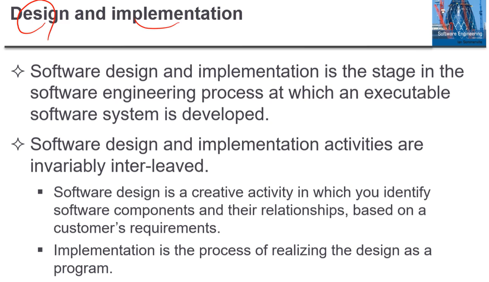

# softwareEngineering
2022-1 Software Engineering

# 중간 - 소프트웨어공학

복습: No
작성일시: 2022년 3월 1일 오후 2:30

[HW2_2017203035_김수헌.hwp](mid/HW2_2017203035_%EA%B9%80%EC%88%98%ED%97%8C.hwp)

[수정_제안요청서(SW 개발).hwp](mid/%EC%88%98%EC%A0%95_%EC%A0%9C%EC%95%88%EC%9A%94%EC%B2%AD%EC%84%9C(SW_%EA%B0%9C%EB%B0%9C).hwp)

[나라장터: 국가종합전자조달](https://www.g2b.go.kr/pt/menu/selectSubFrame.do?framesrc=https://www.g2b.go.kr:8340/search.do?category=TGONG&kwd=%BD%C3%BD%BA%C5%DB)

- 1주차
    
    # 1주차 - 22.03.02
    
    박사 - 과장직
    
    부장직
    
    책임 연구원
    
    수석 연구원
    
    출석 10
    
    중간 30
    
    기말 30
    
    프로젝트 30
    
    2번 빠져도 성적에 영향 X
    
    ## 시험 정보
    
    OX
    
    단답형
    
    빈칸 채우기
    
    한문장 두문장 간단하게 답하는 문장
    
    ## 질문사항
    
    1. 출석 - 교직 증빙 서류
    2. 중간 시험?
    3. 중간 빠지면 반영 비율
    
    ## 프로젝트
    
    1. 4인 1조
    2. 과제 선정 : 기존에 다른 과목에서 진행했던 프로젝트 중에서 소프트웨어 공학에서 배우는 모델을 적용하여 다시 재설계하고 싶은 프로젝트 선정
    3. 추진 방법 - 추후 공지
    4. 제출 결과물 : 설계 각 단계별로 보고서 제출(조별로 작성) - 조건에 따라 작성
    
    ## 소프트웨어 공학
    
    (개발 프로세스 변화에 대해 잘 대응할 수 있는 설계가 있고 아닌 것도 있다)
    
    
    
    1. 근대화된 나라에서는 소프트웨어를 엄청 많이 쓴다.
    2. 상당히 컨트롤 많이 된다.
    3. 우리는 좋은 소프트웨어를 만들기 위해서 필요한 이론 방법 뿐만 아니라 툴까지 포함한다.
    4. GNP에서 상당히 큰 부분 차지
    
    
    
    1. 하드웨어보다 비쌀 수 있다.
    2. 유지보수 비용이 개발 비용보다 많이 든다. 유지보수 비용이 개발 비용보다 몇 배 이상이기도 하다. 소프트웨어 업데이트 비용!!
    3. 코스트 효율적으로 다루는 학문이 소프트웨어 공학이다
    
    
    
    소프트웨어 프로젝트 실패 원인(일정이나 비용 못 맞추는 경우)
    
    1. 시스템 복잡도의 증가 : 요즘 시스템이 무지 복잡하고 크다. 안에 내용들이 되게 복잡하다. 왜 패를 가속화 시키느냐. 시스템은 새로운 능력을 포함해야하는데 이전의 내용을 다 포함하기 힘들어진다?
    2. 소공 방법을 사용하지 않는 경우 : 결국 소공을 쓰지 않고 한다면, 나중에 실패하게 된다.  시간이 많이 걸린다는 것.
    
    ## 전문적인 소프트웨어 개발
    
    
    
    
    
    소프트웨어에서 자주 물어보는 질문들.
    
    # 이거를 시험에 낸적이 있음.
    
    도큐먼트를 포함한다! 안한다?
    
    1. 컴퓨터 프로그램과 도큐먼트를 포함. 소프트웨어 일반적인 사용자를 위해 개발될 수도 있음.
    2. 어떤 소프트웨어가 좋은 소프트웨어인지? 기능 성공 / 퍼포먼스 성공해야함 유지보수 가능해야하고 읽고 쓸 수 있어야 함.
    3. 소공이란 무엇이냐? 소프트웨어 개발에 관련된 모든 부분
    4. **@@@시험에 자주 나오는 것 중 하나임 Spec 맞춰서 개발을 하고 평가를 함. 그리고 진화함.**
    5. 컴퓨터 사이언스는 이론과 근본적인 거를 다루는 반면, 소공은 개발에 관한 거랑 판매하는 행위.
    6. 회사가면 하드웨어/시스템 관련 지식들도 필요할 수 있기에 하드웨어 관련 과목 듣는게 좋음.
    7. 소프트웨어가 복잡해지기 때문에 딜리버리 타임이나 개발 시간 이런 것들을 줄이기 힘들다.
    8. **숫자는 외울 필요 없음. 테스트 비용이 크다. 안정적인 소프트웨어가 중요한데 이것은 테스트 비용이 높아야 한다.**
    9. 한번 읽어보세요
    10. 한번 읽어보세요
    
    
    
    제네릭 상품 : 워드프레세스 같은거
    
    특정한 사용자보다는 일반적인 불특정한 사용자들이 사용하는 것.
    
    커스텀 상품 : 원자력 발전 매니지먼트
    
    특정한 사용자만을 위해 만들어진 상품.
    
    모니터링 시스템
    
    아까 했던 내용이라 중복이라 넘어감
    
    제네릭 : 다형성이 존재하기 때문에 개발자가 요구사항을 적절히 알아서
    
    커스텀 : 특정 사용자를 대상으로 하기 때문에 요구사항을 정해야함.
    
    
    
    1. 유지보수성 좋아야 한다.
    2. 의존력과 보안 : 믿고 쓸 수 있어야 한다.
    3. 효율성
    4. 수용성
- 2주차
    
    # 2주차 - 22/03/07
    
    
    
    소프트웨어 공학이라는 것은 소프트웨어 개발 초기에서부터 소프트웨어 수명이 다 할 때까지  유지보수 하는 것에서 발생하는 다양한 관점에서의 문제들을 다루는 학문
    
    소프트웨어 공학을
    
    조직에서 발생할 수 있는 재정적인 제한 요소들을 해결하기 위한 적절한 이론이나 방법론
    
    소프트웨어 제품의 모든 측면
    
    단순한 개발 뿐만 아니라 매니지먼트 개발툴 방법들을 바라볼 수 있다.
    
    
    
    이런 소프트공학이 왜 중요할까?
    
    사회가 복잡해질 수록 더 향상된 소프트웨어를 사용할 수밖에 없다.
    
    믿고 쓸 수 있어야 한다.
    
    긴 관점에서 생각해보면 소프트웨어 공학 기술들을 적용해서 소프트웨어를 개발하는 것이 훨씬 더 적은 비용으로 사용할 수 있다.
    
    유지 보수에 대응을 잘해야한다.
    
    
    
    **소프트웨어 개발 활동**
    
    1. **SW 명세화 : 고객과 개발자가 해당하는 소프트웨어가 어떻게 돌아가고 동작하고 제한요소가 무엇이 있는지 정의하는 것.**
    2. **개발 : 해당 SW 디자인하고 개발하는 것.**
    3. **검증 : 고객이 요구한대로 동작하는지 체크하는 것.**
    4. **진화 : 소프트웨어가 개발된 후에 시장 요구사항이나 고객의 변화에 대응하기 위해 수정하는 것.**
    
    
    
    소프트웨어에서 영향을 미칠 일반적인 이슈
    
    1. 이질성 : 시스템이 점점 발달함에 따라서 컴퓨터와 모바일 디바이스들은 네트워크로 연결이되어 있음.
    2. 비지니스와 사회적 변화 : 비지니스와 사회가 급격하게 빠르게 변화하고 있다. 새로운 기술 바로바로 적용할 수 있어야 한다.
    3. 보안과 신뢰 : 소프트웨어는 믿을 수 있어야 한다.
    4. 스케일 : 작은 임베디드 시스템부터 인터넷, 클라우드 스케일까지 다양한 규모의 소프트웨어를 개발해야한다.
    
    
    
    소프트웨어 공학의 다양성
    
    일반적으로 적용할 수 있는 소프트웨어 테크닉 같은 것은 존재하지 않는다. 상황에 맞게 변형하거나 수정해야한다.
    
    개발되어질 어플리케이션 종류에 따라서 메소드나 툴을 쓸지 명확하게 파악하고 적용해야한다.
    
    개발할 어플리케이션 + 고객의 요구사항 + 개발 팀의 배경지식
    
    
    
    ### 어플리케이션 타입
    
    1. 독립적인 어플리케이션 : 개인 로컬 PC에서 돌아가는 어플리케이션. 필요한 기능들이 모두 포함되어있기 때문에 네트워크에 연결될 필요가 없다.
    2. 대화형 트랜잭션 기반 어플리케이션 : 원격 컴퓨터에서 실행되며, PC나 터미널을 통해서 접근된다.
    3. 임베디드 컨트롤러 시스템 : 하드웨어 장치를 제어하고 관리하기 위한 소프트웨어 제어 시스템. 숫자로 봤을 때는 아마도 이러한 타입의 시스템이 가장 많을 것이다.
    4. 일괄 처리 시스템 (Batch Processing Systems) : 특정 비지니스 시스템에서 사용되며, 큰 배치가 존재해서 이것을 순차적으로 처리.
    5. 엔터테인먼트 시스템 : 
    6. 모델링이나 시물레이션을 위한 시스템 : 과학자와 엔지니어를 위해 만들어진 시스템
    7. 데이터 콜렉션 시스템 : 데이터 수집해서 처리한 후 다른 시스템으로 전달하는 것.
    8. 시스템의 시스템
    
    
    
    아무리 시스템이 다양하더라도 소프트웨어를 개발할 때 종류에 상관 없이 적용할 수 있는 기본적인 원리들이 있다.
    
    - 어떤 시스템이 있는데 **개발프로세스를 관리하고 이해할 수 있게 개발**되어야 한다. 다른 프로세스에서는 다른 타입의 소프트웨어가 사용될 수도 있다.
    - 어떠한 시스템이 되더라도 **의존성과 퍼포먼스(성능)이 상당히 중요**한다.
    - 소프트웨어가 **어떻게 동작해야하는지 하는 명세와 요구사항**을 이해하고 관리하는 것이 상당히 중요하다.
    - 우리가 완전히 소프트웨어를 개발하는 것보다 기존에 개발되어있는 것을 **재사용**하는 것이 더 효율적이다.
    
    
    
    인터넷 소프트웨어 공학
    
    - 웹은 어플리케이션을 돌아가게 하는데 많이 사용함. 그래서 웹 기반으로 개발하는 것이 많이 늘어나고 있음.
    - 챕터19까지는 진도 못 나갈듯
    - 클라우드 컴퓨팅을 활용하여 우리 애플리케이션을 원격으로 돌아감.
        - 사용자는 소프트웨어를 구매할 필요 없고 돈만 지불하면 됨.
    
    
    
    웹 기반 시스템은 매우 복잡한 분산 시스템이다. 소프트웨어 기본적인 원리들을 적용해서 개발할 때 사용할 수 있다.
    
    
    
    소프트웨어 재개발 : 웹 기반의 시스템을 구축할 때 많이 사용한다.
    
    점진적인이고 민첩한 개발 : 요구사항들이 계속해서 끊임없이 추가됨. 그렇기 떄문에 어떠한 명세를 일렬로 나열하는 것은 쉽지 않다.
    
    다른 챕터에서 강조
    
    
    
    위 슬라이드는 참고만
    
    소프트웨어는 서비스-오리엔티드-소프트웨어 방식에 의해서 구현된다. (너무 추상적)
    
    다양한 인터페이스를 지원한다.
    
    ## 소프트웨어 공학 윤리
    
    
    
    소프트웨어 윤리
    
    - 소프트웨어 공학은 단순한 기술의 어플보다 훨씬 더 넓은 범위의 책임을 가진다
    - 소프트웨어 공학자는 정직하고 윤리적 책임을 가져야한다.
    - 도덕적 행동이라는 것은 단순히 법에 국한된 것이 아니라, 도덕적으로 맞는 것인지를 판단할 수 있어야 함.
    
    
    
    
    
    - 비밀 유지 : 개발자들은 자신이 개발하는 것에 대해 비밀 유지를 해야한다.
    - 능숙도 : 개발자들은 자신의 능력을 잘못알고 있으면 안된다. 자신의 능력 밖의 일을 맡지 말아야 한다.
    - 지적 재산권 : 각 나라의 지적 재산권에 대해서 전부 고려를 해야한다. 나중에 알고보니 해당 기술이 다른 사람의 소속이 되어있을 경우 로열티를 지불해야 함.
    - 컴퓨터 남용 : 자신들이 가지고 있는 컴퓨터를 다른 용도로 사용하면 안된다.
    
    
    
    **참고로 살펴보세요 (그 다음 슬라이드도)**
    
    ## Case Studies 사례 연구
    
    
    
    - 당뇨병 환자에게 인슐린 급여 시스템
        - 임베디드 시스템으로 구성되어있고, 피의 인슐린 정도를 측정하여 인슐린 급여
    - 건강관리 환자 관리 시스템
        - 사람들의 정신 건강에 대한 정보를 받아서 관리하는 시스템
    - 날씨 시스템
        - 다양한 측정 도구로 측정하고 종합하여 기상 예측
    - 디지털 러닝 환경
        - 학교 수업에서 활용
    
    
    
    인슐린 펌프 시스템
    
    - 피에 있는 당 센서를 통해 데이터를 모음. 이 데이터를 기반으로 인슐린을 얼마나 투여할지 양을 계산
    - 피의 당 수치의 변화율 계산한다
    - 정확한 인슐린 양 계산해서 마이크로 펌프가 전달
    - 이것이 동작을 잘못할 경우 사람이 의식을 잃거나 죽을 수도 있다.
    
    
    
    
    
    하드웨어 아키텍쳐
    
    액티비티 모델
    
    
    
    높은 레벨로 중요한 것은 무엇이냐
    
    - 필요할 때 해당 시스템은 인슐린을 전달할 수 있어야 한다.
    - 이 시스템은 정확한 양의 인슐린을 공급해줘야 한다.
    - 이런 요구사항들을 항상 만족할 수 있는 상태로 구현이 되어야 한다.
    
    # 2주차 22/03/09
    
    
    
    환자를 위한 시스템
    
    병원에서 당장 치료를 필요로 하지 않지만 주기적으로 의사를 만나는 사람
    
    # 자세한 건 다음에 이야기 하도록 하겠습니다
    
    Mentcare에 대한 슬라이드는 간단하게 읽어보길 바랍니다
    
    시험에 Mentcare 시스템에 대해 설명해라 이런 내용은 시험에 내지 않습니다.
    
    
    
    Mentcare 클라이언트 : 의사
    
    네트워크를 통해서
    
    멘티케어 서버에 접속해서
    
    환자의 데이터베이스에 접근
    
    멘티케어 주요 기능 참고로 읽어보기 바랍니다
    
    자세한 내용 한번 읽어보길 바랍니다
    
    
    
    날씨를 예보할 때 사용하는 일부를 이야기 하고 있음.
    
    간단하게 말하자면 온도 기압 햇빛 등을 측정하는 센서들이 있는데 그 장치로 부터 데이터를 모으는 것을 Weather station이라고 한다.
    
    나미지 내용들도 간단하게만 읽어보면 될 거 같습니다.
    
    # iLearn << 이건 이번학기에 안 다루므로 생략하도록 하겠습니다.
    
    # 챕터1은 여기서 마치도록 하겠습니다
    
    
    
    챕터 2는 소프트웨어를 개발할 때 어떤 프로세스가 있는지 프로세스 중심으로 학습
    
    
    
    소프트웨어 시스템을 개발할 때 필요한 구조화된 활동
    
    - **Specification : 소프트웨어 시스템이 무엇을 해야하는지 정의하는 것.**
    - **Design and implementation : 구현하고자 하는 시스템을 어떻게 구성할지 정의**
    - **Validation : 실제로 구현된 소프트웨어가 소비자가 원하는 것인지 체크**
    - **Evolution : 소비자가 필요로하는 변화에 맞춰서 시스템을 변경하는 것.**
    
    소프트웨어 프로세스 모델 자체가 실제로 추상적으로 표현된 것임.
    
    큰 범주 내에서 이것들은 공통적으로 이루어지는 것.
    
    
    
    소프트웨어를 개발할 때 일련의 순서들
    
    프로세스 설명에는 이런 것도 포함될 수 있다.
    
    - 프로덕트(산출물) : 프로세스 활동을 하면서 결과물로 나오는 것
    - 역할 : 책임에 대해 역할을 반영하는 것
    - 사전, 사후 조건들 : 사전과 사후의 진술
    
    
    
    플랜 드리븐과 애자일 프로세스
    
    - 플랜 드리븐 프로세스는 모든 프로세스 활동들이 계획의 진행정도가 측정되는 것
    - 애자일 프로세스에서는, 계획을 약간씩 추가하면서 개발하는 것, 고객의 요구사항이 변화되었을 때 대응하기가 쉽다
    - 실무에서는 플랜 드리븐 방식과 애자일 프로세스가 혼합되어있는 경우가 많다
    - 좋거나 나쁜 소프트웨어 프로세스는 존재하지 않는다 == 상황에 따라 유동적으로
    
    
    
    소프트웨어 프로세스 모델
    
    - 폭포수 모델 : 계획으로 이끌어진 모델. 명세와 개발 검증 심화 하는 것들을 확실히 분리하고 구별한다. phase로 나눠서 끝낸다.
    - 점진적으로 개발하는 방법 : Specification과 development and validation이 서로 뒤섞여있다.
    - 통합과 환경 : 시스템 자체를 기존에 있는 수정 가능한 컴포넌트를 조합해서 만든다.
    - 실제로 규모가 큰 시스템은 위에 있는 이런 모든 모델들을 섞어서 개발한다
    
    ### 폭포수 모델
    
    
    
    한 단계가 끝나고 나면 다시 바꿀 수 없음. 맨 끝가서 다시 돌아가는 방법 뿐
    
    1. 요구 사항 정의
    2. 시스템 & 소프트웨어 디자인
    3. 구현과 유닛 테스트
    4. 통합하고 시스템 테스팅
    5. 동작하고 유지보수하고
    
    
    
    페이즈로 구성이 되어 있다
    
    1. 요구사항을 분석하고 정의
    2. 시스템 소프트웨어 디자인
    3. 구현 유닛 테스트
    4. 통합 시스템 테스트
    5. 운영과 유지보수
    
    프로세스가 이미 지나고 나면 변화를 주기 힘들다.
    
    다음 단계로 넘어가기 전에 현재 단계는 완전히 끝나야 함.
    
    
    
    - 우리가 프로젝트 단계를 나눌 때 고객의 요구 변화에 대해 대응하기가 어렵다.
        
        ### 이 모델을 사용해야할 때는 요구사항을 아주 잘 알고 있을 때!! 변화가 거의 생기지 않을 때
        
        일부 비지니스 시스템은 요구사항이 안정적이다
        
    - 큰 시스템을 만들 때 폭포수 모델을 대부분 사용한다 시스템이 크면 많은 개발자가 들어오면 여러 팀들끼리 개발을 하는 것.
    
    
    
    ### 점진적인 개발
    
    Specifiaction, Development, Validation을 자유자재로 왔다갔다 할 수 있다.
    
    또한 단계도 초기, 중기, 마지막 버전이 있다.
    
    
    
    - 고객의 요구사항에 대응하는 비용이 적게 든다
    - 고객이 피드백을 주기가 훨씬 쉽다.
    - 훨씬 더 빠르게 결과물을 고객들에게 재공할 수 있다 → 고객들이 일찍 사용해서 부가가치를 만들어낼 수 있다.
    
    중간 결과물이 나오기 때문에 고객의 피드백에 발빠르게 대처 가능
    
    
    
    - 프로세스가 눈에 보이지 않는다, 증분으로 진행되기 때문에 정확한 진행도를 확인하는 것이 어렵다. 빨리빨리 개발이 되기 때문에 모든 버전에 대해 문서를 만드는 것이 상당히 비효율적
    - 시스템 구조가 새로운 기능을 추가하다보면 점점 더 안좋아짐. 이렇게 되면 결국 시간이나 돈을 소요하는 것이 된다.
    
    
    
    ### 통합과 환경 설정
    
    - 기존에 만들어져 있는 컴포넌트를 결합하여 새로운 어플리케이션을 만드는 것
    - 사용자의 요구 사항에 맞도록 환경설정해서 만들 수 있다.
    - 비지니스 시스템에서 이런 것들을 많이 사용한다
    
    
    
    # 이 챕터에서 이 부분은 고려하지 않겠습니다
    
    
    
    1. 요구사항 명세에 대해 찾아봄
    2. 소프트웨어를 찾고, 평가함
    3. 요구 사항 정제
    4. 어플리케이션 시스템 가능 → 어플리케이션 시스템 설정
    5. 컴포넌트가 존재 가능하다면?
    6. 컴포넌트에 대해 수정하고
    7. 신규 컴포넌트를 하고
    8. 시스템 통합
    
    # 그 다음 슬라이드는 그림과 똑같기 때문에 넘어가도록 하겠습니다.
    
    
    
    - 장점은 비용이 절감되고 리스크가 감소된다.
    - 개발 기간이 상당히 단축된다.
    - 단점으로는 만들어진 시스템을 그대로 이용하기 때문에 사용자 요구사항을 모두 적용하는데 어려움이 있을 수도 있다.
    - 재사용 시스템의 혁신 컨트롤의 손실
    
    
    
    - 실제 소프트웨어 프로세스는 교차배치되어있음.
    - 실제 개발 프로세스가 좀 다르게 구성될 수 있다.
    - 폭포수 모델 경우에는 순차적으로 되어있지만, 점진적 모델은 교차배치할 수도 있다
    
    
    
    1. 요구사항 찾아내고 → 여기서 시스템 설명이 나오고
    2. 요구사항 명세 → 여기서 유저 시스템 요구사항이 나옴
    3. 요구사항 검증
    4. 요구사항 문서 작성
    
    
    
    무슨 서비스가 될 지, 제약 사항이 있는지 등을 찾아내는 과정
    
    요구사항 공학 프로세스
    
    - 요구사항 끌어내기 분석하기 : 시스템 이해관계 당사자들이 어떤 것들을 필요로 하는지
    - 요구사항 명세 : 구체적인 요구사항이 무엇인지 기술적으로 정리
    - 요구사항 검증 : 요구사항의 유효성 체크
- 3주차
    
    # 3주차 22/03/14
    
    # 리마인드
    
    - Specification
    - Design and Implement
    - Validation
    - Evolution
    
    # 워터풀 모델 시험에 한번씩 나옴
    
    
    
    - 시스템 명세를 실제로 실행 가능하도록 만드는 과정
    - 소프트웨어 디자인
    - 구현 : 해당하는 구조를 실행할 수 있는 코드로 만드는 단계
    - 디자인과 구현은 서로 밀접한 연관이 있가 교차배치될 수 있다
    
    # 추상적으로 알고 있는 내용임
    
    
    
    4개의 프로세스에서 제일 집중하는 것이 이 부분일 것임
    
    디자인 인풋 - 디자인 활동 - 디자인 아웃풋
    
    - 디자인 인풋
        - 플랫폼 명세
        - 요구사항 명세
        - 데이터 묘사
    - 디자인 활동
        - 아키텍쳐 디자인
        - 인터페이스 디자인
        - 컴포넌트 디자인
        - DB 디자인
    - 디자인 아웃풋
        - 시스템 아키텍쳐
        - DB명세
        - 인터페이스 명세
        - 컴포넌트 명세
    
    
    
    - 아키텍쳐 디자인, 시스템에 대한 여러가지 컴포넌트 들을 연결하는 것
    - 시스템 구조에 맞춰서 어떻게 디자인할 것인가?
    - 인터페이스 디자인
    - 컴포넌트 선택과 디자인 : 구현된 것 찾는다.
    
    
    
    - 구현하기 힘들다
    - 프로그래밍
    - 디버깅 문제
    
    
    
    - 검증과 확인 시스템이 실제로 고객이 원하는 요구사항이 있는지 확인하는 과정이다
    - 프로세스 확인하고 시스템 테스팅 하는 과정 포함
    - 시스템이 실제로 만들어진 결과가 원활한 작동을 하는지 확인하는 것
    - 테스트 라는 것은 상당히 자주 사용된다.
    
    교수님은 실무에서 개발하는 과정에서 무엇을 테스트할지 미리 테스트 리스트를 만들어 놓음
    
    
    
    
    
    - 각각의 컴포넌트가 독립적으로 테스트 되는 것 : 컴포넌트를 둘러 쌓고 있는 시스템. 가상의 시스템
    - 시스템 전체 테스트
    - 고객 데이터를 실제로 가져와서 확인을 하는 것
    
    
    
    테스트 플랜 미리 만들어 놓음
    
    시스템 통합 테스트 플랜 만들어 놓음
    
    서브시스템 통합도 미리 만들어 놓음
    
    명세에서는 점점 큰 단계에서 작은 단계로 만들고
    
    테스트 시에는 점점 작은 단계에서 큰 단계로 통합한다.
    
    
    
    - 소프트웨어는 유연하게 바뀔 수 있어야 한다
    - 비지니스 변화를 통해 요구사항이 변경됨에 따라 소프트웨어 또한 진화하고 변화해야한다
    - 새로운 시스템이 점점 더 적어짐에 따라 개발과 진화 사이에 관련성이 점점 증가한다??
    
    경쟁사가 무엇을 하는지 파악하는 것이 상당히 중요하다.
    
    그 회사 쓰레기 뒤지기도 함. 그 회사 근처 술집에 많이 감
    
    
    
    1. 진화를 위한 시스템 요구사항
    2. 기존 시스템 평가
    3. 시스템 어떻게 바꿀지 제안
    4. 시스템 수정
    
    
    
    대규모 프로젝트는 변화가 불가피하다.
    
    - 새로운 기술이 나오면 계속 바뀌어야 함
    - 새로은 테크놀로지는 향상된 구현을 위해 새로운 가능성을 열어둬야한다.
    - 플랫폼이 바뀌면서 어플리케이션이 바뀔 때도 있다.
    
    체인지 되면 돈을 더 받아야한다.
    
    
    
    변화를 예측하면 좋겠다. 어떤 변화가 있을지 미리 예측을 하는 작업이 필요하다
    
    - 프로토타입 시스템을 만드는데 시스템에 중요한 기능들을 몇가지 보여주는 것.
    
    변화가 용인되어야 한다. 변화된 것들이 그 다음 것들에서 사용되기 때문에 더 쉽게 대응될 수 있다.
    
    
    
    - 시스템 프로토타입은 시스템이 어떻게 돌아가는지 빠르게 체크하는 것. 고객은 이 프로토타입으로 요구사항을 빠르게 확인. 변화를 미리 예측할 수 있다
    - 점진적 딜리버리는 변화를 잘 예측
    
    - 시스템의 초기 버전이고 목적 자체는 개념이고 디자인이다.
    - 프로로타입은 사용되어진다
        - 어떠한 요구 사항이 있는지 확인할 수 있다.
        - 이정도 설명하면 될 거 같아요
    
    
    
    - 시스템 사용성을 개선한다
    - 자신이 진짜 무엇을 원하는지 알 수 있다
    - 디자인 퀄리티 높일 수 있다.
    - 유지보수도 향상된다.
    - 개발 노력도 줄일 수 있다.
    
    
    
    ### 프로토타입 개발 프로세스
    
    프로토타입 목적 세우기 → 프로토타입 기능 정의 → 프로토타입 개발 → 프로타입 평가
    
    
    
    프로덕트에서 잘 이해하지 못한 것에 대해 포커스를 맞춰야한다
    
    에러체킹 리커버링 이런 것은 포함될 필요가 없다.
    
    
    
    Throw-away 프로토타입
    
    프로토타입은 패기되어야 한다.
    
    - 개발이 좀 쉽지 않다.
    - 개발 문서 자체도 없다
    - 코드 구조자체도 좋지 않다
    - 프로토타입은 아마도 조직의 기준을 만족하지 못한다
    
    회사에 개발 표준 같은 것들이 있다.
    
    
    
    delivery 커스터머에게 결과를 전달하는 것
    
    - 한번 개발해서 하는 것(Single delivery)이 아닌 실제로 개발을 여러 단계로 쪼개서(인크리먼털 딜리버리) 점진적으로 개발하는 것이 낫다.
    - 어떤 것이 중요한 것이 요구사항을 만든다. 우선 순위도를 만들고 우선 순위가 높은 것은 초반부에 넣는다.
    - 점진적 딜리버리가 시작되면 요구사항이 고정되고, 요구사항 수정없이 개발한다.
    
    # 3주차 22/03/16
    
    
    
    개발할 때 한번에 모든 내용을 개발하는 것이 아니라 일부 내용을 개발해나가는 것.
    
    - 다음 개발할 인크리먼트를 진행하기 전에, 각각의 인크리먼트에 대해 평가를 진행해야함.
    - 애자일 방법에서 사용됨.
    - 평가 자체는 사용자와 커스터머에 의해서
    
    - 엔드 유저에게 사용을 하기 위해 전달
    - 소프트웨어의 실질적인 평가방법이 된다.
    - 이 부분은 여러분이 참고로 읽어보면 될 듯
    
    
    
    전체적인 인크리먼탈 딜리버리
    
    1. 요구사항 정의
    2. 여러개의 인크리먼트에 대한 요구사항 정의
    3. 시스템 아키텍쳐 디자인
    4. 인크리먼트 부분 개발
    5. 인크리먼트 평가
    6. 인크리먼트 통합
    7. 시스템 평가
    8. 인크리먼트 배포 → 만약 제대로 되지 않는다면 4번으로 돌아감
    9. 마지막 시스템
    
    
    
    - 각각의 인크리먼트를  빠르게 실제로 사용을 할 수가 있음.
    - 각각의 인크리먼트 자체가 프로토타입처럼 사용되기 때문에 추후에 인크리먼트 요구사항이 변경될 수 있음.
    - 프로젝트 실패할 리스크가 크게 줄어든다.
    - 높은 우선 순위로 구성되어 있는 서비스 같은 경우는 장기간 테스트가 이루어지므로 훨씬 더 안정적
    
    
    
    인크리먼트의 문제점
    
    - 기존 시스템을 새로운 시스템으로 대체하려고 할 때 문제가 발생할 수 있다.
        - 새로운 시스템 도입하면 새로운 기능에 대해서 사용하지 않으려고 하는 경향이 있다.
    - 인크리먼트 딜리버리는 개발을 하면서 명세가 완성되기 떄문에, 개발 초기에는 완전한 명세를 알 수가 없다.
    
    # 2장의 Process Improvement 생략
    
    ## 애자일 개발
    
    
    
    
    
    빠르게 소프트웨어 개발
    
    - 빠르게 소프트웨어를 개발해서 사용에게 전달하는 것은 가장 중요한 요구사항 중 하나.
        - 비지니스 환경도 바뀌고 있고 요구사항도 바뀌고 있다. 소프트웨어 요구사항이 변화없이 안정적으로 가는 것은 불가능하다.
        - 소프트웨어 자체는 비지니스 요구사항 변화에 대응하면서 빠르게 진화해야한다.
    - 플랜 드라이브 개발 자체가 시스템 종류에 따라서 필요하기도 하지만, 비지니스 요구 사항은 만족하기 힘들다
    - 1990 애자일 개발이 등장함.
    
    
    
    - 프로그램의 명세와 디자인 그리고 구현이 서로 뒤섞여 있는 방법이다.
    - 이해관계 당사자와 함께 같이 개발을 해나가는 방법.
    - 새로운 버전의 소프트웨어 자체가 상당히 빈번하게 전달이 된다.
    - 상당히 많은 툴 들의 도움을 받아야 함.
    - 문서화는 최소화로 하고 코드에 중점을 둬야한다.
    
    
    
    Plan-Driven 방법과 Agile 방법 차이
    
    1. Plan Driven
        
        요구사항 공학 → 요구사항 명세 → 디자인 그리고 개발
        
        만약 변경사항이 있다면 다시 돌아옴
        
    2. 요구 공학과 디자인 개발을 더 빠르게 왔다갔다
    
    
    
    Plan Driven
    
    - 소프트웨어 공학과 개발과 어느정도 분리가 되어 있고, 각 스테이지에서 만들어진 출력물 기반으로 이루어짐.
    - 각 액티비티 활동들이 반복적으로
    
    Agile
    
    - 명세, 디자인, 개발이 전부 뒤섞여 있음.
    
    
    
    애자일 방법
    
    1980 ~ 1990 좋은 소프트웨어를 개발하는 것.
    
    → 철저하게 개발 프로세스를 통제하는 것이라고 생각함
    
    - 애자일 방법은 디자인 보다 코드에 더 집중
    - 반복적 점진적 개발
    - 실제로 돌아가는 소프트웨어를 빠르게 전달하고 변화에 빠르게 대응
    
    ### 애자일 방법의 목적 : 소프트웨어 프로세스에서 오버헤드를 줄이겠다. 문서를 최소화 하는 것. 변화가 있을 경우에 빠르게 대응할 수 있도록
    
    # Agile manifesto 는 참고로 읽어보시기 바랍니다.
    
    
    
    애자일 방법의 원칙
    
    1. 고객의 참여 : 프로젝트 개발 과정에서 긴밀하게 같이 있어야 함. 새로운 요구에 대한 우선순위 정하기와 제공 그리고 시스템에 대해서 평가함.
    2. 점진적인 인도 : 계속해서 소프트웨어가 점진적으로 개발되기 대문에 인크리먼트가 있을 때 마다 커스터머에게 전달해야함.
    3. 프로세스가 아닌 사람에게 집중한다 : 프로세스에 얽메이지 않기 때문에 사람 중심적으로 일을 진행
    4. 변화를 수용 : 변화 자체를 예측하고 이것을 대응할 수 있도록 시스템을 디자인하고 변화를 시켜야한다.
    5. 단순성을 유지해야한다 : 점점 코드가 복잡해짐. 항상 코드가 단순하도록 유지시켜줘야함.
    
    
    
    ### 애자일 기법의 적용
    
    - 소프트웨어 회사가 작거나, 중간사이즈 정도 될 때
        - 대부분의 소프트웨어가 애자일 기법을 이용하고 있다.
    - 커스터머가 개발 프로세스에 대해서 확실한 참여가 있을 때 사용할 수 있다. 외부의 규칙이나 규울이 존재하지 않을 경우 사용할 수 있다.
    
    
    
    ### Extreme Programming
    
    극단적으로 몰아 붙여서 개발
    
    - 새로운 버전이 하루에 여러번 만들어짐
    - 인크리먼츠는 커스터머에게 2주마다 전달됨.
    - 모든 테스트는 각각의 빌드마다 실행이 됨. 해당하는 테스트가 모두 성공적으로 이루어졌을 때 빌드가 받아들여짐.
    
    
    
    XP의 릴리즈 시안을 보여주고 있음.
    
    1. 유저 스토리를 선택함.
    2. 해당 스토리를 여러개의 테스크로 분해
    3. 어떻게 할지 플랜을 짬
    4. 소프트웨어 개발/통합 테스트
    5. 릴리즈
    6. 시스템 평가
    
    
    
    **익스트림 프로그래밍의 실무**
    
    - 점진적인 계획 : 요구는 스토리 카드로 기록이 된다. 하나의 릴리즈에서 포함되어진 하나의 스토리들을 결정. 개발자들은 이 스토리를 여러개의 테스크로 분해를 해서 진행을 함.
    - 스몰 릴리지 : 비지니스 가치를 제공할 수 있는 가장 미니멀하고 유용한 기능들을 먼저 개발함. 점진적으로 여러번 새로운 기능들이 포함되면서 계속 릴리즈가 된다.
    - 심플 디자인 : 현재 요구에 대해 만족할 수 있는 디자인만 하고 더 이상 하지 않음.
    - 테스트 퍼스트 개발 : 자동화된 테스트를 사용하는 것. 새로운 기능에 대해서 테스트를 효율적으로 진행하는 것. 자동화된 테스트를 개발자가 구현해야함.
    - 리펙토링 : 모든 개발자들은 가능한 빨리 코드의 향상을 찾아야 하고 계속적으로 리펙토링을 기대해야한다. 심플리스틱을 유지하기 위해서 깔끔하게 바로바로 고쳐야한다. 그래야 유지보수하기가 쉽다.
    
    
    
    - 페어 프로그래밍 : 개발자들이 짝을 이뤄서 개발을 한다. 서로 작업을 하면서 점검을 하면서 살펴볼 수 있다.
    - 집단 소유권? : 짝을 이루면서 개발을 하다보면 여러 사람이 공동으로 책임질 수 있고 여러 사람이 수정할 수 있다.
    - 연속적인 통합 : 주어진 테스크가 끝나면 바로 전체 시스템이 통합되고 테스트가 진행된다.
    - 유지할 수 있는 속도 : 엄청나게 많은 overtime이 되면 코드 생산 속도가 떨어지게 된다. 과도하게 일을 시키면 안된다.
    - On-site 커스터머 : 커스터머가 풀타임으로 항상 XP 팀과 같이 일을 해야한다. 정상적으로 개발이 되고 있는지 체크해야함.
    
    
    
    - 인크리먼털 개발이 지원된다. 상당히 작은, 끊임없이 시스템을 릴리즈 하기 때문에
    - 커스터머가 풀타임으로 항상 팀과 같이 일한다.
    - 프로세스보다 사람에 집중한다 : 페어 프로그래밍, 공동 소유권, 일도 과도하게 하지 않는다.
    - 변화에 대해 지원한다. 계속해서 시스템을 릴리즈 한다.
    - 단순화를 계속 유지한다. 끊임없이 리펙토링을 하기 때문에.
    
    
    
    - XP를 도입하는게 쉽지 않았다. 애자일을 도입한 회사들은 XP에서 필요한 것들만 골라서 사용함.
- 4주차
    
    # 4주차 22/03/21
    
    **프로젝트 관리 툴**
    
    **한 두페이지 과제**
    
    
    
    - XP에서 커스터머가 개발 팀에 포함되어 있어야한다. 이런 도움이 있어야 요구사항 결정을 만들 수 있다.
    - 유저 요구사항을 유저 스토리나 시나리오로 표현한다.
    - 구현 테스크를 개발팀은 스토리카드로 적고 이것을 기반으로 스케줄이나 비용을 예상함.
    - 커스터머는 다음 릴리즈에 포함될 스토리를 선택한다.
    
    완전성 : 구현할 소프트웨어의 모든 부분은 명세가 되어 있어야 한다
    
    근데 스토리카드로 되어 있기 때문에 이 완전성이 부실할 수도 있다.
    
    
    
    참고로 보면 됨
    
    
    
    ### 리펙토링
    
    - 변화에 대응해서 디자인을 하는 것이 좋다고 생각함. 이렇게하면 전체적인 소프트웨어 사이클에서 비용을 줄일 수 있다. 구현에 대한 시간과 노력을 줄일 수 있다.
    - XP가 들어오면서 좀 다르게 바뀜, 변화가 무엇인지 예측하는 것이 쉽지 않다.
    - 이렇게 하기 보다는 계속해서 코드를 개선하고 어떤 변화가 생겼을 때, 변화를 빠르게 대응할 수 있는게 더 효율적이다
    
    ### 결론 : 디자인을 변화에 대응해서 하는 것보다, 변화에 빠르게 대응할 수 있게 하는 것이 더 효율적임.
    
    
    
    - 개선할 것이 보이면, 바로 개선을 하라.
    - 소프트웨어에 대해 이해를 높일 수 있게 개선을 해야한다. 문서화를 줄여야한다.
    - 이런 변화가 잘 되어야 한다.
    - 아키텍쳐가 바뀌는 경우가 있는데, 그렇게 되면 오랜 시간이 필요로 하게 된다.
    
    
    
    - 중복 코드는 바로바로 제거를 해줘라
    
    # 참고만 하면 될 거 같다.
    
    
    
    - XP에서는 모든 변화가 있을 때마다 테스트를 해야한다.
    - XP 테스팅 특징
        - 테스트 우선 개발
        - 시나리오로부터 인크리머탈 테스트 개발
        - 유저가 개발과 검증에서 포함되어 있어야한다
        - 자동화된 테스트인 경우, 새로운 릴리즈가 나올 때마다 모든 컴포넌트 테스트가 이루어져야한다.
    
    
    
    - 코드를 개발하기전에 테스트를 써야한다. 이것은 정확하게 요구사항을 이해하는데 도움이 된다.
    - 테스트는 프로그램으로 작성이 되는 것. 꼭 자동으로 수행이 되어야 한다. 테스트는 실행한 게 정확한지 평가하는 것도 꼭 포함해야한다.
    - 새로운 함수가 추가되면, 과거에 있던 모든 테스트들이 자동화 되게 돌아가야한다.
    
    
    
    - 이건 넘어가도록 할게요
    - 커스터머가 팀에 포함되어 있어야 한다.
    - 그런데, 커스터머 역할을 수행해야하는 사람들이 필요한데, 그들의 시간이 충분치 않거나 제한적임. 개발팀에 풀타임으로 있지 않을 수가 있다.
    
    
    
    이런식으로 한다. 실제로 이런 것들이 코드로 작성되어야 한다.
    
    
    
    - Stand-Alone 형태로 되어있어야 한다. 원래 아웃풋에서 나올 것과 어떤 것이 있는지 체크해야한다. 어디가 잘못되어 있는지 파악하는 것이 중요.
    - 같은 내용 반복이네요 넘어가도록 하겠습니다.
    
    
    
    ### 테스트 우선 개발 단점
    
    - 프로그래머는 테스트 짜는 거 되게 싫어함. 최소한의 것들을 짜거나 대충 짬. 테스트 라이팅을 제대로 하지 않음. 필드에 나가면 문제가 생길 수도 있음
    - 몇몇 테스트들은 인크리먼탈하게 구현되는 경우가 어렵다. 기능적으로 점점 하나의 고도화 되는 방향으로 간다면 이것을 테스트하는 것이 쉽지 않다.
    - 엄청나게 많은 테스트들이 있다. 그것을 모두다 테스트하는 것은 불가능하다. 완전성을 보장하는 것이 쉽지 않다.
    
    
    
    ### 페어 프로그래밍 : 둘이 같이 코딩을 하는 것.
    
    - 개발 코드를 같이 만드는 것.
    - 코드에 대해서 공통의 권한을 갖게 된다.
    - 한 사람이 이미 구현을 한 코드는 문제가 있을 수 있다. 둘이 같이하면 다른 사람에 의해서 이미 리뷰가 된 코드이며 더 검증이 된 코드일 것.
    - 리펙토링도 쉽다.
    
    
    
    - 같이 앉아서 개발하는 것.
    - 개발하는 과정에서 여러 사람끼리 다이나믹하게 생성이 된다. 서로 다른 사람들끼리 묶을 수 있다.
    - 이렇게 함으로써 여러 사람이 알고 있는 지식이 중요하게 된다. 프로젝트의 리스크가 줄어든다.
    - 페어 프로그래밍 같은 경우 상당히 비효율적으로 보이지만, 장기적으로 봤을 때 두 사람이 각자 별도로 일하는 것보다 훨씬 더 효율적이다.
    
    # 4주차 22/03/23
    
    
    
    ### 애자일 프로젝트 매니지먼트
    
    - 소프트웨어 프로젝트의 근본적인 책임은 프로젝트가 원만하게 매니지 하는 것이 목적. 프로젝트가 잘 진행이 된 다는 것은 해당하는 소프트웨어가 제때 개발이 되어 전달되는 것. 또한 개발비 내에서 프로젝트가 진행되는 것.
    - 프로젝트 기본이 되는 방법은 계획 주도적인 방법(Plan-Driven)이었음.
    - 애자일 프로젝트 매니지먼트는 기존과 방법이 좀 다른다. 애자일에서는 점진적 개발을 사용하고 있음.
    
    
    
    ### 스크럼
    
    관리 입장에서는 정확한 프로젝트의 진행과정을 항상 확인하고 체크해야한다.
    
    외부에는 진행 정도를 알리고 내부에선 진행 잘되도록 할 수 있음.
    
    애자일은 작은 단위로 팀이 구성되고 문서 작업을 최소화 한다.
    
    짧은 주기를 갖고 있는 점진적 개발
    
    근데 조직이 커지면 관리가 어려워짐.
    
    그래서 이런 문제를 해결하기 위해 에자일 스크럼이 등장함.
    
    스크럼은 에자일 방법 중에 하나인데 특정한 에자일 방법이기 보다는 반복적 개발을 매니지하는 것에 초점을 두고 있다.
    
    스크럼 방법에서 3가지 페이즈
    
    - 이니셜 페이즈 : 초기에서 전체적인 아웃라인을 계획함. 프로젝트의 일반적인 구도, 소프트웨어 카이텍쳐 디자인
    - 스프린트 사이클 : 시스템의 인크리먼트한 부분을 만들어내는 과정 중 하나.
    - 프로젝트 클로져 : 프로젝트를 매복하고, 필요한 문서 작업을 완료함.
    
    스프린트 사이클 : 인크리먼트를 개발하는 하나의 주기
    
    
    
    
    
    ### 스크럼 전문 용어 << 스크럼은 다른 용어를 사용함.
    
    - 개발팀 : 소프트웨어 개발자로 구성되어있는 팀. 7명이 넘지 않는 형태.
    - 잠재적 전날 가능한 제품의 증분 : 고객에게 전달하는 내용이라고 생각하면 됨. 스프린트로부터 만들어진 결과물 이것이 인크리먼트
    - 프로덕트 백로그 : 백로그(밀린 일) 이것은 스크럼 팀에서 해야할 일의 리스트. 소프트웨어의 특징을 정의한 것들일 수도 있음. 소프트웨어 요구사항, 유저 스토리 포함.
    - 제품 소유권자 : 특별한 개념은 아닌데. 커스터머 개념으로 생각하면 됨.
    - **스크럼 : 매일 같이 모여서 회의를 하게 되는 데일리 미팅, 일의 진행정도를 리뷰, 오늘 진행해야하는 일 중에 어떤 것이 중요한지. 페이스 투 페이스로 모든 팀이 짧게 미팅하는 것임. 스크럼에서는 매일 미팅을 통해 정보 공유를 하는 것임. 잘못된 구현을 방지할 수 있음. 진행 방향 공유**
    - 스크럼 마스터 : 프로젝트 리더랑 비슷한 개념. 하는 일들이 많이 겹침. 스크럼 마스터가 해야할 일은 스크럼 프로젝트 자체가가이드 라인에 맞춰 효율적으로 진행될 수 있도록 하는 모든 책임을 지고 있다.  스크럼 팀과 외부의 인터페이스에도 관여한다. 프로젝트 매니저로는 생각해선 안된다.
    - 스프린트 : 개발을 하는 단위. 2~4주 정도 길이
    - 벨로시티 : 스프린트에서 한 팀이 얼마만큼의 백로그를 감당할 수 있는지. 팀에 따라서 벨로시티가 다르다.
    
    
    
    ### 스크럼 스프린트 사이클
    
    1. 프로덕트 백로그 : 아이템을 선택
    2. 아이템을 선택
    3. 스프린트를 계획
    4. 스프린트 백로그(스프린트를 진행하면서 해야할 투두리스트) 2~4주 정도
    5. 스프린트 과정을 거침
    6. 스크럼을 매일 진행
    7. 완료가 되면 스프린트 리뷰
    8. 다시 돌아와서 리뷰를 하고 백로그로 감.
    
    (포텐셜 쉬퍼블 소프트웨어 << 사용자에게 전달될 수 있는 소프트웨어 만들어짐.)
    
    
    
    - 스프린트 자체는 고정된 길이를 갖는다, 2주에서 4주 정도
    - 프로덕트 백로그 시작
    - 스프린트에서 해야할 일 셀렉션. 여기서 커스터머들도 관여함.
    
    
    
    - 팀 자체는 소프트웨어를 개발을 위해 구성됨.
    - 이 스테이지에 이 팀은 고객으로부터 분리된다. 조직하고도 분리가 됨.  커뮤니케이션은 스크럼 마스터가 외부와 내부 사이에서 진행.
    - 스크럼 마스터의 역할은 외부로부터 개발팀을 보호하는 것.
    - 스프린트가 마쳐지고 나면(하나의 사이클), 일에 대해 전체적인 리뷰를 하고 고객들에게 보여준다. 그리고 다음 사이클이 시작.
    
    
    
    - 스크럼 마스터는 스크럼을 정리하는 역할. 백로그를 계속해서 확인. 어떤 결정 사항들을 기록. 백로그 대비 일이 얼마나 진행되었는지 평가. 외부 사람들들로부터 혹은 고객과 커뮤니케이션 함
    - 모든 팀 맴버들은 짧은 데일리 미팅을 진행. 이 미팅을 통해 모든 팀 맴버는 정보를 공유, 이전 미팅에 비해 얼마나 진전이 있었는지, 문제가 있었는지 등등
        - 모든 사람이 각 팀에서 일어나는 일에 대해서 이해가 높아지고, 사람들이 동기부여되고 도움도 되고.
    
    
    
    ### 스크럼의 장점
    
    - 제품이 매니지가능하고 이해가능한 작은 단위로 쪼개진다.
    - 불안전한 요구 사항이 지연되지 않는다.
    - 모든 팀은 모든 것을 공유하면서 커뮤니케이션도 잘된다.
    - 고객들은 제품의 증가분을 제때 받으면서 프로덕트 동작시키면서 피드백도 얻을 수 있음.
    - 커스터머와 개발자 사이에 신뢰도 형성된다.
    
    
    
    # 이 방법은 여러분들이 그냥 참고만 하면 됩니다.
    
    인도에서 한국에서 따로 개발하는 경우도 있음. 우리는 다루지 않음.
    
    # Scaling agile methods : 이 부분은 간단히 인트로덕션으로 소개만하고 넘어가도록 하겠습니다.
    
    어떻게 하면 큰 규모에 에자일을 적용할 수 있을까?
    
    # 위 부분은 생략을 하도록 하겠습니다.
    
    
    
    ### 요구 사항을 엔지니어링 기법을 적용해서 요구 사항을 어떻게 명확하게 기술할 수 있는지?
    
    
    
    
    
    - 커스터머가 시스템으로부터 필요로 하는 것들, 어떤 서비스를 필요로 하는지를 설정함. 소프트웨어가 동작을 하거나 개발이 되는 제약사항들도 고려를 하는 것임.
    - 시스템 요구사항은 시스템 서비스와 제약사항에 대한 기술이다.
    
    
    
    - 요구사항은 서비스를 표현하는 상위 레벨의 추상적인 진술이다. 시스템의 제약사항 구체적인 수학적인 기능적인 명세.
    - 이러한 요구사항은 두가지 기능을 제공함.
        - 계약을 위한 입찰을 위한  근거
        - 계약을 위한 구체적인 근거
        - 이 진술 모두 요구사항이라고 불림.
    
    # Requirement abstraction DAVIS 는 참고로 읽어보세요.
    
    
    
    - 유저 요구사항 : 사용자 요구사항. 지켜야할 제약사항. 자연어 다이어그램을 이용함. 유저를 위해서 쓰임.
    - 시스템 요구사항 : 개발자나 상위를 위해서 필요한 것. 구조화된 문서 : 시스템의 기능, 서비스, 동작 제약사항에 대한 구체적인 디스크립션
    
    
    
    유저와 시스템 요구사항을 다룬 것
    
    - 유저 : 매달 처방된 약에 대한 비용을 잘 보여달라.
    - 시스템
        - 각각에 달에 마지막 워킹데이. 처방된 약의 스크립션 코스트들
        - 달에 5시30분 이후에 시스템은 레포트를 생성해서 프린트할 수 있어야 함.
        - 각각의 레포트는 각각의 약의 이름들 갯수들.
    
    
    
    유저
    
    - 클라이언트 매니저
    - 시스템 엔드유저
    - 클라이언트 엔지니어
    - 컨트렉션 매니저
    - 시스템 아키텍쳐
    
    시스템
    
    - 시스템 엔드유저
    - 클라이언트 엔지니어
    - 시스템 아키텍쳐
    - 소프트웨어 개발자(위에 없는 내용)
    
    
    
    ### 시스템 이해관계 당사자
    
    - 사람이나 조직이 될 수 있다. 시스템에 대해 영향을 받는 사람이나 조직은 다 포함된다.
    
    이런 4명이 될 수 있음.
    
    
    
    - 기본적으로 시스템에 기록되어 있는 환자
    - 직접적으로 연결되어 있는 의사
    - 간호사들도 포함.
    - 메디컬 직원
    - 시스템을 설치하고 유지하는 IT 스탭
    
    
    
    - 의료 관련된 윤리 매니저 : 환자의 윤리 가이드라인
    - 헬스 케어 매니저
    - 의료 기록 스탭
- 5주차
    
    # 5주차 22/03/28
    
    
    
    - 구체적인 요구사항을 만드는 것이 시간낭비이다. 왜냐하면 엄청 빠르게 변화하기 때문에.
    - 요구사항 문서들이 제대로 만들어지진 않는다.
    - 점진적 요구사항 공학을 할 수밖에 없다. 유저 스토리 형태로 표현이 될 수 있다.
    - 비지니스 시스템에서는 좋은 방법일 수 있는데, 만약 이 방법이 사전 딜리버리 분석에서는 문제가 생길 수 있다. (발전소, 화학 공장 시스템에서는 에자일 기법 당연히 쓸 수 없다. 조심스럽게 만드는 개발 방법을 사용해야함. 분석을 충분히 해야함) 여러 팀에서 개발되는 시스템에서도 문제 발생
    
    
    
    - 기능적 요구사항 : 시스팀이 어떻게 서비스 되어야하는지 그 서비스를 개선한 것. 어떤 인풋이 들어왔을 때 우리 시스템이 어떻게 반응하는데 행동하는지에 대한 부분을 정의하는 것
    - 비기능적 요구사항 :
        - 시스템에서 특성이나 제약사항 등을 정의하는 것.
        - 개별적인 시스템에 적용되기 보다 전체 시스템에 적용됨
    - 도메인 요구사항
        - 해당 도메인에서 어떤 시스템의 제약사항을 이야기 함.
    
    
    
    - 기능적 혹은 시스템 서비스를 표현하는 것
    - 시스템 타입이나 사용하는 사람에 따라 달라짐.
    - 시스템이 무엇을 해야하는지에 대한 하이레벨 스테이트먼트임
    
    **같은 기능적 요구사항에서도 유저, 시스템이 나뉘어진다**
    
    
    
    - 유저가 약속 리스트를 찾음.
    - 시스템은 그날 에약에 참석할 환자들의 명단을 생성해야한다.
    - 각각의 스텝 코드를 8자리 임플로이넘버로 구분할 수 있어야 한다.
    
    
    
    - 기능적 요구사항이 정확히 기술되어지지 않았을 때
    - 애매한 요구사항은 개발자와 유저가 서로 다르게 해석할 수 있다.
    - 서치
        - 클리닉이라는 것은 작은 병원. 모든 클리닉에 대해서 약속을 다 뒤져볼 수 있다.
        - 개발자는 특정 클리닉에서만 서치하는 것을 이해할 수 있다.
    
    
    
    - 완전성, 일관성있게 기술 되어야 함.
    - 완전성 : 필요한 모든 기능에 대한 기술을 포함해야한다.
    - 일관성 : 서로 충돌 모순이 없어야 한다.
    - 실제로, 완벽한 것은 불가능하다.
    
    
    
    - 시스템에 특성, 제약사항 같은 것들을 정의하는 것. 얼마나 안정적으로 믿고 쓸 수 있는지, 반응시간 용량 이런 것들을 가지고 있음. 디바이스들의 입출력 능력 등등
    - 프로세스 요구사항, 개발 IDE라던가 언어, 개발 메소드
    - 비기능적 요구사항은 기능적 요구사항보다 크리티컬 한데 아닌 경우도 있음.
    
    
    
    비기능적 요구사항의 종류
    
    # 그림을 외워라 라고는 말 못하겠어요.
    
    - 제품 요구사항
    - 조직적 요구사항
    - 외부적 요구사항
    
    크게 3개로 나뉨.
    
    
    
    - 각각의 컴포넌트가 아니라 시스템 전체 아키텍쳐에 영향을 줄 수 있다.
        - 퍼포먼스 요구사항을 만족시키기 위해서 컴포넌트 간에 커뮤니케이션을 최소화 해야한다.
    - **관련된 상당히 다양한 요구사항을 이 부분은 그냥 참고만@@@@@@@@**
    
    
    
    - 제품 요구사항 : 제품이 어떤 특정한 방식으로 돌아가야한다, 스피드, 안전성
    - 조직적 요구사항 : 소속된 회사의 정책이나, 개발 프로세스
    - 외부 요구사항 :
    
    
    
    - 멘티케어 시스템은 항상 쓸 수 있어야 한다.
    - ID카드로 인식을 해야한다
    - 외부적 요구사항 : 정부에서 정한 어떤 프라이버시를 침해하지 않기 위한 룰
    
    
    
    - 비기능적 요구사항은 명확하게 기술하기가 어려울 수 있다.
    - 목적 : 편하게 사용할 수 있ㅇ야 한다.
    - 비기능적 요구사항 평가할 수 있는 형태 : 객관적으로 평가가 가능한 어떤 수단을 이용해서 기술해야한다.
    
    
    
    유저 에러
    
    - 의료진이 사용하기 쉬워야하고 사용자 오류가 최소화하도록 구성되어야 한다.
    - 4시간 정도 트레이닝을 받으면 사용할 수 있다.
    
    
    
    - 스피드 : 트렌젝션 타임, 응답시간, 스크린 리프레쉬
    - 사이즈
    - 유즈이지? : 트레이닝 타임
    - 안전성 : 문제가 발생하는 시간 빈도 등등
    - 로보스터니스 : 실패하고 재시작하는데 시간
    - 이식성
    
    # 시험에 Measure 이런거 쓰라고는 안나옴.
    
    # 6개 다 쓰라고 안함. 프로퍼티 중에 3개 이상 쓰세요. 이런 느낌?
    
    
    
    - 요구공학 프로세스 어떤 사람이 있는지에 따라 달라질 수 있다.
    - 일반적으로 이런 프로세스들은 공통적이다.(100% 다 커버된다는 말은 아님)
        - 요구사항 추출
        - 요구사항 분석
        - 요구사항 검증
        - 요구사항 관리
    - 상당히 interleaved 한 활동이다.
    
    
    
    # 참고로만 보시면 될 거 같음.
    
    iterative하게 하는데 점점 더 구체적으로 가면서 내용을 키워나가는 것.
    
    
    
    1 2 넘어가고
    
    - 엔드유저, 매니저, 공학자 등 다양한 이해관계당사자들을 다 생각해서 진행을 해야한다.
    
    
    
    - 이해관계 당사자로부터 어떤 요구가 있는지 뽑아내야한다. 어떤 서비스를 제공해야하는지 하드웨어 제약사항을 뽑아냄.
    - 포함 스테이지
        - 요구사항 발견
        - 구조화 조직화
        - 우선 순위, 협상
        - 명세
    
    
    
    - 이해관계 당사자달은 자신이 원하는 것을 모름
    - 이해관계 당사자들은 그들의 언어로 표현을 함.
    - 이해관계 당사자와 충돌이 있을 수 있다.
    - 조직이나 내부적인 세력에 의해서 영향을 받을 수 있다.
    - 새로운 이해관계 당사자가 나타나기도 한다.
    
    
    
    계속 빙빙 돈다고 이해하면 된다.
    
    # 5주차 22/03/30
    
    
    
    - 요구사항 발견 : 이해관계 당사자와 상호작용을 통해 요구사항을 발견, 도메인 요구사항 같은 것들을 발견하는 단계.
    - 요구사항 분류과 구조화
    - 요구사항 우선순위와 협상
    - 요구사항 명세 : 문서로 만들어짐.
    
    
    
    # 위 슬라이드는 생략 비슷한 내용임
    
    
    
    ### 인터뷰 : 이해관계 당사자에게 요구사항 끌어내는 법 중 하나
    
    - 형식적, 비형식적 인터뷰
    - 인터뷰 종류 2가지
        - Closed interview : 정해진 질문 리스트를 기반으로
        - Open interview : 이해관계 당사자들과 자유롭게 오픈된 형태로 이야기를 하면서,
    - 효율적인 인터뷰
        - 오픈 마인드로 해라, 선입견 갖지말고 오픈 마인드로
    
    
    
    ### 실제적 인터뷰
    
    - 클로즈, 오픈 인터뷰 믹스된 형태로 이루어진다.
    - 인터뷰를 통해서 이해관계당사자들이 무엇을 원하는지, 어떻게 시스템을 사용하는지 이해하는데 큰 도움이 된다.
    - 비슷한 내용
    - 이런 부분은 시험을 내기 애매한 거 같아요.
    
    
    
    - 해당하는 어플리케이션 전문가들은 그들의 일 이야기를 할 때 소프트웨어 엔지니어들이 이해하기에 다소 쉽지 않음.
    - 인터뷰는 도메인 요구사항을 이해하기엔 바람직하지 않다.
        - 스페시픽한 도메인 단어들을 이해하는데 어렵기 때문
    
    # Ethnography 생략 시험에 안나옴
    
    
    
    ### 스토리 시나리오
    
    - 스토리가 어떻게 사용될 수 있을지 보여주는 리얼라이프 예시
    - 스토리와 테스크를 통해서 실제로 어떻게 동작하는지 디스크립션을 만들 수 있다.
    - 실제 상황에 기반해서 만들기 때문에, 이해관계당사자들은 시나리오들이 어떻게 연관되어있는지 이야기를 끌어낼 수 있음.
    
    ### Photo sharing in the classroom 어떻게 하는지 내용
    
    
    
    - 스트럭쳐 폼 형태로 스토리를 만드는 것
    - 시나리오는 이것을 포함해야한다
        - 어떻게 시작하는지 설명
        - 일반적인 상황 플로우에서 설명
        - 잘못됐을 때 설명
        - 다른 여러가지 상황에 대한 정보
        - 시나리오 끝날 때 설명
    
    
    
    - 초기 과정 어떻게 되는지 설명
    - 정상과정에서 어떻게 되는지 설명
    - 문제가 발생했을 때 어떻게 되는지 설명
    - 다른 활동들
    
    
    
    ### 요구사항 명세
    
    - 유저 그리고 시스템 요구사항을 writing 하는 과정
    - 유저 명세는 일반 엔드유저와 커스터머가 이해할 수 있도록 써야하고, 테크니컬 백그라운드는 제외하는 것이 좋다.
    - 시스템 요구사항은 구체적인 요구사항이기 때문에 기술적인 정보 포함하는 것이 좋다.
    
    
    
    ### 시스템 요구사항 명세하는 방법
    
    - **네추럴 랭귀지 : 숫자로 매겨진 요구사항, 각 문장은 하나의 요구사항만 포함한다**
    - 구조화된 랭귀지 : 스탠다드 폼이나 템플릿을 사용해야한다.
    - 디스크립션 랭귀지 : 프로그램 언어와 같은 것들로 표현
    - 그래픽 노션 : 뒤에 예제로
    - 매스매티컬 명세 : 수학적으로 표현
    
    
    
    ### 요구사항과 디자인 : 시스템 디자인에 대한 이야기
    
    - 이론적으로 요구사항은 시스템이 무엇을 해야하는지에 대한 이야기, 디자인은 서비스가 어떻게 돌아가는지 묘사하는 것.
    - 실제로 요구사항과 디자인은 분리하기가 어렵다.
        - 시스템 아키텍쳐는 개발자 입장에서 요구사항을 만들면서 디자인을 동시에 생각한다.
        - 시스템 자체가 다른 시스템과 상호 연관되어 작동되는 경우.
        - 논펑셔널 요구사항 만족하려면 특정 아키텍쳐를 사용해야하는 경우가 있다.
    
    
    
    ### 네추럴 랭귀지로 사용되는 명세
    
    - 요구사항이 네츄럴 랭귀지로 사용되어진 것.
    
    
    
    - 스텐다드 포멧을 작성해서 사용
    - 일정한 방법으로 언어를 사용해라. shall, should
    - 하이라이팅 하는 것
    - 컴퓨터 용어 관련 사용을 피해라
    - 왜 요구사항이 필요한지 설명해라
    
    
    
    ### 네추럴 랭귀지가 작성하기엔 편한데 문제점 존재
    
    - 명료성이 떨어진다 : 읽기도 좀 쉽지 않음
    - 요구사항 혼돈 : 펑셔널, 논펑셔널 믹스되서 표현되기 때문
    - 요구사항 합병 : 여러가지 요구사항이 한번에 표현될 수 있다.
    
    
    
    ### 구조화된 명세
    
    - 요구사항 작성하는 작성자가 자유도가 상당히 제한적이다. 작성자의 자유도를 제한. 표준화된 형태로 요구사항을 작성하는 방식
    - 이러한 방식들은 어떤 요구사항에선 잘 동작함, 임베디드에는 잘 작동하는데, 비지니스 시스템 요구사항은 너무 엄격하다
    
    
    
    ### 구조화된 명세 : Form-based
    
    - 함수나 개체를 정의함
    - 입력이 어디서 어떻게 들어오는지 설명
    - 출력이 어디로 가는지 설명
    - 다른 정보들 설명
    - 액션
    - 사전 사후 가정
    - 함수에 대한 부작용
    
    
    
    - Function : 당에 대한 설탕 안정성
    - Description : 형태
    - 인풋 : 설탕 현재, 이전
    - 소스
    - 아웃풋
    - 데스티네이션
    - 액션 : 내용자체는 우리수업에서 중요하지 않음
    - 요구사항
    - 사전 컨디션
    - 사후 컨디션
    - 사이드 이펙트
    
    
    
    ### 구조화된 명세 : 표 형태로 된 명세
    
    - 내추럴 랭귀지를 보충할 때 사용한다.
    - 여러가지 다양한 것들
    - 당의 수준을 보고 어느정도를 투약할지?
    
    
    
    하나의 상황에서 여러가지 상황이 존재. r2가 최근 r1이 이전
    
    
    
    ### 유즈 케이스 : 동작하는 케이스들
    
    - 유즈케이스는 UML에서 포함하는 시나리오 중에 하나다.
    - 유즈케이스 에서는 인터렉션 상에 있는 행위자들을 식별할 수 있도록 해줌.
    - 인터렉션 같은 것들을 이해하는데 도움을 줌.
    - 상위레벨의 그림을 통한 모델로서 이해할 수 있게 해줌.
    
    
    
    ### 멘티케어 시스템에서 유즈케이스
    
    Actor : 졸라맨들
    
    의사는 레포트 만들 수 있고
    
    기록 볼 수 있고, 에디터 할 수 있고 등등
    
    
    
    ### SW 요구사항 문서
    
    - 시스템 개발자가 필요한 것이 무엇인지 공식적으로 진술한 문서.
    - 사용자의 요구사항 정의가 있어야하고 시스템 요구사항에 대한 명세 또한 포함되어야 한다.
    - 디자인 문서가 아니다. 시스템이 어떻게 해야하는지를 포함하지말고 무엇을 해야하는지에 초점을 둬야함.
    
    
    
    - 시스템 커스터머 : 요구사항 명세, 사용자가 원하는 요구사항 충족할 수 있는지, 커스터머들은 요구사항 변화에 대해 명세한다
    - 매니저 : 해당하는 시스템을 bidding(입찰)을 하기 위해 요구사항을 사용할 수 있다.
    - 시스템 엔지니어 : 개발될 시스템이 어떤 것인지 이해하는데 사용됨.
    - 테스트 엔지니어 : 시스템의 테스트를 계획하고 검증하기 위해 사용한다.
    - 시스템 유지보수 엔지니어 : 시스템을 이해하고 여러 부분들의 연관성을 이해하는데 사용
    
    # Requirements document variability 그냥 넘어감
    
    
    
    ### 요구사항 문서의 구조
    
    - Preface : 서문
    - 소개
    - 용어사전
    - 유저 요구사항에 대해 이해.
    - 시스템 아키텍쳐에 대해 말함.
    - 시스템 요구사항 명세
    - 시스템 모델
    - 시스템 진화
    - 부록
    
    ㅁㅁㅁ
    
- 6주차
    
    # 6주차 22/04/04
    
    # Problems with natural language 시험에 자주 내신다고 하심
    
    
    
    ### 요구사항 검증
    
    - 사용자의 요구사항이 잘 반영되어있는지 검증하는 것
    - 이것을 원래대로 되돌리는데 상당히 큰 비용이 들기 때문에 매우 중요하다.
        - 한번 수정된 요구사항을 바꾸는 것은 큰 돈이 필요하다
    
    
    
    ### 요구사항 체크
    
    - 타당성 : 사용자의 요구가 서비스에 잘 반영이 되었는지 검증
    - 일관성 : 요구사항에 충돌이 없는지
    - 완전성 : 모든 요구사항이 다 포함되어 있는지
    - 현실성 : 현재 가능한 예산과 기술로 구현이 가능한 것인가?
    - 검증가능성
    
    
    
    ### 요구사항 검증 기술
    
    - 요구사항 리뷰
    - 프로토타입을 이용
    - 테스트 케이스 생성
    - 
    
    
    
    - 잘되어있는지 확인
    - 클라이언트와 계약자 모두 잘되어 있는지 확인
    - formal 할 수도 있고 informal 할 수 있다. 커뮤니케이션 잘되어야 한다. 당연한 이야기
    
    
    
    ### 리뷰 체크
    
    - 확인가능한지
    - 이해가능한지
    - 출처가 어디인지? : 명확하게 기술되어있는가?
    - 적응성
    
    
    
    ### 요구사항 변화
    
    - 불가피하게 변화할 수밖에 없다.
        - 새로운 하드웨어, 시스템 변경, 새로운 법규
    - 돈을 지불하는 사람과 사용하는 사람은 다를 수 있다.  최종 엔드유저는 일반 사용자임.
    
    
    
    # 참고로 읽어보기 바랍니다
    
    
    
    1. 문제가 어떻게 되는지 초기 이해
    2. 이니셜 요구사항 만듦
    3. 문제를 이해하고 변경
    4. 요구사항 변경
    
    # 이런 그림을 그려라 라고 문제를 내지 않음.
    
    # 변형이 가능할 수 있는 것X, 답이 정확한 것들O
    
    
    
    ### 요구사항 관리
    
    - 요구사항 공학 프로세스와 시스템 개발 동안에 요구사항을 관리하는 프로세스이다
    
    # 그냥 읽어보기 바랍니다.
    
    
    
    - 요구사항이 무엇인지 확인해라. 각각의 요구사항이 유니크하게 변화되어야 한다.
    - 다음슬라이드에 나옴
    - 어떤 요구사항이 있었을 때 이것이 추척이 되어야 한다. 어떤 요구사항이 바뀌면 다른 요구사항에 영향을 주는 것이 있을 수도 있음.
    - 툴을 잘 사용해라
    
    
    
    
    
    - 요구사항 변화 관리
        1. 문제가 무엇인지 확인이 되었으면 문제를 분석하고 명세를 변경
        2. 모든 주변환경과 비용을 분석함
        3. 변화를 구현하는 것
    
    - 문제 분석 및 명세 변화
        
        한번 읽어보세요 제목만 봐도 알 수 있을 거에요
        
    - 추적성이 보장되어야 변화된 요구사항에 의존되어있는 요구사항을 찾을 수 있음.
    - 변화 수용
    
    # 키 포인트는 요약이니까 그냥 넘어갈게요 읽어보세요
    
    ## 챕터 5  시스템 모델링
    
    # 팀 프로젝트
    
    1. 팀 랜덤하게 산출
    2. 과제가 나오게 될 것.
    3. 요구사항대로 준비.
    4. 조별 발표를 진행.
    
    조만간 하게 될 것임.
    
    
    
    ### 시스템 모델링 : 시스템을 모델링 하는 것
    
    - 시스템에 추상화된 모델을 개발하는 과정. 시스템 모델에 각각의 모델이 있는데 다양한 관점에서 바라보는 것. 여러개의 시스템 모델로 표현이 될 수 있다. 각각의 시스템 모델은 뷰 관점에서 추상적으로 이해할 수 있는 모델.
    - 다양한 그래픽컬한 모델로 사용이 된다. UML을 통해서 표현이 된다.
    - 시스템 모델은 시스템의 기능 같은 것을 이해할 수 있도록 도움을 준다.
    
    
    
    ### 기존에 있거나 새로운 시스템 모델
    
    - 기존에 있는 시스템은 요구 공학에서 기존의 시스템이 정확히 무엇을 하는지 명확하게 하는데서 사용될 수 있고 장점과 단점을 말할 수 있는 기초로 사용이 될 수 있다. 이것을 기반으로 새로운 시스템의 요구사항을 끄적일 수 있다.
    - 일부는 시스템 요구사항에서도 사용된다. 추상화된 모델.
    - 이거는 생략하도록 하겠습니다.
    
    
    
    시스템 모델은 시스템의 완전한 표현이 아니다. 추상화 하는 것임. 자세한 부분은 생략할 수도 있는 것.
    
    - 외부환경들과 해당하는 시스템이 어떻게 연결되어있고 이런 것들
    - 시스템과 환경 사이에, 시스템과 컨퍼런스 사이에 외부와의 상호작용. 상호작용 관점에서 모델링 하는 것.
    - 시스템 데이터 처리. 구조화적인 형태로서 보여주는 것.
    - 행동적 모델, 입력에 따라 상태가 바뀌는데 동작 관점에서 어떻게 바뀌는지?
    
    
    
    UML 같은 경우는 수업 시간에 많이 사용되는 툴. UML 기술 방법 중 5개가 있다.
    
    - 액티비티 다이어그램 : 액티비티 관점에서 프로세스나 데이터 관련된 액티비티를 보여줌
    - 유즈 케이스 다이어그램 : 시스템과 환경들이 어떻게 상호작용 하는지
    - 시퀀스 다이어그램 : 어떤 동작 자체를 시퀀스로 순차적으로 보여줌.
    - 클래스 다이어그램 : 클래스 관점에서 그림을 그리는 것.
    - 스테이트 다이어그램 :
    
    
    
    # 그래픽 모델은 다루지 않음.
    
    
    
    ### 컨텍스트 모델 : 시스템을 감싸고 있는 환경을 보는 모델
    
    - 시스템의 동작의 컨텍스트를 표현한다.
    - 소셜, 조직에 관련된 것들,
    - 아키텍쳐는 시스템과 관계를 보여준다.
    
    
    
    실제로 외부에서 봤을 때는
    
    - 환자 기록과 연결되어있고
    - 어떤 것들과 연관되어 있는지
    
    # 6주차 22/04/06
    
    
    
    ### 내용 모델링
    
    - 시스템이 동작하는 내용을 보여주는데 사용하고 있다. 주변 시스템 바운더리와 어떤 관계에 놓여있는지
    - 시스템 바운더리는 종종 사회나 조직의 상황에 맞춰서 설정이 되기도 한다.
    
    
    
    ### 시스템 바운더리
    
    - **어떤 내용들이 시스템 밖에 있고 안에 있는지 알려주는 것.**
        - 개발하려고 하는데 사용된 외부 시스템이 어떤 것이 있는지,
    - 바운더리가 어떻게 되는지에 따라 시스템 요구사항이 바뀔 수 있다.
    - 시스템 바운더리가 정의되는 것에는 정치적인 영향도 있다.
        - 조직의 상황에 맞춰서 시스템 바운더리를 어떻게 잡을지 영향을 미칠 수 있다.
    
    
    
    멘티 케어 시스템은 혼자 동작하는 것이 아니라 환자 기록 관리 시스템, 매니지먼트 레포팅 시스템 등등 이런 것들과 연관되어 있다.
    
    
    
    ### 프로세스 관점
    
    - 컨텍스트 모델은 단순히 다른 모델들과 어떻게 연관되어 있는지만 보여줄 뿐이고, 개발된 시스템들이 실제로 어떻게 사용되었는지 보여주진 않음.
    - 프로세스 모델은 개발되어질 시스템이 어떻게 사용되는지
    
    
    
    ### 강제 수용 프로세스
    
    병원에서 사용하는 강제 수용 프로세스
    
    환자의 권리 알려주고 어떤 식으로 돌아가는지~
    
    
    
    ### 상호작용 모델
    
    - 유저 상호작용 모델링은 유저 요구사항을 인식하는 것이 중요하다.
    - 시스템과 시스템 사이의 인터렉션 모델링은 시스템이 서로 커뮤니케이션하는 문제를 관리하는데 상당히 도움이 될 수 있음.
    - 컴포넌트 인터렉션 모델링은 제안된 시스템이 시스템 포퍼먼스 요구사항이나 의존성을 이해할 수 있는지, 어떻게 돌아가는지 대략적으로 파악.
    - 유즈케이스 다이어그램, 시퀀스 다이어그램은 인터렉션 모델링 하는데 사용할 수 있음.
    
    
    
    ### 유즈 케이스 모델링
    
    - 요구사항이 무엇인지 도출할 때 유즈 케이스를 사용
    - 각각의 유즈케이스는 각각의 테스크를 표현한다. 하나의 유즈케이스로 하나만 표현한다.
    - 엑터는 사람이 될 수도 있고 시스템이 될 수도 있다.
    
    
    
    ### 멘티케어 시스템에서 유즈케이스의 하나의 예시
    
    데이터를 전송하는 유즈케이스 : 병원에서 접수하는 사람이 데이터를 전송하면 환자의 기록시스템에 접근한다.
    
    
    
    ### 트렌스퍼 데이터 유즈케이스
    
    - 엑터 : 접수원, 환자 레코드 시스템
    - 설명 : 여러분들이 자세히 읽어보길 바라요
    - 데이터 : 환자의 개인정보들, 조치한 정보들
    - 자극 : 접수원이 뭔가 명령을 내리는 걸로 인해서 동작
    - 결과 : PRS 시스템 이름?
    - 주석들 : 보안에 관련된 이야기
    
    
    
    ### 병원 접수원의 역할에 대한 유즈케이스
    
    - 환자의 등록 등등
    
    
    
    ### 시퀀스 다이어그램 (UML의 일부)
    
    - 시퀀스 다이어그램은 순차적으로 어떤 사건들이 일어나는지 보여주는 다이어그램이다. 엑터들과 어떻게 상호작용하는지 모델링하면서 순차적으로 살펴볼 수 있도록
    - 시퀀스 다이어그램은 인트랙션의 시퀀스를 보여준다
    - 오브젝트와 엑터들이 그림의 위에 위치한다. 라인으로 그림을 그린다.
    
    
    
    시퀀스 다이어그램 예)
    
    메디컬 의료접수원
    
    시스템 엑터들이 존재
    
    - 환자정보 시스템 PID
    - 멘티케어 디비 Info, PID, UID
    - 인증 : Info, UID
    
    승인이 문제가 없다면 다시 보내줌
    
    
    
    ### 데이터 트렌스퍼 시퀀스 다이어그램
    
    모르는 시스템이니까 너무 자세하게 알 필요는 없긴해요.
    
    
    
    ### 구조 모델
    
    - 구조 모델은 시스템을 구성하고 있는 구성 구조를 보여준다. 시스템을 구성하고 있는 컴포넌트를 보여줌 관계나.
    - 그조 모델은 시스템 디자인의 구조를 보는 관점에서 정적인 모델로 볼 수도 있고, 시스템이 실행될 때 시스템의 구성을 보여주는 관점에는 동적인 모델로 볼 수 있다.
    - 이러한 구조 모델은 시스템 아키텍쳐를 논의할 때도 사용해서 만들 수 있다.
    
    
    
    ### 클래스 다이어그램
    
    - 클래스 다이어그램은 객체 중심으로 모델링할 때 사용할 수 있다. 시스템에서의 클래스들이 어떻게 있는지 보여준다. 관련이 어떻게 되어있는지도 포함
    - 여러분들이 읽어보세요
    - 연관은 클래스들 사이의 연결을 가르킨다.
    - 초기 단계에서 이런 모델링을 개발한다면 리얼 월드에 해당하는 엔티티로 구성되어있다.
    
    
    
    환자와 환자기록 1대1 연결
    
    
    
    확장된 클래스 다이어그램 구조
    
    - 연관관계가 어떤 것들인지 설명하기도 함.
    - 하나에 여러개 대응 관계도 표시
    
    
    
    내부적인 클래스의 속성, 오퍼레이션도 포함을 해야한다.
    
    
    
    
    
    ### 일반화(상속관점에서 받아들이면 될 것임)
    
    - 일반화는 복잡한 것을 다룰 때 항상 사용할 수 있는 기술
    - 우리가 경험하고 있는 모든 객체가 있을 때 구체적인 특성을 하나하나 이해하는 것이 아니라. 일반적인 클래스를 정의하고 그것에 대한 특징을 이해한다.
    - 설치류나 쥐들의 공통적인 특성을 생각하고 다른점을 서로 나눠서 생각함. 이것은 상속.
    - 시스템을 모델링을 할 때, 공통적인 특성을 가지고 있는 것이 있는지 확인하고 모델링을 하는 것이 상당히 유용할 수가 있다. 변화가 있을 때 모든 클래스를 살펴보는 것이 아니라 공통적인 클래스만 바라보면 된다.
    - 객체지향 언어에서 일반화는 클래스 상속을 통해 구현할 수 있다.
    - 일반화에서는 특성이나 오퍼레이션들을 하위 레벨에 있는 클래스와 연관되어서 전달되어진다.
    - 읽어보세요.
    
    
    
    ### 일반화 계층
    
    
    
    닥터 안에 있는 속성들에 대해 디테일하게 알아보자.
    
    - 병원의사랑 일반의사 모두 이름 전화번호 닉네임 가지고 있고, 등록, 등록해제 가지고 있음.
    - 병원 의사는 스태프, 페이저 가지고 있음
    - 일반 의사는 프랙티스, 어드레스 가지고 있음.
    
    
    
    ### 오브젝트 클래스 어그리게이션(집합) 모델
    
    어그리게이션 모델을 통해 특별한 클래스의 연관관계
    
    - 어그리게이션 모델에서는 다른 여러개의 클래스로 구성된 집합 형태의 클래스를 표현할 수 있는 것을 제공함.
    
    
    
    집합에 대한 예제
    
    환자 기록이 환자와, 진찰 기록에 대한 집합임.
    
    
    
    공통적으로 모든 스터디팩에서 가지고 있는 것들 최상위 클래스
    
    ㅁ
    
- 7주차
    
    # 7주차 22/04/11
    
    
    
    - 행동적 모델은 시스템 동적인 행동을 시간에 따라 시스템이 계속 바뀌는 경우.(실행중인 시스템의 동적 행동 모델), 시스템 환경의 자극에 반응 할 때 어떤 일이 발생하거나 해야할지 보여준다.
    - 자극에는 2가지 타입이 있따
        - 데이터 : 시스템에서 처리 해야할 데이터가 도착하는 경우.
        - 이벤트 : 이벤트 시스템 처리를 유발하는 이벤트가 발생한다. 이벤트애 연결된 데이터가 있을 수 있지만 항상 그런 것은 아니다. 사용자가 어떤 버튼 스위치를 눌렀다던가 하는 경우 + 데이터에 관한 거, 구분은 좀 애매함
    
    
    
    - 많은 비지니스 시스템은 데이터 처리 시스템임.주로 데이터에 의해 구동되며, 시스템에 입력된 데이터로 처리된다. 비교적 적은 이벤트 처리
    - 데이터 기반 모델은 입력 데이터 처리 및 관련 출력 생성과 관련된 일련의 작업을 보여준다.
    - 시스템에서 종단 간 처리를 표시하는데 사용할 수 있다. 요구 사항을 분석하는 동안 특히 유용하다.
    
    
    
    ### 사각형 둥근 사각형 구분하기
    
    
    
    
    
    - 실시간 시스템에서 종종 이벤트 기반이고 최소한의 데이터만 처리한다. 임베디드 시스템의 경우 데이터 입력보다 이벤트가 더 많다.
    - 이벤트 기반 모델링은 시스템 외부 및 내부 이벤트에서 어떻게 반응하는지 보여줍니다.
    - 시스템이 유한한 수의 상태가 있고 이벤트가 다른 상태로의 전환을 유발할 수 있다는 가정에 기반합니다. (유한한 STATE들이 존재한다고 가정)
    
    
    
    - 상태 머신 모델은 외부 및 내부 이벤트에 대한 응답으로 시스템의 동작을 모델링한다.
    - 자극에 대한 시스템의 반응을 보여주기 떄문에 실시간 시스템 모델링에 자주 사용됩니다.
    - 상태 머신 모델은 노드를 표시하고 이벤트를 이러한 노드 사이에에 화살표로 표시한다. 이벤트가 발생하면 시스템이 한 상태에서 다른 상태로 이동한다.
    - 상태 차트는 UML의 필수적인 부분이며 상태 머신 모델을 나타내는데 사용된다.
    
    
    
    상태 다이어그램 → 이벤트 기반 모델링 예씨
    
    (상태 머신 모델)
    
    
    
    이전 슬라이드 OPERATION STATE를 자세히
    
    # states and stimuli 간단히 읽어보기
    
    # 46페이지까지가 챕터 5시험범위 Model-driven-engineering 안함!
    
    # 챕터6 아키텍쳐 디자인
    
    
    
    ### 아키텍쳐 디자인
    
    - 아키텍쳐 설계는 소프트웨어 시스템이 어떻게 구성되어야 하는지 이해하고 해당 시스템의 전체 구조를 설계하는 것과 관련있다.
    - 아키텍쳐 설계는 시스템의 주요 구조 구성요소와 이들 간의 관계를 식별하므로 설계와 요구사항 엔지니어링 간의 중요한 연결 고리이다.
    - 아키텍쳐 설계 프로세스의 아웃풋은 시스템 통신 구성 요소 집합으로 구성되는 방식을 설명하는 아키텍쳐 모델이다.
    
    
    
    - 애자일 프로세스 초기 단계는 전체 시스템 아키텍쳐를 설계하는 것으로 일반적으로 받아들여진다.(애자일 기법의 경우에도 초기에 아키텍쳐 디자인 진행)
    - 시스템 아키텍쳐를 리펙토링 하는 것은 시스템의 많은 구성 요소에 영향을 미치기 때문에 일반적으로 비용이 많이 든다.(코드 리펙토링 말고 시스템 전체 리펙토링은 힘들기 때문에)
    
    
    
    패킹 로봇 컨트롤 시스템의 아키텍쳐
    
    
    
    ### 아키텍쳐 추상화
    
    - 소규모의 아키텍쳐는 개별 프로그램의 아키텍쳐와 관련이 있습니다. 이 수준에서 우리는 개별 프로그램이 구성 요소로 분해되는 방식을 고려합니다.
    - 일반적으로 아키텍쳐는 다른 시스템, 프로그램 및 프로그램 구성 요소를 포함하는 복잡한 엔터프라이즈 시스템 아키텍쳐와 관련됩니다. 이러한 엔터프라이즈 시스템은 서로 다른 회사에서 소유하고 관리할 수 있는 서로 다른 컴퓨터에 분산되어 있습니다.
    
    
    
    - 이해관계자와 커뮤니케이션
        - 아키텍쳐는 시스템 이해 관계자가 논의의 초점으로 사용할 수 있습니다.
    - 시스템 분석
        - 시스템 비기능적 요구 사항을 충족할 수 있는지 여부에 대한 분석이 가능함을 의마합니다.
    - 대규모 재사용
        - 다양한 시스템에서 아키텍쳐를 재사용할 수 있씁니다.(시스템 전체를 재사용한다기보단 큰 구성 요소를 재사용 가능.)
        - 제품 라인 아키텍쳐를 개발할 수 있습니다.
    
    
    
    ### 아키텍쳐의 표현
    
    - 엔티티와 관계를 보여주는 단순하고 비공식적인 블록 다이어그램은 소프트웨어 아키텍쳐를 문서화하는 데 가장 자주 사용되는 방법입니다.
    - 그러나 이것들은 의미 체계가 부족하고, 엔티티 간의 관계 유형이나 아키텍쳐에서 엔티티의 가시적 속성을 보여주지 않기 때문에 비판을 받았습니다.
    - 아키텍쳐 모델의 사용에 따라 다릅니다. 모델 의미론에 대한 요구 사항은 모델이 사용되는 방식에 따라 다릅니다.
    
    
    
    ### 박스와 라인 다이어그램
    
    - 매우 추상적이다 - 구성 요소 관계의 특성이나 하위 시스템의 외부에서 볼 수 있는 속성을 보여주지 않음.
    - 그러나 이해관계자와 의사 소통 및 프로젝트 계획에 유용합니다.
    
    
    
    ### 참고
    
    ## 아키텍쳐 디자인 결정
    
    
    
    ### 아키텍쳐 디자인 결정
    
    - 아키텍쳐 설계는 창의적인 과정이므로 시스템의 유형에 따라 과정이 다르다.
    - 그러나 많은 공통 결정이 모든 설계 프로세스에 걸쳐 있으며, 이러한 결정은 시스템의 비기능적 특성에 영향을 미칩니다.(아키텍쳐 디자인 케바케 심하지만 공통적인 부분 존재)
    
    
    
    ### 아키텍쳐 설계에 있어서 생각해볼 점들
    
    - 설계중인 시스템의 템플릿 역할을 할 수 있는 일반적인 아키텍쳐가 있는지?
    - 시스템은 하드웨어 코어 또는 프로세서에 어떻게 분산되는지?
    - 어떤 아키텍쳐 패턴이나 스타일이 사용될 수 있는지?
    - 시스템을 구성하는데 사용되는 기본적인 접근 방식은 무엇인지?
    - 시스템 구성 요소의 작동을 제어하기 위해 어떤 전략이 사용되는지? (중앙집권적 중앙 컴포넌트가 서브 컴포넌트 제어 / 어떤 시스템은 서브 컴포넌트에게 제어를 맡김)
    - 시스템 구조적 구성 요소는 어떻게 하위 구성 요소로 분해되는지?
    - 시스템의 비기능적 요구 사항을 제공하는 데 가장 적합한 아키텍처 조직은 무엇인지?
    - 시스템 아키텍쳐는 어떻게 문서화해야 하는지?
    
    # 7주차 22.04.13
    
    
    
    ### 아키텍쳐 재사용
    
    - 개발할 때 기존에 있던 것을 업데이트 한다. 도메인이 이미 존재하고 있을 것이고, 이미 있는 비슷한 아키텍쳐를 분석해서 재사용
    - 응용프로그램 제품은 코어 아키텍쳐에다가 고객의 요구 사항이 있을 때 변형할 수 있는 것. **우리 수업에서는 다루지 않음**
    - 시스템 아키텍쳐는 하나 이상의 여러가지 스타일이나 아키텍쳐 패턴을 통해 디자인 할 수 있다.
    
    
    
    ### 아키텍쳐와 시스템 특성
    
    - 퍼포먼스 : 복잡하게 돌아가는 것은 로컬에서 처리하고 모듈간 커뮤니케이션을 최소화. 이렇게 하면 포퍼먼스 향상할 수 있다. fine-grain(작은 모듈)보다는 크게 사용.
    - 보안 : 계층 아키텍쳐를 사용. 레이어 별로 확실하게 할 일 구분
    - 안전성 : 크리티컬한 세이프티들을 로컬라이즈 해라
    - 가용성 : redudant(중복된) 컴포넌트를 많이 include 해라, 일부 잘못되더라도 가용성이 보장됨.
    - 유지보수 : 시스템을 작게 만들어 놓으면 교체하기 쉽다. 근데 fine-grain으로 만들면 유지보수는 쉽지만, 포퍼먼스는 떨어지게 됨
    
    각각 아키텍쳐의 장단점을 잘 파악해야함.
    
    
    
    ### 아키텍쳐 뷰
    
    - 시스템 아키텍쳐를 디자인하거나 문서화할 때 어떤 관점에서 바라보는 것이 유용할까?
    - 아키텍쳐 모델을 기술할 때 어떤 기호를 사용하는 것이 좋을까?
    - 각각의 아키텍쳐 모델들은 하나의 관점에서 시스템을 보여줄 수 있음.
    
    
    
    - 로지컬 뷰
    - 피지컬 뷰
    - 개발 뷰
    - 프로세스 뷰
    
    
    
    - 로지컬 뷰에서는 객체나 객체 클래스로 시스템의 핵심 부분을 추상화하면서 보여주면서 시스템의 요구사항을 논리적 객체뷰에 연관짓는 것을 가능하게 해야한다.
    - 프로세스 뷰에서는 런타임일 때 시스템이 프로세스와 상호작용하면서 어떻게 되는지 보여준다.
    - 개발뷰, 소프트웨어가 개발될 때 어떻게 분해되어있는지를 보여준다.
    - 피지컬뷰, 시스템의 하드웨어를 보여주고, 소프트웨어가 하드웨어에서 어떻게 분산되어 있는지를 보여준다.
    
    
    
    ### 아키텍쳐 뷰의 표현
    
    - 저자는 동의하지 않는다.
    
    **여러분들은 참고정도**
    
    
    
    ### 아키텍쳐 패턴
    
    - 패턴은 어떤 정보나 지식을 표현하고 공유하고 재사용하는 것.
    - 이런 아키텍쳐 패턴들은 다양한 환경에서 실험되고 테스트되어졌던 디자인 프렉티스들.
    - 패턴들은 어떤 경우에는 유용하고 어떤 환경에서 유용하지 않은지.
    - 패턴들은 tabular 혹은 그래픽 형태로 표현이 될 수도 있다.
    
    
    
    ### MVC 패턴
    
    Model-View-Controller
    
    - 어떤 정보를 디스플레이할 때 모델과 보여지는 것과 제어하는 것을 분리해서 모델링 하면 효율적이다.
    - 여러 개의 방식으로 데이터가 보여지고 상호작용할 때 사용할 수 있다.
    
    
    
    # Web Application ~~ MVC 패턴 참고로 여러분들이 간단히 살펴보세요
    
    
    
    ### 계층 아키텍쳐 패턴
    
    - 서브시스템을 레이어드 형태로 모델링 하는 것.
    - 시스템 자체를 여러게의 셋으로 만들어내는 것. 정해진 서비스들을 제공한다. 항상 1층 차이 나는 레이어만 커뮤니케이션 가능함. 2층 뛰어넘기 못함.
    - 화면이 바뀌더라도 인접한 레이어만 영향을 받음.
    
    
    
    ### 레이어 아키텍쳐 패턴
    
    - 예제 : 서로 다른 도서관에서 문서의 복사본을 공유할 때 사용하기 좋다. (도서관에 따라 권한이 다를 때)
    - 언제 사용하는지? : 기존의 시스템이 있는데 그것의 최상단에 무엇을 만들 때 사용하기 좋다. 여러 팀이 나눠서 개발을 할 때 각각의 팀이 기능적인 계층을 책임질 수 있음.
    - 장점 : 인터페이스가 제대로 유지만 될 수 있다면, 전체 레이어를 재사용하는 것이 가능하다. 중복되는 기능들이 레이어에 있을 때 의존성을 빌려줄 수 있다.
    - 단점 : 레이어들 사이에 아주 깔끔하게 데코레이션 하는 것이 불가능하다.  성능이 문제가 될 수 있다.
    
    
    
    ### 일반적인 레이어 아키텍쳐
    
    참고하세요
    
    iLearn도 참고로 보기 바랍니다
    
    
    
    ### 저장소 아케틱쳐
    
    - 서브 시스템들은 데이터를 주고 받는다
        - 쉐어드 데이터는 중앙에 데이터베이스, 모든 시스템은 중앙에 데이터베이스에 접근하여 데이터를 요구하고 처리하는 방식
        - 각각의 서브시스템이 자기만의 데이터베이스를 가지고 있음. 필요하면 다른 서브시스템에서 자기가 가지고 있는 데이터를 전달해 줌.
    - 엄청나게 많은 데이터가 공유될 때는, 레포지토리 아키텍쳐가 대부분 사용됨.
    
    
    
    - When Used : 우리가 설계할 시스템이 엄청 많은 정보들을 생성하고 긴 시간 동안 저장할 때 사용한다. 데이터 드리븐 시스템에서도 사용되어진다.
    - 장점 : 모든 컴포넌트들이 독립적으로 분리될 수 있다. 다른 컴포넌트 존재 생각하지 않고 중앙 레포지토리만 생각하면 됨. 다른 컴포넌트가 변하더라도 중앙만 보면 됨. 백업도 용이함.
    - 단점 : 레포지토리에서 어떤 문제가 발생하면 모든 시스템에 다 영향을 준다.
    
    
    
    ### 리포지토리 아키텍쳐 예시
    
    
    
    ### 클라이언트-서버 아키텍쳐
    
    - 분산시스템 모델, 데이터나 프로세싱들이 널게 분산된 형태로 위치되고 있다. 하나의 컴퓨터 안에 구현이 되어질 수도 있음.
    - 프린팅이나 데이터매니징 같은 standard-alone 서버들의 셋들이 있을 수도 있음.
    - 서버로부터 서비스를 요청하는 클라이언트들의 셋으로도 정해질 수 있다.
    - 네트워크를 통해서 서버를 접근해서 원하는 서비스를 요청받는다.
    
    
    
    - 설명 : 클라이언트서버 아키텍쳐에서는 시스템의 기능이 서비스 형태로 구성되어있음. 별도로 분리된 서버가 존재하고, 그 서버로부터 어떤 서비스를 요청받는 형태. 클라이언트 같은 경우에는 이런 서비스들을 사용하는 객체나 사용자. 네트워크를 통해 서버에 접근.
    - 예제 : 참고
    - When used ? : 공유된 데이터베이스의 데이터가 다양한 위치에서 접근될 수 있을 때 사용한다.
    - 장점 : 기본적인 장점은 이 모델같은 경우에 네트워크를 통해 분산된 형태로 서버가 존재하기 때문에, 일반적인 프린팅 서비스 같은 형태가 모든 클라이언트가 사용가능함. 모든 클라이언트는 모든 서비스를 네트워크로 이용가능
    - 단점 : 각각의 서비스가 Signle point of failure, 만약 저장소가 문제가 발생하면 모든 서비스 제약이 걸림. 그리고 이런 것들은 모두 네트워크 기반이기 때문에 성능이 느릴 수밖에 없음
    
    
    
    ### 클라이언트 서버 아키텍쳐 예시
    
    클라이언트는 인터넷을 통해서 원하는 서비스를 받을 수 있음.
    
    - 만약 새로운 서비스를 추가한다면? 새로운 서버를 준비하고 네트워크에 연결하기만 하면 됨.
    - 통합할 때도 통합하고 연결하면 됨.
    
    ㅁㅁㅁㅁㅁㅁㅁㅁㅁㅁㅁㅁㅁㅁㅁㅁㅁㅁ
    
- 8주차
    
    [0418_정지민_Copy of Ch6 Architectural design.pdf](mid/0418_%EC%A0%95%EC%A7%80%EB%AF%BC_Copy_of_Ch6_Architectural_design.pdf)
    
    **필요하면 하기**
    
    # 8주차 22.04.18
    
    
    
    ### 파이프와 필터 아키텍쳐
    
    (리눅스 파이프라인과 동일한 개념. 입력 filtering해서 원하는 결과 출력)
    
    - 기능적 변환은 입력을 처리하여 출력을 생성
    - 파이프 및 필터 모델이라고 할 수 있습니다.
    - 이 접근 방식의 변형은 매우 일반적이다. 변환이 순차적인 경우 데이터 처리 시스템에서 광범위하게 사용되는 일괄 순차 모델이다.
    - 대화형 시스템에는 적합하지 않다.
    
    
    
    - 설명 : 시스템의 데이터 처리는 각 처리 구성 요소가 개별적으로 구성되게 한다
    - 예 :
    - 관련 출력을 생성하기 위해 입력이 별도의 단계에서 처리되는 데이터 처리 애플리케이션(배치 기반 및 트랙잰셕 기반 모두)에서 일반적으로 사용됩니다.
    - 장점 : 이해하기 쉽고 변환 재사용을 지원합니다. 워크플로 스타일은 많은 비지니스 프로세스의 구조와 일치합니다. 변환을 추가하여 진화하는 것은 간단하다. 순차 또는 **동시 시스템을 구현할 수 있다.**
    - 단점 : 데이터 전송 형식은 통신 변환 간에 합의되어야 합니다. 각 변환은 **입력을 구문 분석하고 출력을 합의된 형식으로 구문 분석 해제해야 합니다.** 이것은 **시스템 오버헤드를 증가시키고 호환되지 않는 데이터 구조를 사용하는 기능 변환을 재사용하는 것이 불가능하다는 것을 의미** 할 수 있습니다.
    
    
    
    
    
    ### 어플리케이션 아키텍쳐
    
    - 응용 프로그램 시스템은 조직의 요구 사항을 충족하도록 설계되었습니다.
    - 비지니스(출장시스템 + 메일 시스템 회사에서 필요한 시스템들)에는 공통점이 많기 때문에 애플리케이션 시스템에도 애플리케이션 요구 사항을 반영하는 공통 아키텍처가 있는 경향이 있음.
    - 일반 응용 프로그램 아키텍처는 특정 요구 사항을 충족하는 시스템을 생성하도록 구성 및 조정될 수 있는 소프트웨어 시스템 유형에 대한 아키텍처 입니다.
        
        (원래 존재하던 아키텍처를 수정하여 사용 가능)
        
    
    
    
    ### 어플리케이션 아키텍쳐의 사용
    
    - 아키텍처 디자인을 위한 시작점으로
    - 디자인 체크리스트로
    - 개발팀 어디에게 무슨 일을 주고 등을 결정할 때
    - 재사용을 위해 구성 요소를 평가하는 수단.
    - 애플리케이션 유형에 대한 이야기 하기 위한 어휘로
    
    
    
    - 데이터 프로세싱 어플리케이션
        - 처리 중 명시적인 사용자 개입 없이 데이터를 일괄 처리하는 데이터 기반 응용프로그램 입니다.
    - 트랜잭션 처리 애플리케이션.
        - 데이터 센터에 두고 트랜잭션 발생 시 데이터에 접근해 사용자에게 원하는 결과 리턴.
    
# 기말 - 소프트웨어공학

복습: No
작성일시: 2022년 5월 2일 오전 1:56

[HW3 소프트웨어 프로젝트 보고서 작성](https://www.notion.so/HW3-08f8eec8b5fa44fcba41090a1a170f29)

- 10주차
    
    # 10주차 22.04.27
    
    # Chapter 7 - Design and Implementation
    
    
    
    - 소프트웨어 설계와 구현은 실질적인 돌아갈 수 있는 소프트웨어 시스템을 개발하는 것
    - 소프트웨어 설계와 구현활동은 불가피하게 **서로 얽혀있다.**
        - 소프트웨어 디자인은 창의적인 활동이다. 커스터머가 요구하는 요구사항을 기반으로 소프트웨어 구성하는 컴포넌트 파악하는 것.
        - 구현은 해당하는 소프트웨어를 실제로 구현해서 만들어내는 것.
    
    
    
    ### 개발을 하느냐, 사느냐
    
    - 넓은 영역의 도메인에서, 기존의 시스템을 사는 것이 가능해졌다. 구매한 시스템을 유저 리콰이어먼트에 맞춰서 약간 수정하면 된다.
        - 이미 병원에서 많이 사용되는 템플릿을 가져다 쓰는 것이 훨씬 더 빠르고 저렴하게 만들 수 있다.
    - 기존의 기성제품을 사용하게 됐을 때, 기존의 시스템이 기능들을 어떻게 구성해서 요구사항을 만족하게 할 수 있을지?
    
    
    
    ### Object-oriented 설계 프로세스
    
    - 구조화된 객체지향 설계 프로세스는 많은 시스템 모델을 개발하는 과정을 포함함.
    - 상당히 많은 노력들이 필요함. 이런 모델들을 유지하는 것 쉽지 않음. **작은 시스템을 개발할 때 객체지향으로 개발하는 건 별로 비용-효율적이지 않다**
    - 그러나 큰 시스템에서 서로 다른 그룹을 지어 개발하는 경우는 괜찮을 수 있다.
    
    
    
    ### 프로세스 단계
    
    - 실제로 객체지향 설계하는 프로세스는 다양하게 있을 수 있어요. 조직된 회사에 따라 다르게 개발할 수 있음.
    - 공통적인 프로세스들
        - 이 **시스템의 사용 모델 의미**가 무엇인지 → **문맥**
        - 시스템 **아키텍쳐를 디자인**해라 → **아키텍쳐 디자인**
        - 주요한 시스템의 **오브젝트를 식별**해라 → **오브젝트 식별**
        - **디자인 모델들을 개발**하고 → **디자인 모델 개발**
        - 오브젝트 **인터페이스 명세 → 인터페이스 명세**
    - 웨더 스테이션으로 이 프로세스를 설명하겠다.
    
    
    
    ### 시스템의 컨텍스트와 외부상호작용을 이해하는 것.
    
    - 외부 환경 - 어떻게 구조화되고
    - 바운더리 설정하는데 사용될 수 있다.
    
    # 앞에서 설명했기 때문에 넘어감
    
    
    
    - 시스템 컨텍스트 모델은 다른 시스템과 우리가 개발할 시스템이 어떻게 관계가 있는지
    - 언터렉션 모델은 다양한 환경과 어떻게 상호작용 하는지?
    
    
    
    - Weather station 구현한다고 하면
        - 나머지 연결된 3개의 시스템을 고려해줘야 함.
    
    
    
    - 날씨 레포트 같은 것들 고려
    
    
    
    - 시스템 : 웨더 스테이션
    - 유즈케이스 : 웨더를 레포트 하는 것.
    - 엑터 : 웨더 인포 시스템, 웨더 스테이션
    - 디스크립션 : 참고로 읽어보셈
    - 자극 : 어떤 것들
    
    # 우리 수업에선 웨더 시스템을 이해하는 것에 초점을 둔게 아니라서 하나하나 보진 않겠습니다.
    
    
    
    ### Architectural design
    
    - 이전 단계에서 했던 환경에 대한 부분들이 제대로 이해가 됐기 때문에 아키텍쳐를 디자인 하는 것.
    - 여기서 해야할 것은, **시스템을 구성하는 주요한 컴포넌트, 상호작용하는 것**들을 찾아내야함. 이런 것들을 컴포넌트를 이용해서 아키텍쳐 그림을 그려야함.
    - 웨더 스테이션은 커뮤니케이션을 하는 여러개 서브 시스템으로 구성되어 있다.
    
    
    
    ### 웨더시스템의 추상적인 아키텍쳐
    
    커뮤니케이션 링크로 주고받는 시스템 구상
    
    
    
    ### 데이터 콜렉션 세부 살펴보기
    
    1. 센서로 부터 데이터를 받는 리시버
    2. 그걸 기반으로 웨더 데이터 생성
    3. 그것을 트랜스미터가 전달
    
    
    
    ### 시스템 주요 객체 식별(객체를 우리가 찾아내는 단계)
    
    - 오브젝트의 클래스를 무엇인지 찾아내는 것은 객체지향설계에서 가장 어려운 단계이다
    - 이것은 할 수 있는 공식 같은 것이 존재하지 않는다. 경험에 의해서 기술에 의해서 해당 분야 경력에 의해서.
    - 객체 식별은 하다 보면 새로운 것들이 계속 나올 수 있다. 한번에 되지 않는다.
    
    
    
    - 문법적인 방법을 통해 접근, 시스템의 설명을 보고 자연어를 기반으로 객체 추출.
    - 실제로 볼 수 있는, 무언가 만질 수 있는 것들 기반으로 식별할 수 있다.
    - 어떤 행동을 할 때 누가 관여되어있는지 보면서 오브젝트를 찾아보아라.
    - 시나리오 기반 분석을 할 수 있다. 각 시나리오 안에 객체, 속성, 메소드를 식별할 수 있다.
    
    
    
    - 웨더시스템에서는 만질 수 있는 하드웨어 혹은 데이터들을 통해 만들 수 있다.
        - 땅 풍속계, 압력계, 온도계 등등 이런것도 오브젝트로 간주 가능
            - 하드웨어 오브젝트들.
        - 웨더 스테이션
        - 웨더 데이터
    
    
    
    오브젝트에
    
    - 변수
    - 서비스
    
    존재
    
    
    
    ### Design models 설계 모델을 결정하는 것.
    
    - 설계 모델은 오브젝트와 오브젝트 클래스가 어떤 관계인지 보여주는 것
    - 두 가지 디자인 모델이 있음.
        - **스트럭쳐 모델 : 스태틱 시스템 모델 고정적인 모델**
        - **다이나믹 모델 : 상황에 따라 다이나믹하게 바뀌는 모델**
    
    
    
    - 서브시스템 모델 : 관련된 서브시스템들이 어떻게 논리적으로 그루핑 되어있는지 보여줌.
    - 시퀀스 모델 : 오브젝트 상호작용을 순차적으로 보여줌.
    - 스테이트 머신 모델 : 이벤트에 대해서 오브젝트가 어떻게 바뀌는지 보여주는 모델
    
    
    
    ### 서브시스템 모델
    
    - 오브젝트들의 그룹들에 관련된 어떻게 로지컬하게 구성되어 있는지?
    
    
    
    ### 중간고사 시험에 나왔단 시퀀셜 모델
    
    - 어떤 사건이 발생했을 때 오브젝트가 어떻게 인터렉션하는지 보여주는 모델
        - 객체는 탑에 존재하고
        - 시간은 버티컬 방향으로 흐른다.
        - 타겟을 바텀으로 볼 수 있음.
    
    
    
    - 시간은 버티컬 방향으로 흐름
    - 어떻게 데이터 주고받는지 확인 가능
    
    
    
    ### 스테이트 다이어그램
    
    - 스테이트가 어떻게 바뀌는지?
    - 시스템 다이어그램은 런타임에서 어떻게 돌아가는지 유용하게 볼 수 이싿.
    
    
    
    # 이런 과정을 거치는구나 이해하면 됨
    
    
    
    ### 인터페이스 명세화
    
    - **객체 사이에 어떻게 데이터를 주고 받는지 오브젝트 사이에 인터페이스가 정확하게 명세**되어 있어야 한다.
    - 디자이너가 인터페이스를 표현하는 것은 피하고, 그것에 대한 내용을 안으로 숨겨라. 인터페이스를 표현할 때 데이터 같은 것들 숨겨야 함.
    - 객체는 여러개의 인터페이스를 가질 수 있다. 뷰 포인터에 따라 다른 것을 사요앟ㄹ 수 있다.
    - **UML**을 사용하면 구조화를 쉽게 할 수 있다.
    
    # 정리
    
    # 1. 컨텍스트 해당하는 시스템에 사용될 환경을 이해하는 것.
    
    # 2. 이해한 내용을 기반으로 시스템 아키텍쳐 설계
    
    # 3. 어떠한 부분으로 오브젝트를 선별할 것인지
    
    # 4. 설계 모델에 대해서 찾아 내야한다.
    
    # 5. 인터페이스를 정의함.
    
    # 10주차 22.05.02
    
    - 챕터 스킵 할 수 있음. 서브 챕터 스킵
    - 중간 다들 잘봐서 기말 어렵게 할 수도 있음
    - 프로젝트 개인으로 할지 팀별로 할지
    
    # 디자인 패턴
    
    
    
    - **문제와 솔루션에 대한 추상적인 지식을 재사용할 수 있는 방법이 디자인 패턴**
    - 패턴이란 무엇인가? 문제가 무엇인지 설명 그리고 해결책의 핵심적인 내용들
    - 다른 설정에서 재사용할 수 있을 만큼 충분히 추상적이어야 한다.
    - 기존의 오리엔티드 특성을 사용할 수 있다.
    
    디자인 패턴은 해결 방식이다. 솔루션이다.
    
    
    
    ### 패턴이란?
    
    디자인 패턴은 기존에 사람들이 베스트 프레틱스를 표현을 해놓은 것이고 다른 사람이 해놓았던 경험들을 다시 ReUse 하는 것이다.
    
    
    
    ### 패턴 요소
    
    - 이름
    - 문제 설명
    - 해결책 설명 : 디자인 솔루션에 대한 템플릿 정도이다.
    - 결과 : 테스트 결과, 적용하면서 생기튼 잃거나 얻는 것들
    
    
    
    ### 옵저버 패턴
    
    - 이름 : 옵저버 패턴
    - 설명 : 프로그램을 짜다보면 어떤 정보를 디스플레이할 때 다양한 방식으로 디스플레이 할 수 있음.
    - 결과 : 디스플레이 성능을 최적화 하는데 한계가 있다
    
    
    
    옵저버를 따로 둬서 데이터를 표현하는 것을 다르게 표현한다.
    
    
    
    - 설명 : 오브젝트의 디스플레이 상태를 분리
    - 문제 설명 : 여러가지 상황에서 상태 정보 디스플레이를 어떻게 제공할지
    
    
    
    # 표를 자세하게 읽진 않을게요. 그래도 여러분들은 한 번쯤은 읽어보세요 내용을 기억할 필요는 없습니다.
    
    
    
    # 넘어감
    
    
    
    실제로 디자인 패턴 사용할 때 적용할 패턴과 어떻게 인식될지.
    
    # 이 부분 여러분들 참고로 보세요
    
    
    
    명백히 중요함에도 불구하고 프로그래밍 자체에 포커스 두지 않고, 다른 구현 이슈에 대해 이야기 하고 있음.
    
    - Reuse : 재사용을 많이할 수밖에 없다. 최근 현대 소프트웨어의 경우는 기존 소프트웨어를 재구성한다. 최대한 많이 사용해야한다.
    - Configuration management : 생략
    - Host-target development : 제품 소프트웨어일 경우 같은 컴퓨터에서 실행하지 않는다. 다른 컴퓨터에서도 테스트를 해봐야한다.
    
    
    
    
    
    대부분 오브젝트 레벨, 컴포넌트 레벨로 사용할 것임
    
    - 추상적 레벨 : 소프트웨어를 직접적으로 재사용하는 것은 아님. 소프트웨어 디자인을 재사용하는 것
    - 오브젝트 레벨 : 오브젝트 재사용
    - 컴포넌트 레벨 : 컴포넌트 재사용
    
    
    
    그림
    
    
    
    # 이 부분 제 생각엔 중요한 거 같아요.
    
    - 시간에 대한 비용도 포함되어있어야 한다. **소프트웨어 재사용을 위해 찾아보는 것**. 힘들게 찾은 것이 목적에 맞는지 아닌지 검토해야한다.
    - 리유즈 소프트웨어를 사야한다.
    - 약간의 수정 혹은 설정을 바꾸는 비용도 있다.
    - 다른 블럭들 하고 인터페이스에 대해 새로운 것 하기 위해서 돈이 든다.
    
    
    
    # Configuration Management, Target Development 통째로 넘어감 시험범위 x
    
    
    
    ### 참고로 읽어보도록 하고요
    
    
    
    - 리눅스가 오픈소스소프트웨어겠죠?
    
    
    
    
    
    ### 이것도 참고로 읽어보세요
    
    
    
    오픈 소스 개발에서 근본적인 규칙. 오픈소스 자체가 공짜로 사용 가능하게끔 하는 것이긴 한데, 이것은 모든 곳에 적용되진 않음.
    
    - 법적으로 보면 코드 개발자가 여전히 **코드에 대한 소유권**을 가진다. 이것이 어디에 사용되고 어떻게 제한될지 제약을 걸 수가 있음
    - 어떤 오픈소스 소프트웨어 개발자는 오픈소스 컴포넌트를 사용했다면 만들어진 소프트웨어도 오픈소스로 공개를 해야한다
    - 어떤 사람은 자신의 코드를 아무렇지 않게 사용하도록 하는 사람도 있다
    
    
    
    - GNU(General Public License) GPL : 이것은 일반적으로 유료펌웨어도 가능하긴 한데. 외부로 이 코드를 팔거나 사용을 하게 되면, 한번 GPL은 영원한 GPL임. 여러분들이 GPL 라이센스 하에 → GPL 라이선스를 사용했다면 우리 소프트웨어도 오픈 소스가 GPL이 된다. 만약 상대방이 코드 공개 요청을 하면 우리 소프트웨어를 제공해야한다.
    - GNU(LGPL) : 라이브러리 형태로 우리가 사용한 경우, 우리 소스 코드를 공개할 필요는 없다. 수정을 하면 공개를 해야한다.
    - BSD : 우리가 수정을 하거나 무언가 변경을 하더라도 이것을 re-publish 할 의무가 없다. 제약이 없다. 사용해서 팔아도 된다. 무슨 짓을 하던지 상관 없는 라이선스임.
    
    그래서 공개용 소프트웨어랑 실제 소프트웨어를 따로 만든다. ← 편법인듯?
    
    신고가 들어오면 압수 당하기 떄문에 평상시에 조심히 해야한다.
    
    # 시험에 나온다면 이 라이선스를 구별만 할 수 있으면 된다.
    
    
    
    ### 프로그램 테스팅
    
    - 작성한 프로그램이 있는데 이것이 **의도한대로 돌아가는지 확인하는 것**. 프로그램의 결함이 없는지 살펴보는 것.
    - 우리가 소프트웨어 테스트할 때, 우리 프로그램을 실행할 때 인조적 데이터를 사용할 수 있다.
    - 테스트에서 에러가 있는지 없는지 확인하고, non-functional attributes
    - 에러가 있는지는 찾을 수 있지만 **에러가 없는지는 증명할 수 없다.**
    - 특별한 이야기 아님
    
    
    
    ### 프로그램 테스트 목적
    
    - 개발자나 커스터머에게 소프트웨어가 리콰이어먼트 만족하는 것 보여주는 것
        - 커스텀 소프트웨어 : 최소 모든 요구사항에 대해 하나의 테스트를 수행하는 것을 의미함.
        - 제네릭 소프트웨어 : 시스템 특성을 테스트. 쪼끔 애매해요
        
        # 참고만 하고 수업에서 의미를 두진 않겠습니다.
        
    - 소프트웨어가 불확실하고 바람직하지 않을 때 돌아가지 않는 상황 동작을 발견하는 것.
        - 결함을 테스트한다. 시스템과 크래쉬 돼서 동작이 되지 않는 다던가, 데이터가 깨진다던가, 원하는 데이터가 나오지 않는다거나
        
    
    
    
    ### 증명과 결함 테스팅
    
    - 첫번째 목적 validation testing
        - **기대한대로 돌아가는지 확인하는 것.**
    - 두번째 목적 defect testing
        - **결함을 테스팅함**
    
    같은 얘기니까 넘어가도록 함.
    
    이것이 경계에 있는 문제도 있음. 모든 경우에 1, 2로 분리되는 것은 아님
    
    
    
    ### 테스트 프로세스의 목적
    
    검증 테스팅
    
    - 개발자나 시스템 커스터머에게 목적이 맞는지 보여주는 것
    - 의도한 것
    
    결함 테스팅
    
    - 오류 발생하는 것
    
    
    
    ### 그림 An input-ouput << 볼 필요 있어요
    
    어떤 데이터를 선정해서 시스템에 통과시키면 결과가 나온다.
    
    - le 는 이상 행동을 야기시킬 수 있는 인풋 데이터
    - oe 아웃풋에 결함이 발생할 수 있다.
    
    실제로 다를 수가 있다. 크기와 실제 체감이 서로 다를 수 있다.
    
    전체적인 체계ㅁㅁㅁㅁㅁㅁ
    
- 11주차
    
    # 11주차 22.05.04
    
    
    
    ### 확인과 검증
    
    - **확인 Verification**
        - 프로덕트가 **올바르게 구현했는지 확인**하는 것
        - 구현한 소프트웨어가 명세에 따라서 구현되었는지
    - **검증 : Validation**
        - 옳은 소프트웨어를 만들었는지?
        - 구현한 실제 소프트웨어가 **사용자가 실제로 원하는 기능을 수행**하는지
    
    **첫번째는 명세 → 잘못된 명세더라도 명세대로 잘 만들어졌는지**
    
    **두번째는 실제 사용자가 원하는 것 → 명세를 떠나서 실제로 사용자가 원하는 것인지?**
    
    **명세는 항상 옳은 것이 아닐 수도 있다**
    
    # 차이 알아두기 나올 거 같음
    
    
    
    ### 확인과 검증의 확신
    
    - 확인과 검증의 목적은 **구현된 시스템이 목적에 적합한지 확신을 가질 수 있도록 만들어주는 것.**
    - 확신 순서는 시스템의 목적, 유저의 기대치, 시장 환경에 따라서 다를 수 있음.
        - 소프트웨어 목적 : 얼마나 소프트웨어가 결정적인 곳에 사용되었는지에 따라 확신 레벨이 다르다.
        - 사용자의 기대치 : 특정 어떤 소프트웨어에서는 기대치가 높지 않을 수도 있음.
        - 시장 환경 : 어떤 제품은 결함이 좀 있어도 고객 확보를 위해 빠르게 출시 하는 경우가 있음.
    
    
    
    ### 검사(스태틱)와 테스팅(동적)
    
    - 인스펙션 : **코드를 돌리지 않고 문제가 있는지 없는지 눈이나 툴로 검사를 하는 것**
    - 테스트 : **실제로 코드를 동작시키면서 제품의 동작을 관찰하는 것**. 테스트 데이터를 입력받고 어떻게 동작하나 관찰함
    
    
    
    ### 인스펙션과 테스팅이 소프트웨어 프로세스에서 서로 다른 확인과 검증을 어떻게 지원하는지 보여줌.
    
    - 시스템 테스팅 하는 것은 시스템 프로토타입이나 실행가능한 프로그램만 테스팅할 수 있음.
    - 인스펙션은 소스코드가 아니더라도 가독 가능한 모든 것에 대해 검사 가능.
    
    
    
    ### 소프트웨어 인스펙션
    
    - 무언가 문제가 있는 부분들을 발견할 목적으로 소스코드 형태를 관찰하는 것.
    - 구현이 되기 전에 시스템을 실행하지 않고 검사를 실행할 수 있다.
    - 시스템에 어떠한 곳에도 적용할 수 있다 : 요구사항, 디자인, 설정데이터, 테스트 데이터 등
    - 프로그램의 에러를 발견하기 위한 효과적인 테크닉
    
    
    
    ### 인스펙션의 장점
    
    - 보통 테스팅을 할 때, 에러가 발생하더라도 하나의 에러가 다른 에러를 감출 수 있다. 인스펙션은 스태틱한 프로세스이기 때문에 **에러들 사이에 연관 관계가 없을 수도** 있음. → **인스펙션은 가려진 에러들도 다 보여줌**
    - 완전하지 않은 상태에서 개발을 하면 하드웨어인지, 소프트웨어 문제인지 모를 수 있다. 하지만 인스펙션 하는 것은 가능하다. 테스트를 하려면 별도의 환경을 구현해야한다. 하지만 인스펙션은 불안전한 상태에서도 가능! → **별도환경 없이 인스펙션 가능**
    - 프로그램 결함을 찾아낼 수 있고 그밖에 다른  형태의 소프트웨어 품질 특성을 검토할 수 있고, 표준을 잘 따랐는지, 이식성이 유지보수가 좋은지? → **결함 찾아낼 수 있음**
    
    
    
    - 인스펙션과 테스팅은 서로 **상호보완적인 관계**임. 각자 장단점을 갖고 있음
    - 그래서 V & V과정에서 둘 다 수행이 되어야 함.
    - 인스펙션을 확인하면 **명세의 적합성**을 확인할 수 있지만 사용자들의 **실제 요구사항** 적합성을 확인하긴 힘들다.
    - 인스펙션은 비기능적 특성을 체크하기 힘들다, 성능, 사용성 등등
    
    # 이런 것들 때문에 인스펙션과 테스팅은 서로 동시에 일어날 수밖에 없다.
    
    
    
    ### 소프트웨어 테스팅 프로세스의 모델
    
    1. 테스트 케이스를 디자인해서 테스트 케이스를 만듦.
    2. 테스트 데이터를 준비를 한다.
    3. 실제 프로그램을 돌린다.
    4. 테스트 결과가 나오면 결과가 어떤지 비교하고
    5. 테스트 리포트를 만든다
    
    # 이 그림은 특별한 건 없고 여러분들이 참고만 하면 될 거 같습니다.
    
    
    
    ### 테스팅의 단계
    
    - 개발 테스팅 : 개발 중간에 시스템을 테스트하는 것. **버그와 결함을 찾는 것**
    - 릴리즈 테스팅 : 별도의 분리된 테스트팀에서 전체의 시스템에 대해 테스트를 진행하는 것임. 사용자에게 **소프트웨어 릴리즈 하기 전에 진행됨.**
    - 유저 테스팅 : 해당하는 시스템에 **잠재적인 사용자들이 시스템 환경**에서 테스트 하는 것.
    
    
    
    ### 개발 테스트
    
    - 팀에서 시스템을 개발하는 과정에서 생기는 모든 테스트 활동을 말함.
        - 유닛 테스트 : 개별적인 프로그램의 유닛이나 오브젝트들을 테스트 하는 것. 오브젝트나 메소드들의 기능이 정상적인지 테스트 하는 것에 큰 초점을 맞추고 있다.
        - 컴포넌트 테스트 : 여려개의 유닛들이 있는데 이것을 통합해서 큰 단위의 컴포넌트를 만들고 이것을 테스트 하는 것임. 컴포넌트 인터페이스를 테스트 하는 것. 결합된 유닛 사이의 오류를 찾을 수도 있음. **이 단계에 있다고 유닛이 완벽하다고 가정하면 안됨**
        - 시스템 테스트 : 모든 컴포넌트들이 시스템 내에서 통합이 되고 전체 시스템을 테스트 하는 것이 된다. 시스템 테스트 사이에서는 컴포넌트들 사이에서 상호작용에 관심을 갖고 진행. **여기서 유닛이 문제가 되는 경우도 있음**
    
    
    
    ### 유닛 테스트
    
    - 개별적인 컴포넌트를 테스트 하는 단계. 개별적인 컴포넌트들은 분리된 상태로 테스트가 진행된다
    - 이것은 결함 테스팅 프로세스가 된다.
    - 유닛
        - 오브젝트 내 존재하는 개별적인 **함수나 메소드**일 수도 있음.
        - 여러 개의 특성을 갖고 있는 **오브젝트가 유닛**이 될 수도 있다.
        - 인터페이스로 정의된 복잡한 컴포넌트들이 그들의 기능에 접근하기 위해 사용되곤 한다.
    
    
    
    ### 오브젝트 클래스 테스팅
    
    - 클래스의 완전한 테스트 커버리지는
        - 오브젝트와 연관되어진 모든 오퍼레이션을 테스트하는 것
        - 오브젝트 속성들에서 관련되어 있는 것도 셋팅하고 검사할 필요가 있다.
        - 모든 오브젝트의 가능한 스테이드들도
    - 현실적으로 상속같은 기능이 있기 때문에 오브젝트 클래스를 모두 검사하는 것은 상당히 힘들다.
    
    
    
    ### 웨더 스테이션 오브젝트 인터페이스
    
    - identifier 변수
    
    
    
    - 날씨를 테스트 한다던가 스타트 셧다운 테스트 케이스 정의가 필요하다.
    - 스테이트 모델을 고려하고, 스테이트 트렌지션을 생각해서 테스트 시퀀스를 만들어야 한다.
        - 예제
    
    
    
    ### 유닛 테스트를 효율적으로 하기 위해선 가능한 단위 테스트를 자동화하는 것이 좋음.
    
    - 가능할 때마다, 유닛 테스트를 자동화해서 모든 테스트가 자동으로 돌아가며 테스트될 수 있게.
    - 이러한 자동 유닛 테스트 같은 경우에 오토메이션 프레임워크 들이 있다. JUnit 등
    - 이러한 유닛 테스트 프레임 워크에서, 작성된 소스 코드를 테스트 케이스를 이용해서 일반적인 테스트 클래스 제공. 레포트를 보여준다던가 GUI를 이용해서 정보를 보여주는 것도 가능.
    
    
    
    ### 자동화된 테스트 컴포넌트
    
    - **설정**에 관련된 부분 : 시스템을 테스트 하는 케이스, 입력과 예상되는 출력을 초기화 하는 과정
    - **호출**에 관련된 부분 : 테스트할 객체나 메소드가 호출되는 부분
    - **어썰션** 관련된 부분 : 실제로 프로그램이 동작한 결과와 원하는 결과를 비교하는 단계
    
    
    
    ### 유닛 케이스 테스트는 어떻게 만들면 좋을까?
    
    - 테스트 케이스 목적 자체가 시스템이 **사용자가 원하는대로 동작하는지 확인**하는 것임.
    - 만약 문제가 있으면 테스트 케이스를 통해 들어날 수 있도록
    - 두가지 타입의 유니 테스트 케이스
        - 프로그램의 **정상적인 오퍼레이션**이 가능한지를 확인하는 것. 정상적인 입력이 들어갔을 때 예상한 아웃풋이 나오는지
        - 일부러 **문제가 발생할 만한 테스트 케이스**를 넣어서 시스템이 어떻게 돌아가고 Crush가 일어나는지?
    
    
    
    ### 테스팅 전략 2가지가 있음
    
    - **파티셔닝 테스트** : 인풋에 그룹을 우리가 이해 한 다음 **일정한 특성이 있는 것들끼리 파티션**을 하는 것. 특성이 비슷한 인풋을 선택해서 대표값으로 테스트.
    - **가이드라인 기반 테스팅** : 테스트 케이스를 만들 때 가이드 라인을 만들어서 하는 것. 어떠한 곳에서 에러가 발생할 지 예측.
    
    
    
    ### 파티션 테스팅
    
    - 같은 파티션에 있을 경우 프로그램의 동작이 유사한 형태로 나올 것이다.
    - 각각의 파티션으로부터 테스트 케이스를 만들어 내야한다\
    - ㅣㅑㅏ,ㅍ 흐ㅕbvmkk
    
    
    
    - 그룹 4개 파티션 다름.
    - 각각의 특정 아웃풋을 형성
    
    
    
    - 영역에 중간 값
    - 경계가 되는 값
    - 경계를 벗어난 값 테스트
    
    
    
    가이드라인 테스팅 : 가이드라인이란? 과거의 프로그래머들의 경험들이 누적이되면서 발생한 노하우를 통해 버그가 자주 일어나는 것을 가이드라인으로 찾아내는 것.
    
    ### 여기서 Sequences는 배열을 의미하는 거 같음.
    
    - 하나의 값만 가지고 있는 배열을 넣고 정상적으로 돌아가는지 확인
    - 여러가지 다른 테스트에서 서로 다른 배열을 사용해봄.
    - 분할 경계에서 문제가 많이 발생하는데, 첫번째, 중간, 마지막 값에 대해 테스트를 할 수 있어야 함.
    - 데이터가 없는 0의 크기의 시퀀스도 처리할 수 있어야 함.
    
    
    
    ### 또 다른 테스트 가이드라인
    
    - 인풋 중에서도 가능하다면 모든 에러 메시지를 시스템에서 발생시킬 수 있는 인풋들을 통해 테스트해보아라
    - 데이터를 상당히 많이 줘서 인풋 데이터 오버플로우 시키는 상황
    - 같은 인풋을 여러개 반복적으로 입력을 해서 어떠한 결과가 나오는지?
    - 강제적으로 유효하지 않은 아웃풋 생성할 수 있는 상황 만들기
    - 연산의 결과가 엄청 크거나 엄청 작게 만들 수 있는 경우.
    
    # 11주차 22.05.09
    
    
    
    - 소프트웨어 구성 요소는 종종 상호 작용하는 여러 개체로 구성된 복합 구성 요소입니다
    - 인터페이스를 통해 다른 문제들을 찾는 것.
    - **컴포넌트 테스트는 인터페이스 동작이 잘되는지 안되는 곳 있는지 찾는 것.**
        - 구성 요소 내에 유닛 테스트는 다 끝났다고 가정하고 찾는 것.
    
    
    
    ### 인터페이스 테스트 목적
    
    - 인터페이스 **에러를 찾는 것임. 혹은 인터페이스에서 유효하지 않은 과정을 찾는 것임.**
    - 인터페이스 타입스
        - 매개변수를 전달하는 시스템
        - 공유메모리 기준으로 공유하는 것.
        - 다른 서브 시스템에 의해서 호출되는 것
        - 메시지 기반으로 서브 시스템 동작
    
    
    
    - 작은 네모 5개가 밖에서 나오는 인풋을 통해 아웃풋으로 A, B, C 가 돌아가는 것을 조절한다
    
    
    
    ### 인터페이스 에러
    
    - **인터페이스 오용**
        - 파라미터를 잘못된 순서로 사용한 경우, 원할한 위치에 정확한 정보를 넣어야 한다
    - **인터페이스 오해**
        - 잘못된 인터페이스를 호출한 경우?
    - **타이밍 에러**
        - 적절한 타이밍에 맞춰서 해야한다. 싱글 쓰레드는 상관없음.
    
    
    
    # 경험적인 부분이여서 참고 >> 근데 읽으심
    
    - 파라미터가 양극단에 있도록 배치해야한다. 경곗값으로 테스트를 하라.
    - 포인터 부분에서 NullPointer로 테스트 하라
    - 컴포넌트 fail을 일으킬 수 있는 것들로 테스트
    - 메시지 패싱 시스템에서는 스트레스 테스팅(엄청난 메세지 보내라)
    - 공유 메모리 시스템에서는 컴포넌트 순서 다양하게
    
    
    
    ### 시스템 테스트
    
    - 여러가지 컴포넌트 통합 해서 테스트 하는 것이다. **통합 된 시스템을 테스트** 하는 것.
    - 컴포넌트 자체에는 문제가 없다고 가정하고 테스트를 하지만 현실은 그렇지 않다.
    - 컴포넌트들이 호환이 잘되는지, 정확한 데이터를 전달하는지, 정확한 타이밍에 전달하는지 등등 테스트
    - 시스템 동작을 확인하는 것.
    
    
    
    ### 시스템과 컴포넌트 테스팅
    
    - 다양한 컴포넌트들이 합쳐져서 테스트가 일어난다.
    - 테스트 하는 동안에 여러 서브팀이 만든 것들이 통합이 된다. 시스템 테스트는 집단적으로 진행이 된다.
    
    ### 테스트를 시키는 사람의 직급은 높아야 한다.
    
    
    
    ### 유즈 케이스 테스팅
    
    - 각각의 유즈 케이스 같은 경우 여러 개의 시스템 컴포넌트들을 돌리는 것.
    
    
    
    ### 유즈 케이스 테스트를 시퀀셜 다이어그램을 통해 테스트할 수 있다.
    
    - request에 대해 response가 잘오는지?
    
    
    
    - 인폿 리퀘스트에 대해 승인이 되야한다.
    
    # 나머지는 읽어보세요
    
    
    
    ### 테스트 정책
    
    - 어느 정도 레벨로 테스트를 하겠다. **테스트 정책을 만들겠다. 테스트 커버리지(범위)** 정도를 만들어야 한다
    
    ```json
    철저한 시스템 테스트는 불가능하므로 필요한 시스템 테스트 범위를
    정의하는 테스트 정책이 개발될 수 있습니다.
    ```
    
    .
    
    - 테스트 정책의 예시
        - 모든 시스템 기능들 각각의 메뉴들은 전부 테스트 되어져야 한다.
        - 결합되어 있는 기능들은 어떻게 어떻게 해야한다.
        - 사용자 입력이 제공되는 경우 모든 기능은 올바른 입력과 잘못된 입력 모두로 테스트해야 합니다.
    
    
    
    - TDD(테스트-드라이븐-개발)는 **테스팅과 코드 개발을 교차로 배치하는 프로그램 개발 접근 방식**이다.
    - 개발한 코드를 더 잘 만들 수 있다.
    - 새로운 코드를 만들게 되면 테스트를 할 수 있다?
    - **애자일 기법에서 TDD를 무조건 사용**하지만, TDD를 사용한다해서 애자일 기법은 아니다.
    
    # 여기 번역 다시하기
    
    
    
    
    
    - 필요한 기능의 증분을 식별하는 것으로 시작, 일반적으로 몇줄의 적은 코드를 구현해야한다.
    - 테스트 하는 코드를 작성한다. 자동적으로 테스트가 진행되어야한다.
    - 특별한 내용은 없어요.
    - 문제가 생기면 새로운 테스트 돌린다.
    
    
    
    - **코드 커버리지** : 우리가 새로 개발하는 코드들이 얼마나 커버(충족)되었는지?
    - **리그레션 테스트** : 새롭게 구현이 되면 구현된 것만 테스하는게 아니라 이전에 구현되었던 모든 거 같이 테스트
    - **심플리 디버깅** : 새로 개발 되면 일반적으로는 새로 개발된 코드에 문제가 있다. 디버깅 할 수 있는 범위가 좁다.
    - **시스템 문서** : 시스템 자체가 문서를 대체한다.
    
    # 사견 : 시험에 나올듯
    
    
    
    ### 리그레이션 테스트
    
    - 회귀 테스트는 **변경 사항이 이전에 작동하던 코드를 ‘파손’하지 않았는지 확인하기 위해 시스템을 테스트하는 것**이다.
    - 자동화된 테스트가 상당히 강력한 기능 제공
    - 테스트할 때 성공적이되면 커밋을 해야한다.
    
    
    
    ### 릴리즈 테스팅
    
    - 릴리즈 테스팅은 **개발 팀 외부에서 사용하기 위한 시스템**의 특정 릴리스를 테스트 하는 프로세스 입니다. 배포 테스트
    - 목적은 해당하는 소프트웨어가 사용자에게 전달을 해도 충분한지 확인하는 과정.
        - 릴리즈 테스트 그러므로, 어떤 기능이 있는지 성능 테스트 의존성 테스트
    - 릴리즈 테스트는 기본적으로 **블랙 박스 테스트이다**. 내부 코드를 모른채로
    
    
    
    - 릴리즈 테스트는 시스템 테스트의 일부이다. 하지만 테스트를 하는 사람이 다르다.
    - 차이
        - 릴리즈 테스트는 시스템 개발에 관련되지 않은 사람이 진행을 한다.
        - 시스템 테스트는 개발자에 의해서 이뤄지고, 버그를 발견하는데 포커스를 둔다.
        - 릴리즈 테스트는 **외부 사용자에 의해 이뤄지고, 외부에서 사용할 때 요구사항이 맞춰져 있는지에 포커스를 둔다.**
    
    
    
    ### 요구사항 기반 테스트
    
    - 각각의 요구사항을 열심히 살펴보고 그것에 관한 테스트를 개발한다.
    - 멘티케어 시스템 요구사항
        - 환자가 어떤 특정한 약에 알러지 반응이 있는 것을 알고 있을 경우에는, 알러지 반응이 있는 약을 받을 때는 꼭 경고 메시지 조치를 해줘야한다.
        - 만약 넘어간다면 왜 무시하는지에 대해 꼭 이유가 있어야한다
    
    
    
    - 알려지지 않은 알러지 기록을 갖고 있는 환자. 어떤 것을 해라. 처방 같은 것들을 확인해라
    - 2개나 3개의 알러지가 기록된 게 있는 경우.
    
    # 시나리오를 만든다. 테스트 케이스를 만든다.
    
    # 여러분들 하나하나 꼼꼼하게 읽어보세요.
    
    # 멘티케어 시스템 시나리오
    
    
    
    테스트 시나리오를 작성해야한다.
    
    # 시스템 테스트 VS 릴리즈 테스트
    
    **버그 찾기 VS 사용에 문제 없는지**
    
    
    
    ### 성능 테스트
    
    시스템이 먹통이 될 때까지 계속 테스트를 증가시켜보라.
    
    - 릴리즈 테스트의 일부에는 성능 및 안정성과 같은 시스템의 새로운 속성 테스트가 포함될 수 있다.
    - 테스트는 시스템 사용 프로필을 반영해야 한다.
    - 성능 테스트에는 일반적으로 시스템 성능이 허용 불가능한 수준이 될 때까지 부하가 꾸준히 증가하는 일련의 테스트 계획이 포함됩니다.
    - 스트레스 테스트는 시스템이 실패 동작을 테스트하기 위해 의도적으로 과부하되는 성능 테스트의 한 형태이다.
    
    
    
    ### 유저 테스트
    
    - 유저 혹은 고객이 테스트 하는 것.
    - 유저 테스트가 필요한 이유
        - 시스템 테스트나 릴리즈 테스트가 실행되는 경우. 워킹 환경과 다를 수 있음.
        - 유저 테스트는 실제 워킹 환경에서 테스트를 하기 때문에 실제 경우와 다를 수 있다. 그래서 다른 오류들이 더 나올 수 있다.
    
    
    
    - 알파 테스트 : 개발하는 팀 함꼐
    - 베타 테스트 : 유저만 테스트하는 것.
    
    # 사실 우리 수업에서 알파 베타 구분하는 것은 의미가 없음. 알파 베타 등이 있고 체계화해나간다 이정도만 알면 됨.
    
    
    
    # 이 그림은 억지스러워서 생략하겠습니다.
    
    # 그림 설명 페이지도 생략
    
    
    
    - 개발 팀의 파트로 같이 일하고 있는데, 이런 유저가 시스템 수용성에 영향을 미친다.
    - 별도로 분리된 수용 테스트 프로세스가 없다.
    - 유저가 전형적인 유저인지 살펴봐라
    
    ㅁㅁ
    
- 12주차
    
    # 12주차 22.05.11
    
    ### 소프트웨어 진화
    
    
    
    - 프로세스 진화 과정
    - 레거시 시스템
    - 소프트웨어 유지보수
    
    
    
    - **소프트웨어는 불가피하게 변화가 생길 수밖에 없음**
        - 소프트웨어를 사용하면서 **새로운 요구사항**
        - **비지니스 환경**이 계속해서 바뀜
        - **에러가 수정**이 되어야 한다.
        - 새로운 **컴퓨터나 장치가 시스템**에 추가될 때
        - 해당하는 **시스템의 성능이나 신뢰성이 개선**될 때
    - 기존의 조직에서 가장 큰 문제는 기존에 존재하는 소프트웨어를 어떻게 구현하고 관리할 것인가?
    
    
    
    ### 진화의 중요성
    
    - 어떤 조직이 있을 때 그 조직이 사용하는 소프트웨어는 상당히 많은 돈을 투자해서 만든 소프트웨어임. 상당히 중요한 비지니스 자산 중 하나임.
    - 비지니스에 맞춰서 유지하는 것은 상당히 중요함. 그들은 계속해서 바꾸고 업데이트 해야함.
    - 그런 이유로 상당히 큰 회사에서 소프트웨어 예산의 중요한 것들은 사용하고 있는 소프트웨어를 진화시키고 변화시키는데 사용된다.
    
    
    
    - 나선형 모델
    - phase1 일 때 돌고 2일 때 돌고~~ 계속 변화하고 진화한다
    
    
    
    ### 소프트웨어 진화와 서비스
    
    - 소프트웨어 **개발**하고
    - 소프트웨어 **진화**하고
    - 소프트웨어 **서비스**하고
    - 소프트웨어 **쇠퇴**
    
    각각의 컴포넌트 사이에 오버랩이 있음
    
    
    
    ### 진화와 서비스
    
    - 진화
        - 소프트웨어 시스템 전체 라이프 사이클 중에서 실제로 해당하는 소프트웨어가 사용이 되면서 진화가 되어진다. **새로운 요구사항**이 만들어지면서.
    - 서비스
        - 이 단계에서 소프트웨어가 여전히 사용가능하다. 하지만 상당히 **작은 변화들만 허용**하는 것들이다. 예를 들어 버그 픽스라던지. 소프트웨어 환경에 따라서 변화하는 약간의 변화. 새 기능들은 추가되지 않는다.
    - 페이즈 아웃
        - 소프트웨어가 사용되긴 하지만 **더 이상 지원하지 않겠다.**
    
    
    
    ### 소프트웨어 진화 프로세스
    
    - 소프트웨어 진화 프로세스. (밑 3개 요소에 따라 달라질 수 있음)
        - 유지보수 되어야 하는 소프트웨어의 종류
        - 해당하는 소프트웨어 개발 프로세스 어떻게 사용되는지
        - 관련된 사람들이 어떤 스킬과 경험을 갖고 있는지
    - 시스템을 진화할 때 어떤 변화를 해야할지 제안
        - 변화를 통해서 변화에 영향을 받는 컴포넌트가 있을 거고 어느 정도에 비용이 들지, 컴포넌트 교체로 인해 다른 컴포넌트에게 미치는 영향. 이런것들을 예측
    - 어떠한 변화를 해야할지에 대한 **식별과 진화는 시스템이 사용되는 동안 계속해서 진행**되어야한다.
    
    
    
    1. 새로운 시스템을 사용하면서
    2. 어떤 변화해야할지 **파악 식별**
    3. **변화 제안**
    4. 소프트웨어 **진화** 프로세스
    
    **이러한 과정들을 계속 반복**
    
    
    
    ### 소프트웨어 진화 과정
    
    1. 요구사항 발생
    2. 요구사항의 영향 분석
    3. 어떻게 해야할지 릴리즈 플랜
        1. 결함 수정
        2. 플랫폼 적용
        3. 시스템 개선
    4. 변화 구현
    5. 시스템 릴리즈
    
    **이 과정들을 반복**
    
    
    
    ### 변화 어떻게 구현하는가
    
    1. 어떠한 변화가 있을지 **제안**
    2. 해당하는 것들을 수정하기 위한 **요구사항 분석**
    3. 요구사항 업데이트
    4. 소프트웨어 개발
    
    
    
    ### 변화 구현
    
    - 시스템의 수정이 디자인되고 구현되고 테스트 되는 이러한 개발 자체는 반복이 된다.
    - 최초로 시스템을 개발한 개발자들이 변화를 구현하는데 책임이 없다. 프로그램 자체를 이해하는 것부터 시작해야한다. 개발하는 사람과 유지보수하는 팀이 서로 다를 수 있음.
    - 프로그램을 이해하는 단계에서, 프로그램 구조를 이해해야하고, 어떤 기능들을 어떻게 전달하는지, 제안된 변화에 대해 프로그램을 어떻게 변화시키는지?
    
    
    
    ### 상당히 긴급하게 SW변화해야하는 상황
    
    - 긴급하게 변화가 일어나야하는 경우에, 모든 스테이지를 거치지 않고 바로 구현을 해야하는 상황이 있을 수 있다.
        - 심각한 소프트웨어 결함. 정상적인 상황에서 바로 사용할 수 있도록 바로 리페어해야한다.
        - 시스템의 환경을 바꿨더니 이상한 결과가 나온다.(OS 업그레이드 등)
        - 비지니스 변화가 생겨서 빠르게 바꿔야 하는 상황(경쟁사 제품의 릴리즈)
    
    
    
    1. 변화가 무엇인지 보고
    2. 소스코드 분석하고
    3. 소스코드 수정하고
    4. 변화를 전달
    
    **사실 보면 특별한 건 없어요.**
    
    
    
    ### 애자일 방법과 진화
    
    - 애자일 방법은 점진적 개발(기존의 소프트웨어에 추가되는 개발법)을 기반이다. 그래서 개발에서 진화로 넘어가는 거 자체가 큰 차이가 없다.
        - 진화 자체가 자주 시스템이 업데이트 되는 개발 프로세스 관점에서 봤을 때 별로 큰 차이가 없다.
    - 회귀 테스트나 이런 것들도 시스템이 변해도 바로 사용할 수 있다.
    - 이런 변화 같은 것 추가적인 유저 스토리로 표현할 수가 있다.
    
    
    
    ### 개발하는 팀과 유지보수 하는 팀이 다를 때 생길 수 있는 문제
    
    - 개발팀은 애자일 어프로치를 사용함. 근데 유지보수하는 팀은 애자일 별로 익숙하지 않고 플랜 기반 어프로치
        - 진화 개발하는 팀은 구체적으로 문서를 필요로 하는데 애자일 프로세스는 문서가 다소 부족하여 어려움을 겪음
    - 혹은 플랜 기반으로 최초로 개발했을 때 진화 시스템에서는 애자일 기법을 좀 더 선호.
        - 애자일 기법에 사용하는 오토메이티드 테스트부터 진화팀에서 다시 개발을 시작해야함.
    
    ### 결론은 서로 다른 개발 어프로치를 사용하면 어려운 문제가 발생할 수 있다.
    
    
    
    ### 레거시 시스템 정의
    
    - 레거시 시스템이란 상당히 오래된 시스템을 말함. 새로운 시스템 개발에서는 더 이상 사용하지 않는 개발언어나 기술로 만들어진 오래된 시스템.
    - 레거시 소프트웨어는 오래된 하드웨어에 기반해서 돌고 있음. mainframe 컴퓨터 같은. 레거시 프로세스 등?
    - 레거시 시스템 같은 경우 단순한 소프트웨어 시스템으로 보기 보다는 넓은 관점에서 하드웨어 소프트웨어 라이브러리  다른 서포팅 소프트웨어 비지니스 프로세스 등 모든 것들을 총망라함.
    
    
    
    ### 레거시 시스템의 구성 요소
    
    1. 어플리케이션 소프트웨어
    2. 시스템 하드웨어
    3. 서포팅 소프트웨어
    4. 어플리케이션 데이터
    5. 비지니스 정책과 룰
    6. 비지니스 프로세스
    
    
    
    ### 레거시 시스템 컴포넌트
    
    - 시스템 하드웨어 레거시 시스템이 사용하는 하드웨어는 더 이상 사용하지 않는 하드웨어를 의미함.
    - 서포팅 소프트웨어 관점에서 보면 더 이상 서포팅하지 않는 것.
    - 어플리케이션 소프트웨어
    - 어플리케이션 데이터 : 일관성이 떨어지고 중복되고 다른 데이터베이스에 연결되어 있고 등등
    
    
    
    - 비지니스 프로세스는 여러분들이 참고
    - 생략
    - 비지니스 정책과 룰, 해당하는 레거시 시스템에서 사용하는 과거의 정책이나 룰이 포함되어있다.
    
    그냥 이해만 하면 돼요
    
    
    
    ### 레거시 시스템의 계층
    
    1. 하드웨어
    2. 플랫폼과 인프라 소프트웨어
    3. 어플리케이션 소프트웨어
    4. 비지니스 프로세스
    
    **각 계층은 밑에 있는 계층과 의존함.**
    
    
    
    ### 레거시 시스템 교체
    
    - 레거시 시스템 교체는 **상당히 위험하고 비용이 많이들 수 있다**.
    - 시스템을 교체하는 것이 왜 위험한가?
        - 전체적인 시스템 **명세의 부족**
        - 시스템과 비지니스 프로세스가 아주 **긴밀하게 통합**
        - 안에 구현되어 있는 **문서화되지 않은 비지니스 룰**이 있다.
        - **새로운 소프트웨어를 개발하는 것은 시간도 많이 걸리고 비용**도 많이 든다.
    
    
    
    ### 레거시 시스템 변화
    
    레거시 시스템을 변경하는데 비용이 많이 든다.
    
    - 일정한 프로그래밍 스타일이 존재하지 않음. → 코드를 이해하는데 상당히 어려움.
    - 사용하는 프로그래밍 언어가 상당히 오래됨.
    - 문서가 적합하지 않고 충분하지 않음.
    - 불가피하게 시스템 구조가 저하됨.
    - 프로그램 최적화로 인해 프로그램 이해하기가 상당히 어려움
    - 데이터 에러, 중복, 일관성 문제가 있음.
    
    # 12주차 22.05.16 대면 강의 05.18랑 교체됨
    
    
    
    ### 레거시 시스템 관리
    
    - 레거시 시스템을 사용하는 조직들은 어떻게 진화시킬지 전략을 갖고 있어야한다
        - 시스템을 폐기하는 것. 기존에 있던 어떤 프로세스를 바꿈.
        - 해당하는 시스템 유지보수
        - 유지보수적으로 자체를 개선하기 위해 리엔지니어링 → 시스템을 크게 바꾸는 것
        - 새로운 시스템으로 교체하는 것
    - 시스템 품질과 비지니스 벨류에 따라 전략적으로 선택해야한다.
    
    
    
    가로는 레거시 시스템의 품질축, 세로는 비지니스 가치
    
    각각에 대해 어떻게 운영하면 좋은 가
    
    
    
    - 품질 낮고, 가치가 낮은 경우
        - 폐기
    - 품질 낮고, 가치가 높은 경우
        - 중요한 사업적인 기여를 하고 있는데, **리엔지니어링 해서 품질을 높여야 한다**. 아니면 새로운 시스템으로 교체하는 것. (가치가 낮기 때문에 필요함)
    - 품질은 높은데, 가치가 낮은 경우
        - 폐기한다던가, 교체한다던가, 유지보수 한다던가
    - 품질 높은데, 가치가 높은 경우
        - **일반적인 시스템 유지보수**
    
    
    
    ### 비지니스 벨류 평가 방법(판단 기준)
    
    - 여러가지 다양한 관점에서 고려됨
        - 시스템의 엔드 유저
        - 비지니스 커스터머
        - 라인 매니저
        - 아이티 매니저
        - 시니어 매니저
    - 다른 이해관계 당사자들에 대해서도 인터뷰
    
    
    
    ### 비지니스 벨류 평가할 때 고려해야할 사항들
    
    - **시스템의 사용**
        - 해당하는 시스템이 얼마나 자주 사용되는지 얼마나 많은 사람들에게 사용되는지? 사용하는 사람이 적으면 비지니스 가치가 높지 않을 것임.
    - **지원되는 비지니스 프로세스**(서류결재 → 전자결재)
        - 만약 강제적으로 비효율적인 비지니스 프로세스의 사용하도록 강요한다면 그것은 시스템 가치가 낮다.
    - **시스템 의존성**
        - 만약 시스템에 의지하지 않고, 비지니스 커스터머에게 직접적으로 문제를 준다면 해당 시스템은 가치가 낮다.
    - **시스템의 산출물**
        - 해당 비지니스(회사)가 아웃풋에 상당히 의존적이라면, 그러면 시스템은 상당히 높은 가치를 지닌다.
    
    # 사견 : 이거 나올듯
    
    
    
    ### 시스템 퀄리티 평가
    
    - **비지니스 프로세스 평가**
        - 해당하는 비지니스 프로세스를 얼마나 잘 지원하고 있는지?
    - **환경 평가**
        - 시스템의 환경이 얼마나 효율적이고 유지보수하는 비용이 얼마나 드는지?
    - **어플리케이션 평가**
        - 소프트웨어 시스템의 퀄리티가 어떻게 되는지?
    
    
    
    # 이 부분은 참고로만 넘어가겠습니다
    
    
    
    ### 환경 평가 요소 무엇이 있는가?
    
    # 각각에 대해서 여러분들이 한번 확인해볼 필요가 있는 부분
    
    - 지원자 안정성 : 시스템을 제공하는 사람이 여전히 잘 존재하는지? 재정 관점에서 안정적이어야 함. 기존에 제공했단 지원자가 더 이상 지원을 안할 수도 있다?
    - 고장율 : 하드웨어를 사용할 때 문제가 발생될 확률. 소프트웨어도 안정적으로 잘 제공되고 있는지?
    - 나이(시스템 나이) : 하드웨어가 얼마나 오래됐는지?
    - 성능 : 성능이 문제를 일으키지 않는가?
    
    
    
    - 지원의 요구사항
    - 유지보수 비용
    - 상호 운용성 : 다른 인터페이스와 상호적으로 동작할 때 문제가 없는가?
    
    **위 3개는 여러분들이 한번 읽어보세요**
    
    
    
    ### 어플리케이션 평가에서 사용되는 요인들
    
    - 이해정도 : 코드가 난잡할 수도 있고 복잡한 정도가 다를 수도 있다.
    - 문서에 대한 수준 : 관련된 시스템의 문서가 잘 갖춰져있는가? 완전성, 일관성, 현재성 잘 되어있는가?
    - 데이터 : 시스템에 관련된 데이터 모델, 파일에 대한 데이터가 중복되어 있는지? 최신인지?
    - 성능 : 성능도 볼 수 있겠죠
    
    
    
    - 프로그래밍 언어 : 과거에 사용되었는데 현재 사용하지 않는 것 컴파일러 옛날 것인지?
    - 형상 관리 : 시스템을 개발하면서 많은 버전들이 만들어지고 유지보수가 되어왔는데 이런 것들이 유지보수가 잘 되어왔는지?
    - 테스트 데이터 : 기존의 기능들이 잘 되는지?
    - 퍼스널 스킬 : 유지보수 할 수 있는 능력을 갖고 있는가?
    
    
    
    ### 시스템 측정
    
    - 어플리케이션 시스템의 퀄리티 평가를 정량적인 데이터로 어떻게 수집 할 수 있을 것인가?
        - 시스템의 변화 요구가 얼마나 있는 것인가?
            - 시스템 변경 사항이 많은 경우, 해당하는 소프트웨어 품질은 떨어질 수밖에 없다.
        - 얼마나 다른 유저 인터페이스의 갯수?
            - 다양한 유저 인터페이스 제공하게 되면 일관성, 중복성에 문제가 생겨 관리가 어렵다
        - 시스템에서 이용하는 데이터의 크기?
            - 데이터의 크기가 크면 일관성이 떨어지고 에러가 난다.
        - 오래된 데이터를 정리하는 것 상당히 비용과 시간이 많이든다.
    
    
    
    ### 소프트웨어 유지보수
    
    - 해당되는 소프트웨어가 사용되고 난 뒤 다시 수정이 될 때
    - **커스텀 소프트웨어**를 바꿀 때 사용되는 용어
        - 제네릭 소프트웨어는 변경이 가더라도 새로운 버전에 맞춰서 만드는 것.
    - 이런 유지보수는 시스템 아키텍쳐 자체를 수정할 정도로 큰 변경을 이야기 하는 것임.
    - 수정이라는 것은 기존에 존재하는 컴포넌트를 수정하고 혹은 시스템에 어떤 컴포넌트를 추가하는 것.
    
    
    
    ### 유지보수 타입
    
    - 문제가 있는 부분들 수정
        - 버그나 취약점이 발견되어 있을 때 변경하고 맞게 고침
    - 환경 맞춤(적응)
        - 다른 환경에 대해 맞춰야할 때가 있음.
        - 주변 환경 변화에 대해 소프트웨어를 변경해야할 때
    - 새로운 기능 추가 수정해야할 때
        - 새로운 요구사항을 만족시키기 위해
    
    
    
    # 케바케라 참고로만 알아두면 될 거 같아요
    
    
    
    ### 유지보수 비용
    
    - 보통 2배에서 100배 정도
    - 기술적 혹은 비기술적인 요소에 영향을 받는다.
    - 소프트웨어를 유지보수하면서 비용도 같이 늘어날 수밖에 없다.
        - 유지보수 계속하면 소프트웨어 구조에 안좋은 영향을 미칠 수밖에 없다.
    - 시스템이 오래될 수록 유지보수 비용도 높아진다. (사용하는 언어, 컴파일러)
    
    
    
    ### 유지보수 비용
    
    - 어떤 동일한 기능 시스템 개발하는 동안 추가로 두는 비용보다, **유지보수 할 때 추가하는 것이 훨씬 더 비쌈.**
        - 새로운 팀이 유지보수 한다면 기존의 소프트웨어를 이해해야함.
        - 유지보수 하는 팀과 개발하는 팀이 다르면 개발하는 팀 입장에서 유지보수가 잘 될 수 있도록 소프트웨어를 만드는 것이 별로 본인들에겐 이득이 없음.
        - 유지보수 하는 일 자체가 별로 인기가 없다.
            - 유지보수 하는 스탭들은 경험이 적은 사람. 도메인 지식도 부족할 수 있다.
        - 시간이 지나면서, 소프트웨어 구조가 저하되며 변경되기 어려워질 수가 있다.
- 13주차
    
    # 13주차 22.05.18 대면 강의 05.16랑 교체됨
    
    ### 전체적인 진도 방향과 흐름
    
    1. 소프트웨어공학
    2. SW프로세스
    3. 애자일 기법
    4. 소프트웨어 프로세스 단계별로 진행
    5. 요구사항
    6. 시스템모델링
    7. 아키텍쳐 디자인
    8. 구현
    9. 테스팅
    10. 진화
    11. 심화적인 내용들
    
    ### 설계 프로젝트 관련 공지
    
    컨트롤 방식 진도 안나갈 거 같으니까 적당히 하세요
    
    ---
    
    # Chapter 10
    
    
    
    ### 시스템 의존성(확실성 옛날엔 이렇게 해석)
    
    - 많은 컴퓨터 기반 시스템에서 중요한 요소 중 하나가 시스템 의존성이다.
    - 시스템의 의존성은 **해당하는 시스템에서 사용자의 신뢰도가 무엇인지 반영하는 것**. 사용자의 확신의 정도가 얼만큼인지 관여한다. 여기서 확신이란 유저가 생각한대로 소프트웨어가 돌아가야하고 정상적인 상황에서 실패하지 않아야 하는 것.
    - 의존성은 reliability(원하는 서비스를 받을 수 있는지 **신뢰성**), availability(**가용성**) and security 와 관련이 있다.
    
    
    
    - 시스템의 오류가 발생했을 경우 영향받는 사람들에게 안 좋은 영향을 끼친다
    - **의존적이지 않고 신뢰가 없고 안전하지 않다면 그들의 사용자로부터 거**부되어진다.
    - **시스템의 오류가 발생했을 때 드는 비용이 크다. 경제적 손실이나 물리적 데미지**를 받을 수 있다
    - 의존적이지 않으면 **정보의 손실을 야기**시킨다.
    
    
    
    ### 오류의 원인
    
    - 하드웨어 오류 : 디스크 고장 등
    - 소프트웨어 오류 : 여러가지 명세, 디자인, 구현 에러들이 발생.
    - 동작의 실수 : 사람의 동작은 실수가 있다. 원하지 않는 데이터 삭제하는 것. 시스템 실수의 많은 요인 중 하나가 인간의 실수임
    
    
    
    ### 의존성 속성 원칙
    
    의존성이 어디서부터 만들어지는가?
    
    어떤 하나가 떨어져도 다른 속성을 커버치면 의존성이 높을 수도 있음.
    
    **가용성 신뢰성 안정성 보안성 회복성**
    
    - **가용성** : 내가 원할 때 서비스를 제공 받을 수 있는 능력(전화 교환원이 전화를 빨리 받는 경우)
    - **신뢰성** : 요구 사항대로 서비스가 제공이 되어야 한다.(전화 교환원이 잘못연결해준 경우 신뢰성이 떨어짐.)
    - **안전성** : 문제 없이 시스템이 돌아갈 수 있어야 한다.
    - **보안성** : 외부의 침입으로부터 시스템을 안전하게 지킬 수 있어야 한다.
    - **회복성** : 어떤 데미지가 있는 이벤트가 있더라도 시스템이 리커버 할 수 있는 능력이 있어야 한다.
    
    
    
    
    
    
    
    - 수리능력 : 시스템 수리를 얼마나 잘할 수 있는지, 서비스 재개 얼마나 빨리 할 수 있는가
    - 유지보수성 : 유지보수할 수 있는 능력
    - 에러 수용력 : 사용자가 인풋에 에러가 있는 것들을 넣어도 피할 수 있는 능력
    
    # 시험에 잘 나오는 거. 5개는 아니더라도 몇 개 물어봄. 혹은 요소를 설명하라. 거의 나옴.
    
    
    
    - 안전한 시스템의 동작은 특별한 이야기는 아닌 거 같아요.
    - 시스템 같은 경우 외부 공격에 의해서 망가질 수 있다.
    - 여긴 여러분들 한번씩 읽어보세요 특별한 이야기는 아닌 거 같아요
    
    
    
    큰 영향가는 없지만 한번 읽어보도록 할게요
    
    - 개발을 할 때 에러 상황들을 피해라
    - 벨리데이션 같은 거 할 떄 에러를 찾아라
    - 디자인할 때 결함에 대한 시스템 디자인을 하라
    - 외부에 공격에 대해서 디자인 프로젝션 해라
    
    
    
    # 여러분들 한번 읽어보기 바랍니다. 당연히 좋은 이야기
    
    
    
    - 의존성 코스트는 영향을 받는다. 의존성의 비용이 높아지면서 exponetially하게 올라간다.
    - 두가지 이유
        - 의존성을 올리기 위해선 **하드웨어적으로 상당히 비싼 기술**을 사용해야한다.
        - 테스트와 시스템 벨리데이션을 더 많이 해야하는데. 이거 조차 비용이 많이든다. 작은 오류를 수정하기 위해 엄청나게 큰 비용이 들 수밖에 없다.
    
    
    
    - **의존성이 엄청 높은 것들을 받아들이는 경우도 있다, 어느 정도라도 실패하는 경우 비용이 크지 않다면 그냥 쓰는 경우가 있다.**
        - 신뢰성 달성 비용이 매우 높기 때문에 신뢰할 수 없는 시스템을 수용하고 고장 비용을 지불하는 것이 더 비용 효율적일 수 있습니다.(**번역**)
    - 사람들이 어떻게 생각하느냐에 따라서 다르다. 어플리케이션에 따라서?
    - 세번쨰도 크게 생각할 필요가 없다.
    
    # 첫번째 부분을 잘 따져봐야한다.
    
    # 13주차 22.05.23
    
    
    
    - 우리가 다루고 있는 소프트웨어 같은 경우 다른 곳과 분리된 것은 아니다. 상당히 넓은 시스템 엔지니어링 프로세스이다.
    - 소프트웨어를 사용하는 시스템도 상호 연결이 되어있다. 하나의 소프트웨어가 독립되어 돌아가지 않고 연동되어 돌아간다.
    - 예
        - 웨더 시스템도 다른 영향을 준다,
    
    
    
    
    
    
    
    - 하드웨어 필요하다
    - 운영체제
    - 커뮤니케이션 데이터 매니지먼트
    - 어플리케이션 시스템
    
    # 사실 이 부분은 중요한 부분은 아니에요
    
    
    
    - 하나를 바꾸게 되면 다른 레이어에 영향을 준다.
    
    # 이 슬라이드도 중요하진 않음.
    
    
    
    # 이 부분이 중요함. 이 부분이 이 챕터에서 말하고자 하는 것.
    
    ### 규정 및 준수
    
    - 결국 사기업은 자기 회사의 이익을 제공하기 위해서 돌아간다. 회사는 자기 이익을 쫓기 때문에 규제가 필요하다.
    - 시민들의 안전을 확보하기 위해서 대부분의 정부들은 사기접을 제한하기 위한 규제 같은 것을 만들어낸다. 어떤 표준을 만들어놓고 사기업에 만들어내는 결과물에 대해 안정성과 보안성을 보장한다
    
    
    
    - 외부에 승인된 것들로 시스템을 구성해야한다.
    - 조직들에 의해서 승인된 것만으로 시스템을 구성해야한다. 크리티컬 시스템 개발 같은 경우에 의존적이고, 안전성, 보안성에 대한 증거를 갖고 있어야 한다.
    
    
    
    # 여기는 여러분이 읽어보면 될 거 같아요.
    
    - 규제 및 준수는 사회 기술 시스템 전체에 적용된다.
    - 안전성과 같은 시스템도 규제에 의해 인증 받아야 한다.
    - 인증을 받기 위해서 규제에 따라 잘 만들어야 한다.
    
    
    
    ### 중복과 다양성
    
    - **중복 : 하나가 문제가 발생하면 바로 백업시스템이 사용가능하도록 싱글 버전 컴포넌트보다 하나로 돌아가는 것보다 여러 개를 유지한다.**
    - **다양성 : 같은 기능을 제공해주는데 있어서 다른 방식으로 다른 컴포넌트로 제공을 해준다. 같은 방식으로 시스템이 망가지지 않는다. 이 서비스를 제공해줄 때 다른 방식으로 여러 개를 구현해놓음. ← 기존의 시스템이 fail 될 때 다른 방식으로 정상적으로 돌아가게 할 수 있도록.**
    - 문제가 발생했을 때 서로 독립적으로 있으면 좋다.
        - 다른 언어를 사용한다던가, 이러면 컴파일러가 fault가 나도 영향을 미치지 않는다.
    
    # 여기 좀 중요할듯(내 생각)
    
    
    
    - 러던던시 : 회사들은 백업 서버를 만들어놓고 만약 기존 시스템이 죽으면 자동적으로 스위칭 하게  만들어놓는다.
    - 다이버시티 : 외부 공격에 대응하기 위해서 다른 서버에서 다른 os에서 만들어놓는 것임. 만약 해킹을 당하면 같은 방법으로 뚫을 수 있는데 그것을 막고 시간을 벌 수 있음.
    
    
    
    ### 개발 프로세스에서도 다이버시티와 리던던시 사용가능
    
    - 이런 활동을 할 때 검증 같은 거 할 때 사용할 수 있다, 한 가지 접근만 하지 말고 여러가지 방법으로 시스템을 테스팅 해봐라
    - 확인과 검증에서 중요하다.
    - 정적 분석도 하고 크로스 체크도 하고 등등 다양한 방법을 써라. 사람마다 다른 방법을 사용해서 다이버시티를 만족시킬 수 있다.
    
    
    
    ### 중복과 다양성의 문제
    
    - 개발 비용이 상당히 늘어난다. 서버를 여러 대 중복해서 가지고 있다면, 비용이 많이 늘어난다. 시스템 복잡하다. 시스템이 복잡하면 버그가 일어날 확률이 높다.
    - 
    - 어떤 개발자는 무조건 단순하게 개발하는 것이 최고다. V&V를 많이해서 차라리 소프트웨어 의존성을 높게 만드는 것이 더 유리하다고 말하는 사람도 있다.
    
    # 시험 범위 Chapter 10 30페이지 까지
    
    ### Chapter 21
    
    
    
    ### 임베디드 시스템
    
    - 컴퓨터 시스템이 많이 사용된다. 게임 컨트롤러, 등등
    - 하드웨어에 대해 반응을 하는 소프트웨어이다. 필요에 의해서 컨트롤하는 시그널을 만들어 내야하는 소프트웨어이다.
    - 결국 해당하는 시스템의 임베디드 되는 형태로 구현이된다. 실시간으로 발생하는 이벤트에 대해 구현이 된다.
    
    
    
    ### 민감성
    
    - 실시간 시스템에서← 첫번쨰는 별로 안중요
    - 리얼타임시스템이 아닐 때, 시스템에 의해서 만들어지는 결과가 있을 건데 인풋이 시스템에 대해 적절한 아웃풋을 내면 **콜렉트니스** 하다고 할 수 있다.
    - 리얼타임시스템에서, 시스템에서 만들어지는 아웃풋에 대해, **시간도 고려한다**. 시간이 상당히 중요한 평가 기준 중에 하나이다.
    
    
    
    - 실시간 시스템은 시간도 상당히 중요한 부분 중에 하나다.
    - 소프트 실시간 : 주어진 시간 안에 결과가 나오지 않으면 해당 제품의 품질이 떨어지는 것임.
    - 하드 실시간 : 주어진 시간 안에 결과가 나오지 않으면 아예 잘못된 것이다.
    
    
    
    ### 임베디드 시스템의 특성들
    
    - 임베디드 시스템은 멈추지 않고 계속 돌아가는 특성
    - 시스템의 상호작용 환경은 예측 불가능하다
    - 시스템을 디자인하는데 물리적 제한이 있을 수도 있다.
    - 하드웨어 인터렉션들이 필요하다.
    
    
    
    ### 임베디드 시스템의 디자인(시간 내에 돌아갈 수 있을지 심각하게 생각해야한다, 고민을 많이 해야한다.)
    
    - 임베디드 시스템에서 디자인을 할 때는 소프트웨어가 아니라 시스템 엔지니어링 프로세스를 고려해야한다. 시스템 **하드웨어의 성능과 디자인에 대해 명확하게 이해하고** 있어야 한다.
    - 설계 프로세스의 일부는 소프트웨어에 구현될 시스템 기능과 하드웨어에 구현될 시스템 기능을 결정하는 것을 포함할 수 있다.
    - 하드웨어 로우레벨 디시젼,
    - 결국은 베터리나 파워 매지니먼트들도 고려해줘야함
    
    
    
    ### 자극적 시스템
    
    - 실시간 시스템에서 주어진 시스템에 대해 결과를 만들어주는 것. 어떤 입력에 따라서
    - 주기적인 자극 : 어떤 인터벌 시간에 따라서 주기적으로 데이터를 계속 만드는 것.
    - 비주기적인 자극 : 예측하지 못한 시간에 발생하는 것.
    
    
    
    ### 알람시스템 침입자 경보 시스템
    
    뭐 특별한 건 아니고 눈여겨서 봐야할 거
    
    - (침입자가 전원을 끌 수도 있으니)전원이 10~20% 사이로 떨어지면 : 백업 베터리를 돌리면서 알람을 울림
    
    
    
    # 이 슬라이드는 생략
    
    
    
    센서로 자극이 들어오고 Actuator를 통해서 반응을 준다.
    
    
    
    ### 아키텍쳐에서 고려해야할 것.
    
    - 주어진 시간에 대해서 여러가지 반응에 대하여 응답해야하기 때문에 자극 스위칭을 빠르게 일어나는 시스템 아키텍쳐를 만들어내야한다
    - 타이밍 요구사항이 서로 다르기 때문에 순차적 루프로 구현하는 것은 바람직하지 않다.
    - 특별한 건 아닌 거 같아요.
    
    
    
    1. 센서 컨트롤러가 자극을 받고
    2. 데이터 프로세스가 처리하고
    3. 액츄얼 컨트롤러가
    4. 액츄얼에게 리스폰스 반환
    
    
    
    ### 프로세스 액티비티즈 디자인
    
    1. 플랫폼 선택 : 어디서 돌아가는지 파악
    2. 자극을 찾기
    3. 타이밍 분석 : 시간이 중요하기 때문에 어떠한 결과를 만들어낼지부터 분석
    4. 프로세스 디자인 : 이것을 전부 파악해야 디자인을 할 수 있음.
    5. 등등등
    
    # 앞 부분만 눈여겨보면 되겠습니다.
    
    
    
    ### 프로세스 조정?
    
    # 전체적으로 이야기 하자면, 스마트폰 같은 경우 다른 앱들에 의해서 어떻게 돌아갈지 예측이 안될 수도 있음. 리소스 공유 때문에 경쟁을 하게 됨.
    
    평상시는 문제 없이 돌아가는데 가바지 콜렉션 뜨면 확 느려짐. 동영상 돌아가면서 메모리 데이터 엑세스 문제들 때문에? 여러 가지 리소스들 잘 처리하는 것으로 해결.
    
    
    
    ### 상호 배제
    
    - 프로듀서가 계속해서 데이터를 생성해서 쌓아놓는다. 컨슈머는 버퍼에 있는 데이터를 열심히 읽어서 의미있는 데이터를 만들어놓고 쌓아놓는다.
    - 프로듀서와 컨슈머가 상호적으로 접근하면 안된다.
        - **(컨슈머)소비하는 애는 항상 더 빠르게 돌아가야함.**
        - **여기서도 문제가 생기는게 프로듀서가 데이터를 만드는 중인데 컨슈머가 없는 데이터를 처리하게 됨.**
    - 이런 것을 버퍼로 해결할 수 있다?
    
    # 시험에 자주 냈었는데 중요한 내용들이 많이 빠져서 고민을 해보도록 할게요.
    
    
    
    ### 링 버퍼
    
    **생성하는 애는 계속 오버라이트를 함**
    
    **컨슈머는 계속 얘를 소비함**
    
    얘를 컨슈머가 못 따라잡게 해야함.
    
    
    
    ### 실시간 시스템의 모델링
    
    - 자극이 있다면 트렌지션이 한 스테이트에서 다른 스테이트로 트리거 됨.
    - 자극에 의해서 트렌지션 이동이 생긴다.
    
    
    
    
    
    
    
    - 로우레벨 프로그래밍을 하는 경우가 많음.
    - 시스템 프로그래밍은 시간을 컨트롤 해야해서 C를 쓰는 경우가 많다.
        - 심지어는 어셈블리어도 사용을 많이 한다.
    - 객체 지향 시스템에서는 속성에 대한 액세스를 중재하고 작업에 대한 호출을 처리하기 위해 추가 코드가 필요하기 때문에 성능 오버헤드가 발생합니다. 성능 저하로 인해 실시간 마감 시간을 맞추는 것이 불가능할 수 있습니다.
- 14주차
    
    # 14주차 22.05.25
    
    
    
    ### 유지보수 예측 : 정확한 예측
    
    - 유지보수 예측은 실제로 우리가 시스템에서 문제를 일으키는 부분이 어디인지 예측하는 것. 유지보수 비용이 많이 드는게 어디있는지
        - 변경에 영향을 주는 컴포넌트들의 유지보수 가능성이 얼만큼 있는지
        - 시스템을 변경하게 되면 품질을 떨어뜨리고 유지보수하는 것을 더 어렵게 만든다. 비용이 더 든다.
        - 유지보수 비용 전화를 얼마나 많이 하는지
    
    
    
    1. **유지보수 가능정도**
        1. 시스템에서 비용이 가장 많이 드는 부분이 어디 부분이냐
    2. **유지보수 비용을 예측**하는 것
        1. 라이프 타임동안 유지 보수 비용이 얼마나 드는지 → 시스템 도입부터 폐기까지
        2. 내년도에 해당하는 시스템 유지보수 해야하는 비용이 얼마나 드는지
    3. **시스템의 변화를 예측**하는 것
        1. 얼마나 시스템의 요구사항이 있을 것인가
        2. 변화가 있을 경우 어떤 부분이 가장 영향을 많이 받는지?
    
    
    
    ### 변화 예측
    
    - 얼마나 변화가 있을 것인지 예측해야한다. 시스템과 환경에 대해 이해를 하는 것에서부터 시작된다.
    - 시스템들이 엄청 끈끈하게 연결되어있다면 주변 환경도 바뀌는 것을 요구한다
    - 관계에 대해 영향을 주는 요소
        - 시스템 **인터페이스의 복잡성과 개수**
        - 변화하기 쉬운 **요구사항들의 개수**
        - 해당하는 시스템이 사용하는 **비지니스 프로세스**
    
    
    
    ### 복잡한 매트릭
    
    - 유지보수 가능성 정도에 대해서 예측을 하는 것은 시스템 컴포넌트의 복잡성을 평가하는 것에 대해 만들어진다.
    - 연구에 따르면 실질적으로 유지보수하는데 가장 많이 드는 노력은 일부의 시스템 컴포넌트들에서 시간이 많이 사용된다.
    - 관련된 복잡도
        - 제어하는 구조가 얼마나 복잡한지
        - 데이터 구조가 얼마나 복잡한지
        - 오브젝트, 메소드, 모듈의 사이즈
    
    
    
    ### 프로세스 매트릭 : 시스템이 서비스되고 난 이후에 유지보수 등을 예측하는데 사용
    
    - 유지보수성을 추정할 때 사용되곤 한다.
        - 유지보스 요구가 얼마나 있었는지
        - 영향이 얼마나 있었는지 시간
        - 구현할 때 변화 시간
        - 현재 요구사항 중에 대기중인 것들
    - 이런 요소들이 증가한다고 하면, 유지보수성이 쉽지 않음.
    
    
    
    ### 소프트웨어 재공학
    
    - 기능을 변화하는 것은 아니고 레거시 시스템의 일부분의 구조나 작성을 다시하는 것.
    - 자주 유지보수가 일어나는 큰 시스템의 일부 서브시스템에 이런 것을 적용할 수 있음.
    - 효율적으로 만들고 유지보수가 더 쉬워지니까, 시스템 자체가 재설계되고 재문서화가 더 쉬워진다.
    
    
    
    ### 재공학 장점
    
    - 리스크 감소
        - 새롭게 소프트웨어 만들면 리스크 높음, 기존 소프트웨어 수정하니까 리스크 줄일 수 있음
    - 비용 감소
        - 재공학 하는게 더 코스트가 적음.
    
    
    
    
    
    ### 재공학 프로세스
    
    1. 초기 프로그램 존재
    2. 소스코드 트렌스레이션 : 다른 언어로 변환 등등
    3. 리버스 엔지니어링(역공학) → 해당하는 소스코드를 이해하는 것
    4. 프로그램 도큐먼트
    5. 프로그램 스트럭쳐 향상 → 이해하기 쉽게 재구성
    6. 재구성된 프로그램이 만들어짐.
    7. 관련 프로그램 모듈화 → 프로그램 구조 재조직화
    8. 재공학된 프로그램 나옴
    9. 데이터에 대해 제공학을 함 → 데이터 구조 인터페이스 확장 고려
        1. 원래 데이터 추가
    10. 재공학된 데이터
    
    
    
    ### 재공학 접근 방법
    
    - 자동화된 소스코드 컨버전 툴
    - 프로그램 구조 재구성
    - 바꾼 것에 대해 메뉴얼 체인지
    - 프로그램과 데이터 구조 변경
    - 아키텍쳐까지 변화
    
    
    
    ### 재공학 비용 요소
    
    - 재공학되어질 소프트웨어의 수준
    - 재공학될 때 사용되어질 툴이 어떤 것이 있는지?
    - 데이터 컨버전을 하는 것에 대해 다르게 볼 수 있다.
    - 재공학을 할 때 스탭들의 수준에 따라서
        - 올드 시스템은 문제가 될 수 있음. 별로 없을 수 있다.
    
    
    
    ### 리펙토링
    
    - 변화를 하는데 있어서 코드가 복잡하거나 성능이 낮을 때 이것을 개선하는 것.
    - 리펙토링은 미래에 변화할 때 생길 수 있는 문제를 줄이게 해주는 유지보수 정도로 생각.
    - 구조 자체를 개선하는 것들을 포함할 수 있다, 소프트웨어 복잡성을 줄이는 것도 포함이 된다.
    - 리펙토링을 할 때는, **새로운 기능을 추가해서는 안된다**. 프로그램 개선하는 것만 집중을 해야한다.
    
    
    
    ### 리펙토링 vs 리엔지니어링
    
    - 리엔지니어링은 시스템 계속 유지보수 해오다가, 비용이 너무 많이 증가해서, 비용 감소를 위해 **레거시 시스템을 리엔지니어링을 통해 자동화된 툴들을 이용해 유지보수 쉬운 시스템을 만드는 것.**
    - 리펙토링 : **연속적인 프로세스 개발과 진화 프로세스에서 계속 개선**을 시키는 것. 유지보수가 늘어나는 것을 감소시키기 위해서 구조나 품질 저하를 피하기 위해.
    
    # 사견 : 시험에 두개 차이 나올듯?
    
    
    
    
    
    ### 좋지 않은 프로그램 코드
    
    - 중복이 많은 코드
        - 유사하거나 아주 같은 코드가 서로 다른 위치에 존재하고 있을 때, 하나의 싱글 메소드나 펑션으로 구현해야한다.
    - 긴 메소드
        - 짧은 여러개의 메소드로 분리해서 디자인 하는 것이 좋다. 의미론적으로 분해해야함.
    - 스위치(케이스) 스테이트
        - 스위치 문이 중복성이 있고 값에 따라 의존적이다. 객체지향 언어에서는 다형성이라는 것을 사용할 수 있다.
    - 데이터 군집
        - 데이터에 동일한 항목들이 여러부분 생기면 군집이 발생하는데 캡슐화해서 해결을 해라
    - 추측에 근거하여 일반적으로
        - 프로그램 리펙토링 하는데 사용되는 부분이 된다.
    
    # 사견 : 이것도 한번쯤 봐두자
    
    
    
    
    
    ### 키포인트
    
    - 소프트웨어를 개발하고 진화를 하는 자체는 서로 결합되어있고 반복되는 과정이기에 sprial 한 모델로 표현할 수 있다.
    - 커스텀 시스템 : 일반적으로 유지보수 비용이 개발하는 비용보다 훨 씬 더 크다.
    - 소프트웨어 진화에 대한 과정. 소프트웨어 변화에 대한 요구사항에 의해 만들어지고, 변화로 인해 시스템이 얼마나 영향을 받는지, 어떻게 배포할지 계획, 변화를 어떻게 구현할 것인지?
    - 레거시 시스템이란 엄청 오래된 소프트웨어 시스템, 여전히 남아 있는 시스템을 말한다.
    - 기존에 사용하고 있는 레거시 시스템을 계속해서 유지보수 하는 것은 새로운 기술을 이용해서 새로운 시스템을 개발하는 것보다 훨씬 더 저렴할 수 있고 위험이 적을 수도 있다.
    - **비지니스적인 가치와 레거시시스템 품질**을 정확히 평가하게 되면 레거시 시스템을 변경할지 변형할지 유지보수할지 결정할 수 있다.
    - 소프트웨어 유지보수에는 3가지 타입
        - **버그 픽스**
        - **소프트웨어 수정**
        - **새로운 기능/변화 구현**
    
    ㅁ
    
    # 14주차 22.05.30
    
    
    
    - 옵저버 프로세스 : 외부에 있는 센서로부터 데이터를 받고
    - 알람 프로세스
    - 반응 프로세스
    - 디스플레이 프로세스
    
    # 전체의 큰 흐름은 아니기 때문에 참고만
    
    ### 이 챕터의 강조점 : 기존의 디자인 패턴 유사한 패턴을 찾아보고 그것을 활용해라.
    
    
    
    ### 알람 시스템 프로세스 구조
    
    
    
    - 얘네들이 잘 돌아가는지 확인하기 위해 피드백 시스템이 들어감. Actuator가 잘 돌아가는지 체크해서 보내는 것.
    
    
    
    ### 타이밍 분석
    
    - 리얼 타임 시스템이 제때 원하는 아웃풋을 생성할 수 있어야 한다.
    - 타이밍 어날리시스는, 얼마의 빈도로 인풋 데이터를 처리할 것인가?
    - 타이밍 시스템에서 최종 결과는 우리가 프로세스를 얼마나 자주 사용할 것이고 이런 것들?
    
    시간에 대한 요소를 잘 고려해야 함.
    
    
    
    - 데드라인 : 얼마의 시간안에 결과를 만들 수 있는지
    - 빈도수 : 1초에 몇번 발생할 것인가?
    - 실행 시간 : 시간은 요구되어진다. 프로세스 하기 위한 자극 그리고 리스폰스 생산을.
    
    
    
    ### 경보시스템 타이밍 분석
    
    도둑이 들어왔을 때 파워를 끄면 보조 파워로 돌아가야한다.
    
    
    
    - 파워가 문제가 생겼을 때 50 미리세컨 안에 보조베터리가 동작해야함. 전원이 떨어졌다는 것을 센싱해야함
    - 백업 파워를 준비하는데 16 미리세컨이 걸림
    - 메인 컨트롤이 1초에 250번씩 센싱을 함.
    
    생각치 못한 변수가 있을 수 있으니까 40미리 안에
    
    1. R1 R2 R3 R4 : 연속적으로 센싱
    2. 파워 스위치
    3. 보조베터리 실행
    
    # 전체적인 흐름만 알면 돼요 숫자를 외우는게 아니라.
    
    
    
    - 오디오 알람 : 센서가 무슨 오류가 생가면 0.5초 안에 켜져야 함.
    - 커뮤니 : 경찰에 알리는 것 몇 초안에
    - 도어 알람
    - 라이트 스위치
    
    
    
    ### 흐름을 이해해라. 특별한 것들은 아님
    
    - 파워 20% 떨어졌을 때 정책
    
    
    
    - 전체적인 프로세싱 시간을 계산해야한다는 걸 알려준다.
    
    1. 시간 분석을 해야하고
    2. 어떤 컨트롤 할 수 없는 시간을 제외하고 소프트웨어가 돌아가도록
    3. 외부 센서 계산
    
    
    
    ### 실시간 OS
    
    - 리얼 타임 시스템을 매니지먼트 하는
    - 프로세스 매니지먼트와 리스소 매니지먼트
    - 기존의 커널이 약간 수정된 것을 사용할 수도 있다.
    - 파일 매니지먼트는 일반적으로 포함되지 않음
    
    
    
    ### 다른 점은 리얼 타임 클락이 들어간다.
    
    - **리얼타임클락 : 프로세스 스케줄링을 위해 정보를 제공한다**
    - 인터럽트 핸들러
    - 스케줄러
    - 리소스 매니저
    - 디스페쳐
    
    
    
    ### 논 시스템의 컴포넌트 : 멈추지 않는 시스템
    
    - 하드웨어 모듈을 망가진 걸 대체하더라도 시스템을 멈추지 않고 동적으로 재구성하는 것을 OS가 지원해야함
    - 소프트웨어 하드웨어가 문제가 발생했을 때 적절한 액션을 취해야함.
    
    
    
    ### 리얼 타임의 프로세스 매니지먼트
    
    - 여러가지 동시에 돌아가는 프로세스를 어떻게 매니지할 것이냐
    - 주기적인 프로세스는 미리 지정된 시간 간격으로 실행됩니다.
    - RTOS는 실시간 클럭을 사용해서 사용해서 프로세스 실행할 시기를 결정한다.
        - 프로세스 주기
        - 프로세스 데드라인
    
    
    
    - 어떤 자극에 타입은 대해 프로세싱할 때 우선순위가 중요할 수도 있음.
    - 인터럽트 레벨 우선 순위입니다. 매우 빠른 응답이 필요한 프로세스에 할당되는 가장 높은 우선 순위입니다.
    
    
    
    ### 인터럽트 서비스
    
    - 인터럽트 서비스에 대한 것을 처리해준다.
    
    **특별한 건 없는 거 같습니다**
    
    
    
    ### 번역 해보기
    
    
    
    ### 프로세스 스위칭
    
    - 현재 돌고 있는 프로세스에 대해 다음 프로세스를 실행할 때 몇가지 전략.
    
    
    
    ### 스케줄링 전략
    
    - 비선점 스케줄링 : 무조건 끝까지 돌아감. 멈추지 않고 돌아감
    - 선점 스케줄링 : 더 높은 우선 순위가 나오기 전까지는 계속 실행함.
    - **스케줄링 알고리즘 ← 특별히 기억할 필요는 없어요**
    
    
    
    ### 소프트웨어 프로젝트 관리
    
    - 프로젝트를 제때 스케줄링 하고 완료하기 위해
    - 버짓(예산) 스케줄 이런 것들을 제한 안에 하기 위해.
    
    
    
    - 커스터머에게 시간 안에 전달
    - 예산 안에 완성
    - 커스터머 요청 만족
    
    
    
    - **그 상품은 무형이다 ← 제일 중요 (눈에 보이지 않음)**
    - 많은 소프트웨어 프로젝트가 일회성이기 때문에 예측이 어렵다
    - 소프트웨어 프로세스는 다양하고 어떤 조직에 스페시픽 하다
    
    
    
    ### 특별한 건 아닙니다
    
    
    
    
    
    - 프로젝트 플래닝 : 계획 세우는 것.
    - 리스크와 매니지먼트 : 위험에 대한 것을 매니지먼트
    - 사람 매니지먼트 :
    - 리포팅 : 진행사항 문서
    - 무슨 일을 할지 스스로 찾아서 제안서를 내야한다 : 프로젝트 비용 결정
    
    
    
    ### 위험 관리 : 제일 중요함. 이것만 보고 받는 경우도 있음. 리스크 기준 before/after 보기도 함.
    
    - 어떤 리스크가 있는지 찾아내고 프로젝트에서 그 프로젝트에서 일어날 수 있는 위험 영향을 최소화하기 위해 계획
    - 소프트웨어 위험 관리는 상당히 중요하다.
    
    **밑은 그냥 읽어보세요**
    
    
    
    - 2가지 차원으로 리스크의 분류
        - 리스크의 타입 : 기술적인 리스크냐 조직적인 리스크냐
        - 리스크가 얼마나 영향을 주는 것이냐
    - 프로젝트 리스크는 스케줄과 리소스에 관련된 것들
    - 프로덕트 리스크는 품질이나 성능
    - 비지니스 리스크는 개발하는 조직에 대한 것들 등등
    
    # 이것도 나올 거 같음 22.06.13 01:44
    
    
    
    - 스텝 턴 오버 : 잘하는 사람 인력 유출
    - 매니지먼트 변화 : 과제 일부가 바뀌고
    - 하드웨어 이용 불가 : 관세청 문제, 수입 문제
    - 요구사항 체인지
    - 스페시픽케이션 딜레이
    - 사이즈 잘못 추정
    - 케이스 툴 저성능
    - 테크놀로지 체인지
    - 프로덕트 경쟁 : 경쟁사 제품이 미리 나온 것.
    
    
    
    ### 뻔한 이야기 → 근데 시험에 나올 수도 있을 거 같음. (내생각)
    
    
    
    ㅁ
    
- 15주차
    
    # 15주차 22.06.01
    
    
    
    ### 리스크 확인
    
    - 각 팀단위로 리스크를 찾을 수 있고 프로젝트 매니저의 경험에 의해서도 만들어질 수 있다.
    - 경험적인 부분에서 매니저의 역할이 크다.
    - 체크리스트
        - 기술에 대한 위험
        - 조직에 대한 위험
        - 인적 위험
        - 요구사항 위험
        - 견적 위험
    
    
    
    - estimation 판단
        - 개발하는 소프트웨어에 대한 시간 잘못 판단
        - 생각보다 수정하는데 잘못 판단
        - 규모에 대해 잘못 판단
    - 조직
        - 재정적인 문제 때문에 감액을 하는 경우
    - 사람
        - 원하는 사람이 없을 경우
        - 해당하는 프로젝트 수행 어려움
    - 요구사항
    - 기술
        - 기술이 부족한 경우
    - 툴
    
    
    
    - 리스크 각각에 대해서 얼마나 발생할 수 있는지, 얼마나 심각한지 확률
    - 매우 낮음, 낮음 중간 높음, 매우높음
    - 리스크도 4가지로 나눔.
    - 세분해서 나눌 수도 있고 대략적으로 나눌 수도 있다.
    
    
    
    
    
    - 발생 확률이 높음 → 원하는 기술을 갖고 있는 사람은 인건비가 비쌈 → 예산이 줄어듦.
    - 사람이 아픈 것들.
    - 소프트웨어 툴 관련
    
    
    
    ### 리스크 플랜
    
    - 각각의 리스크를 고려해서 리스크를 어떻게 매니지먼트할지 전략을 세우는 것
    - **회피하는 전력 : 리스크 발생을 줄인다.**
    - **최소화하는 전력 : 영향력을 최소화**
    - **만일의 사태 대비 : 리스크가 발생했을 때 어떻게 대처할 것인가?**
    
    # 사견 : 시험에 나올 수도?
    
    
    
    ### 여러 상황 고려
    
    - 여러 엔지니어가 아프면
    - 프로젝트 비용 20% 감축
    - 오픈소스 소프트웨어가 부적절하고 오픈소스가 떠난다면?
    
    생각보다 상당히 골치가 아프다.
    
    
    
    
    
    ### 매니저할 때 리스크를 줄일 수 있는 전략
    
    - 조직에서 비용 문제 발생 : 프로젝트가 얼마나 우리 것이 중요한지 비용감축을 최소화할 수 있는 스토리를 만들어서 시니어 매니저한테 브리핑해서 보여주어라.
    - 리크루트 문제 발생 : 고객에게 이야기 하고 해당하는 컴포넌트 살 수 있는 것 찾아본다
    - 스탭이 아프면 : 일을 서로 오버랩을 해서 구조를 잘 잡고, 서로 하고 있는 일을 이해할 수 있게 하라.
    
    다 이런 종류의 이야기들입니다. 참고로 읽어보세요. 여기있는게 답이 아니라 하나의 예시임
    
    
    
    ### 리스크 모니터링
    
    - 각각의 확인된 리스크를 주기적으로 확인을하고 해당하는 것들이 잘되는지 확인
    - 주기적으로 리스크에 대한 효과를 확인하면서 주기적으로 변화를 줘야함.
    - 중요한 리스크는 계속 확인하고 논의하고 프로그레스 미팅을 한다.
    
    
    
    ### 리스크 요인
    
    - 예측에 대한 부분 : 서로 합의된 일정에 만료되는 것 실패하는 경우
    - 조직 : 조직내 소문, 시니머 매니지먼트 능력 부족
    - 사람 : 직원들의 도덕성, 사람들 사이의 관계
    - 요구사항 :
    - 기술
    - 툴
    
    
    
    ### 사람 매니지먼트
    
    - 사람은 조직에서 가장 중요한 자산이다.
    - 매니저들의 일은 기본적으로 사람 지향적이다.  사람을 이해하지 못하면 매니지먼트는 실패할 수밖에 없다.
    - 일을 잘하지 못하는 매니저 같은 경우는 프로젝트를 실패로 이끌 수밖에 없음.
    
    
    
    - 일관성 : 팀 맴버에 있는 사람들을 모두 비슷한 방법으로 대해줘야한다.
    - 존중 : 각각의 사람들은 서로 다른 기술셋을 가지고 있어서 이런 차이를 존중해줘야한다.
    - 참여, 포함 : 사람들은 자기주도적으로 하는 것을 좋아하기 때문에, 본인이 포함되어있다는 느낌을 주고 다른 사람들의 말을 잘 경청하고 뭔가 같이 나아가는 것.
    - 정직 : 프로젝트 리더는 잘되고 있는 것과 진행되지 않고 있는 것에 대해 이야기를 해줘야 함.
    
    
    
    ### 사람들에게 동기 부여
    
    - 매니저의 중요한 역할 중 하나는 프로젝트에서 일하는 사람에게 동기를 부여하는 것.
    - 동기는 사람들을 격려해서 일이 잘되도록 만들어내는 것이다
        - 사람들은 동기가 부여되어있지 않으면, 일이 별로 관삼이 없음. 그럼 열심히 안하고 실수가 생기고 문제가 생긴다.
    - 동기부여는 복잡한 문제를 가지고 있다. 여러가지 다른 타입을 보여준다
        - 기본적인 니즈 : 먹는거 자는가
        - 개인적인거 : 존중 자존감
        - 소셜한 부분들
    
    
    
    ### 인간의 욕구 피라미드
    
    이런 것을 잘 맞춰주도록 매니저가 인간의 패턴을 파악하고 욕구 실현에 대해 잘 해결을 해야한다.
    
    
    
    ### 욕구 충족
    
    - 소프트웨어 개발에서는 생리적 욕구, 안전 욕구는 이슈가 아님
    - 사회적인 요구
        - 공공적인 시설을 제공한다
        - 소셜네트워크 허용하라
    - 명예에 대한 욕구
        - 이룩한 일에 대해 가치 인정
        - 적절한 보상
    - 자아실현에 대한 욕구
        - 사람들이 많다면 더 많은 교육을 시켜줘야한다
        - 책임감을 부여해줘야한다.
    
    **매니저는 각각의 자기 밑에 있는 사람의 성향을 파악해야한다**
    
    
    
    ### 시간 내서 한번 읽어보세요
    
    
    
    # 이것도 한번 읽어보세요
    
    
    
    ### 사람의 타입
    
    - 욕구의 피라미드는 단순화 했던거고, 실제로는 변화무쌍하다
    - 동기를 주기 위해서는 사람의 성향을 고려해야한다
        - 테스크에  지향적인 사람 : 자기가 하고 있는 일에 대해 동기부여되는 사람. 일을 많이 주면 좋아하는 사람
        - 상호작용(교류)에 지향적인 사람 : 같이 일하고 있는 사람의 존재에 의해 동기부여를 받는 사람들
        - 자기에게 지향적인 사람 : 자신의 성공 인정에 동기부여 되는 사람
    
    
    
    ### 성향의 타입
    
    - Task-oriented 일 자체에 대해 동기부여
    - Self-oriented 개인적인 목적, 부자, 인정 등을 위해 성취 수단으로서 일을 하는 것
    - Interaction-oriented 관계지향적인 사람들.
    
    
    
    # 참고로 읽어보세요
    
    
    
    ### 팀워크
    
    - 대부분 소프트웨어 관련 활동은 그룹 활동이다. 혼자서 하는 것이 아님.
        - 단순한 소프트가 아닌 이상 여러 사람들과 함께 하는 것
    - 좋은 그룹은 팀 스피릿(팀 정체성, 소속, 영혼)을 화합하는 것이 되게 중요하다. 팀에 있는 사람들은 개인적인 목적 뿐만 아니라 그룹에 성공에 의해서도 동기부여가 될 수 있다.
    - 그룹 인터렉션은 그룹의 성능을 결정할 수 있는 중요한 요소중 하나다.
    - 매니저들은 자신의 팀원과 잘할 수 있도록 최선을 다해서 할 수 있어야 한다.
    
    팀의 스피릿 같은 팀의 성공을 좌우한다
    
    
    
    ### 그룹 합
    
    - 팀 합이 잘되는 그룹 같은 경우, 맴버들 같은 경우 개인보다도 그룹에 대한 것들을 상당히 중요하게 생각한다.
    - 그룹합의 장점
        - 그룹의 품질이 그룹 맴버들에 의해서 발전될 수 있다.
        - 팀 맴버끼리 서로 배울 수 있고, 서로 정보를 공유하면서 간접적으로 배우는 것이 많다.
        - 지식들이 공유가 될 것임. 그룹 맴버가 떠나더라도 유지보수 하는데 연속성이 끊기지 않을 것임.
        - 리펙토링과 지속적인 개선을 잘 할 수 있다. 그 결과 좋은 품질의 결과물을 내고 문제도 쉽게 수정이 가능하다.
    
    
    
    ### 공동체 정신
    
    # 참고 삼아서 읽어보기 바랍니다.
    
    
    
    ### 팀 작업에 효율성
    
    - 그룹에 대한 사람들 이야기
        - 여러 사람들을 섞어야 한다. 클라이언트, 프로그래밍, 테스팅, 문서화에 특화된 사람들 다 다름
    - 조직 구성
        - 개개인이 가장 능력을 잘 발휘할 수 있도록 구성이 되어야 한다.
    - 기술 관리 커뮤니케이션
        - 그룹 맴버, 소프트엔지니어, 프로젝트 이해관계당사자들과의 좋은 소통은 중요하다
    
    
    
    ### 그룹 맴버 선택
    
    - 매니저의 중요한 일 중 하나는 팀 맴버를 잘 꾸려서 그룹이 잘 돌아가도록 구축하는거
    - 스킬셋을 봤을 때 벨런스가 맞아야 한다.
    
    
    
    ### 어셈블링 팀
    
    - 현실적으로 프로젝트를 할 때 일 잘하는 사람을 데리고 프로젝트를 하는 것은 가능하지 않다
        - 프로젝트 예산은 항상 충분하지 않음. 그렇기 때문에 일 잘하는 사람에게 큰돈을 주기 힘들다.
        - 일반적으로 충분한 경험이 있는 사람이 없을 수밖에 없음
        - 조직에서는 기존의 직원이 기술을 연마해서 개발하기를 원함.
        - 잘하는 사람과 못하는 사람이 섞여있을 수밖에 없음
    - 매니저는 이런 제약 상황에서 일을 효율적으로 할 수 있도록 팀을 구성하고 이끌고 직원을 트레이닝 시켜야한다.
    
    
    
    ### 그룹의 컴포지션 : 그룹을 어떻게 구성할 것인가?
    
    - 그룹은 같은 동기가 있는 사람들끼리 구성되어 있다.
        - Task : 자기 일을 갖길 원함
        - Self : 자기가 보스가 되기 원함
        - Interaction : 채팅많이하고 일 안함
    - 효과적인 팀이 되려면 이런 사람들을 잘 배치해야한다.
    - 밑에는 참고로 보시면 될 거 같아요.
    - interation-orieted 사람들은 중요하다. 발생할 수 있는 긴장들을 발견하고 진정시키는데 기여할 수 있음.
    
    # 15주차 22.06.08
    
    
    
    - 프로젝트 매니지먼트를 잘한다고 해서 프로젝트 성공적으로 끝난다는 것을 보장하진 않음. 하지만 매니지먼트 못하면 실패할 가능성이 높음
    
    ### 프로젝트 플래닝은 무엇이냐
    
    - 어떤 일이 있을 때 그 일을 작은 부분으로 나누는 것. 각각의 팀 맴버에게 그 일을 할당해주는 것. 문제가 발생할 솔루션을 미리 만들어놓고 대비를 하는 것.
    - 밑에 있는 내용ㅇ은 특별한 내용은 아니고, 프로젝트 어떻게 되어야 하는지 팀과 커스터머와 어떻게 되는지?
    
    
    
    ### 플래닝 스테이지
    
    1. 프로포설 스테이지 : 아직 이 과제를 할지 확신이 없는 경우. 이런 단계임에도 플래닝이 필요하다.
    2. 스타트업할 때 어떻게 할지 플래닝. 위 프로젝트에서 누가 일할 것이고 어떻게 분해할 것인가? 등등
    3. 프로젝트 진행중 플래닝 단계, 과제가 진행되고 있을 때, 과제 내용이 바뀔 수 있으니까, 일의 프로그레스를 계속 모니터링 해라.
    
    
    
    ### 프로퍼설 단계
    
    - 여전히 계획은 필요한데 아웃라인이 필요하다
    - 비용을 결정할 때 사용할 수 있는 정보들이 필요하다.
    - 프로젝트 비용은 여러가지가 있는데 개발비용 + 하드웨어 + 등등
    
    
    
    ### 프로젝트 스타트업 플래닝
    
    - 시스템 요구사항에 대해서 알아야하고
    - 프로젝트 비용이나 스탭에 관한 결정을 내리기 위해 충분한 계획을 파악해야한다. 임원 밑에 있는 매니저는 내 사람을 뺏기면 안좋아한다?
    - 시작 계획은 프로젝트 모니터링 메커니즘을 정의해야 한다
    - 스타트업 플랜 같은 경우에 애자일 기법이 필요하다.
    
    
    
    ### 개발 단계에서의 플래닝
    
    - 프로젝트 계획은 프로젝트가 진행됨에 따라 정기적으로 수정되어야 하며 소프트웨어 및 소프트웨어 개발에 대해 더 잘 알고 있어야 합니다.
    - 비용에 대한 것들 바뀔 수 있다. revise 해줘야한다
    
    
    
    ### 소프트웨어 비용
    
    - 프로젝트 비용을 맞추기 위해서 개발하는 비용을 추정을 할 것임.
        - 출장 같은 여러가지 노력에 대한 비용. 정확하게 비용 결정하는 것이 쉽지 않음.
    - 단순한 개발 비용과 커스터머 청구 비용은 단순한 관계에 있지 않다.
    - 여러가지 상황들에 고려해서 조직, 환경 정책 등등으로 되어야 한다.
    
    
    
    
    
    # 시험에 내지 않을 겁니다. 참고만 하세요.
    
    - 개발자가 소스코드의 오너십을 갖고 있느냐
    - 비용이 불분명할 수 있다.
    - 요구사항이 바뀌면서 개발비용이 달라질 수 있다.
    
    
    
    ### 비용 전략
    
    - 언더 프라이싱
        - 회사가 미래에 어떤 기회를 갖기 위해, 약간 손해보더라도 언더 프라이싱 하는 경우가 있음. 개발을 하면서 얻을 수 있는 것들이 있어서.
        - 새로운 마켓에 진출하기 위해 언더프라이싱 할 수 있음.
    - 인크리지드 프라이싱
        - 얼마만에 개발을 해야한다고 이야기 하면, 예상치 못한 문제는 항상 생긴다. 비용을 추가 해서 산출을 한다. 커스터머 입장에서는 눈에 보이지 않는 돈을 더 달라고해서 이해하지 못하는 경우가 있따.
    
    
    
    # 생략
    
    
    
    ### 계획 주도 기반
    
    - **개발 자체에서 아주 구체적으로 계획을 세우는 것을 말한다.** 큰 시스템에서 많이 사용한다.
    - 프로젝트 계획에서는 누가 그 일을 하고 스케줄 어떻게 되고 프로덕트가 어떤지 상세하게 만든다
    - 매니저는 플랜을 결정해야한다
    
    ### 특별한 내용은 아닌 거 같애요
    
    
    
    ### 플랜드리븐개발 장단점
    
    - 어떤 스탭을 미리 파악할 수가 있다. **포텐셜한 문제 알 수 있음. 디펜던시**
    - 소프트웨어는 계속 변화하기 떄문에 **계속 수정이 일어난다**. 쓸 떄 없이 미리 땡겨옴?
    
    # 장점은 기억하도록? 번역 다시하기
    
    
    
    ### 프로젝트 플랜
    
    - 어떤 리소스를 쓸 수 있는지? 일 자체를 쪼개서 작은 일로 스케줄링 하는 것.
    - 플랜 섹션
        - 소개
        - 프로젝트 구성
        - 리스크 분석
        - 하드 소프트
        - 일 분해
        - 스케줄링
        - 모니터링 엔 리포팅
    
    
    
    # 이거는 여러분들 참고로만
    
    
    
    # 이것도 당연한 소리에요
    
    - 프로젝트 계획은 프로젝트 시작 단계에서 초기 프로젝트 계획을 생성할 때 시작되는 반복 프로세스입니다.
    - 계획 자체가 변화하는 것도 불가피하다.
    
    # 특별하게 이야기 할 거는 x
    
    
    
    ### 프로젝트 플래닝 프로세스
    
    1. 제약 사항 정의
    2. 리스크 인식
    3. 정의 milestone deliverables
    4. 스케줄링하고 일을 시작함
    5. 진행사항 보고 일이 끝나지 않는지 잘보고
    6. 작은 문제는 스케줄링 다시
    7. 큰 문제라면 조치를 취한다.
    
    
    
    ### 플래닝 가정 : 이건 여러분들이 실무에서도 알아야 해요
    
    - 계획을 세울 때 실제 세계 관점에서 계획을 쌓아야 하고 **긍정적인 관점으로 하면 안된다.**
    - 프로젝트 진행하다보면 알 수 없는 경우로 **문제가 항상 발생한다.** 초기에 했었던
    - 스케줄링 경우 예측할 수 없는 문제에 대해 **충분히 계획**해야한다
    - **불가피하게 문제가 발생한 경우, 잘 해결 할 수 있도록 계획**을 세워야한다.
    
    
    
    ### 리스크 경감
    
    - 프로젝트 긴 딜레이가 생기게 됐다. 그렇다면 프로젝트 **리스크를 줄여라.**
    - 커스터머 하고 일정이 힘들 수 있으니, **제약사항과 일정에 대해 다시 한번 논의**를 해보아라.
    - 커스터머에 한정하지 말고 문제를 해결하도록 하라. 새로운 계획이 나오면서 어느정도 커버할 수 있는 계획이 나온다.
    
    
    
    ### 프로젝트 스케줄링 : 어떻게 프로젝트 스케줄링 할 것인가? 어려운 문제
    
    - 프로젝트 스케줄링이라는 것은? 프로젝트에 관련된 일을 어떻게 구성가되어 있는지를 파악해서 하나의 일을 여러 개로 나누고 언제 어떻게 수행될 수 있을지 실행
    - 각 작업을 완료하는 데 필요한 달력 시간, 필요한 노력 및 확인된 작업을 누가 수행할 것인지 예상할 수 있습니다. 매니저 입장에서 물어보면 정확히 대답해야함
    - 일을 하기 위한 리소스에 대해서도 생각해봐야한다. 하드웨어 공유를 할 수 없는 경우에, 스케줄이 달라질 수도 있다. 비싼 씨뮬레이터나 출장.
    
    
    
    - 프로젝트를 작업으로 나누고 각 작업을 완료하는 데 **필요한 시간과 리소스를 예측합니다.**
    - 일을 빨리 끝내기 위해서 동시에 할 수 있는 테스크를 판단할 수 있음.
    - 일에 최대한 디펜던시가 없을 수록 좋다. 하나의 테스크 끝내고 다른 테스크 x 동시에 테스크 수행o 더 좋다
    - 프로젝트 매니저의 경험이나 직관을 통해서만 할 수 있다.
    
    
    
    # 특별한건 없어요 넘어가도록 하겠습니다.
    
    
    
    ### 스케줄링의 문제점
    
    문제의 어려움을 예측하는 것이 쉽지 않고 솔루션 개발 어려움
    
    - 2달 동안 10명이 끝난다해서 20명을 투입해서 1달만에 끝나는 것이 아님. 디펜던시가 있기 떄문에 기다리는 경우도 있음
    - 사람이 부족해서 사람을 추가하더라도 후반부에 추가하면 프로젝트를 이해하고 커뮤니케이션 하는데 시간이 많이 걸림
    - 예상하지 않은 일은 항상 생긴다
    
    
    
    ### 스케줄링 표현
    
    - 눈으로 표현해지는 그래픽 노테이션으로 표현할 수 있다.
    - 테스크는 너무 작아도 안되고 너무 커도 안된다.
    
    # project activites 슬라이드는 넘어가도록 하겠습니다.
    
    
    
    마일드스톤 : 의미가 있는 지점 ex) 시스템을 테스트하는 거를 잡을 수 있음
    
    딜리버레이블 : 커스터머에게 전달할 수 있는 결과물. 도큐먼트? 이런 것들
    
    
    
    # 이런 표가 주어졌을 때, 며칠 안에 끝낼 수 있는지 이런 것들 계산 한번 해보기 바랍니다.
    
    # 생략
    
    
    
    ### 이런 것들을 그릴 수 있다. 앞에 있는 테이블을 참조하여 그릴 수 있음
    
    - T1, T2, T4가 앞에 있다. → 이것들은 디펜던시가 없음. 바로 시작할 수 있는 일임.
    - 3하고 7하고 8은 2선에 맞춰져있음.
    - T3는 T1에 디펜던시가 있기 떄문에 T1이 끝나고 나서 진행됨.
    - 7번과 8번도 T1, T4에 디펜던시가 있기 떄문에 이것이 끝나야 진행됨.
    - T7 T8이 끝나야 T10을 시작할 수 있음.
    - T12는 T10과 T11이 끝날 수 있음.
    
    **이런 디펜던시들이 존재한다. 절대 앞으로 땡길 수가 없음. 이 프로젝트는 아무리 사람을 많이 투입해도, 테스크 하나에 대해 하나만 하더라도, 떙길 수 있는 제약이 있음.**
    
    
    
    ### 어떤 특정 사람이 끝낼 수 있는 것도 있음.
    